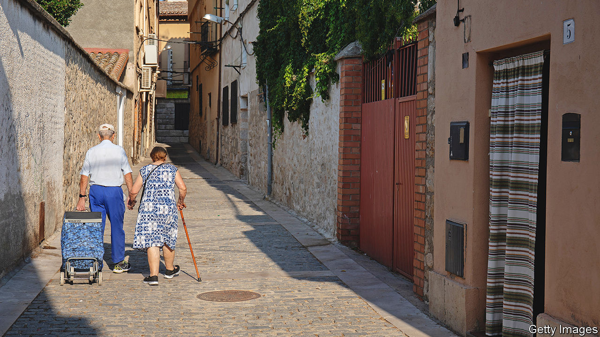
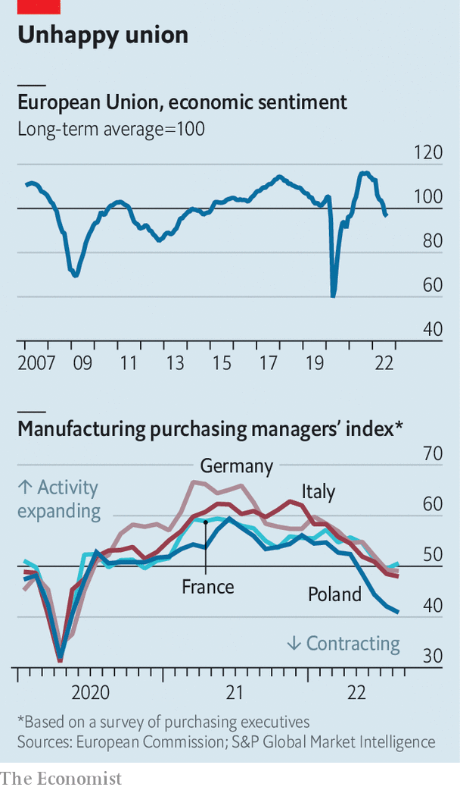

###### Europe’s economy

# Europe is heading for recession. How bad will it be? 

##### Its inflation shock is coinciding with an economic downturn 

 

> Aug 31st 2022 


Every single warning light is flashing red. Russia’s war on Ukraine, an uneven recovery from the covid-19 pandemic and a drought across much of the continent have conspired to create a severe energy crunch, high inflation, supply disruptions—and enormous uncertainty about Europe’s economic future.  are rushing to try to help the most vulnerable. Amid the nervous confusion, there is broad agreement on one thing: a recession is coming.

Quite how bad the downturn will be depends on how the energy shock plays out, and how policymakers respond to it. This week energy prices reached once-unimaginable heights: more than €290 ($291) per megawatt hour (mwh) for benchmark gas to be delivered in the fourth quarter of the year (the usual pre-pandemic price was around €30); and more than €1,200 per mwh for daytime electricity for the same quarter in Germany (up from around €60). Because gas is the marginal fuel in most European electricity markets, it sets the price for power more broadly.

The European economy entered the crisis in a reasonably strong position. The labour market is still relatively healthy, with unemployment at 6.6%—meaning, by Europe’s mediocre standards, that the economy is near to full employment. Wage growth will probably pick up in the coming months, as long-term contracts are renegotiated. Consumer confidence fell at the beginning of the war, but consumption didn’t slump. Inflation expectations have subsided somewhat. 

Yet things will look considerably gloomier in a few months for three reasons. First, industry is under pressure. In the spring, the leaders of Europe’s largest manufacturers argued that cutting off Russian gas supplies too swiftly would bring economic crisis to the continent. Despite high prices, industrial production has so far remained strong. “Part of the reason is that firms are still working off the backlog of orders from the past,” says Michael Hüther from the German Economic Institute, a think-tank. 

But these backlogs will not last for ever, and some crucial forward-looking indicators are grim. “New orders minus inventories—that is, the demands on firms that keep them busy—have fallen off a cliff,” says Robin Brooks at the Institute of International Finance, which represents banks and institutional investors. The decline reflects a weakening global, and in particular Chinese, economy. As Mr Brooks notes, such a drop can mark a turning-point in the economic cycle.

The worst-affected industries will probably be east of the Rhine. Recent surveys of industrial bosses in Germany and Austria point towards contraction. Germany’s unhealthy reliance on Chinese buyers risks dragging down demand for goods across the Teutonic supply chain. Italian industry appears to be in free fall. Poland and the Czech Republic, both sitting outside the euro zone, are vulnerable, too. The exception is Hungary, where manufacturing is expanding at a healthy pace, thanks to battery investment, the electric-vehicles boom and long-term energy contracts (although some of them will soon come to an end).

 


The second reason for gloom is that consumer spending on services will struggle to hold up the continent’s economy. Buoyed by a strong season in France and the south of Europe, as holidaymakers made exuberant use of their pandemic savings, tourism added to growth over the summer. But sentiment is declining as consumers tighten their belts in preparation for a long, cold winter. Services are likely to stagnate over the coming months, with real estate and transport facing particularly severe difficulties, according to s&amp;p Global’s purchasing managers’ index.

Last, Europe will almost certainly see the energy shock coincide with rising interest rates. Having underestimated price increases along with many other of the world’s central banks, the ecb is now determined to bring annual inflation back to its target of 2%, from the alarming 9.1% recorded in August. Isabel Schnabel, a member of the bank’s board, argued in favour of inflicting more pain on the economy to see the job through at the Federal Reserve’s  of central bankers in Jackson Hole, Wyoming. 

Economists therefore expect the ecb to try to buttress its inflation-fighting credentials with a substantial interest-rate rise in its next policy meeting on September 8th, possibly lifting rates by three-quarters of a percentage point. In expectation, yields on European short- and longer-term bonds have increased in the past month. Despite this, the euro has continued to slump, dropping to parity with the dollar for the first time in two decades. That reflects a deteriorating outlook for Europe’s economy and the decision of global investors to turn elsewhere in response. It is becoming yet another worry for the continent’s policymakers, as a weaker currency fuels inflation through dearer imports, hitting real incomes and thus consumption. 

All this suggests that the European economy is certain to enter a recession, led by Germany, Italy and central and eastern Europe. Analysts at JPMorgan Chase, a bank, expect annualised growth rates of -2% for the euro area overall in the fourth quarter of this year, -2.5% for France and Germany and -3% for Italy. Italy’s troubles and high debts could trigger jitters in Europe’s bond markets. European politicians have so far spent a lot of time thinking about how to respond to surging energy prices. They could soon have a broader crisis on their hands. ■


