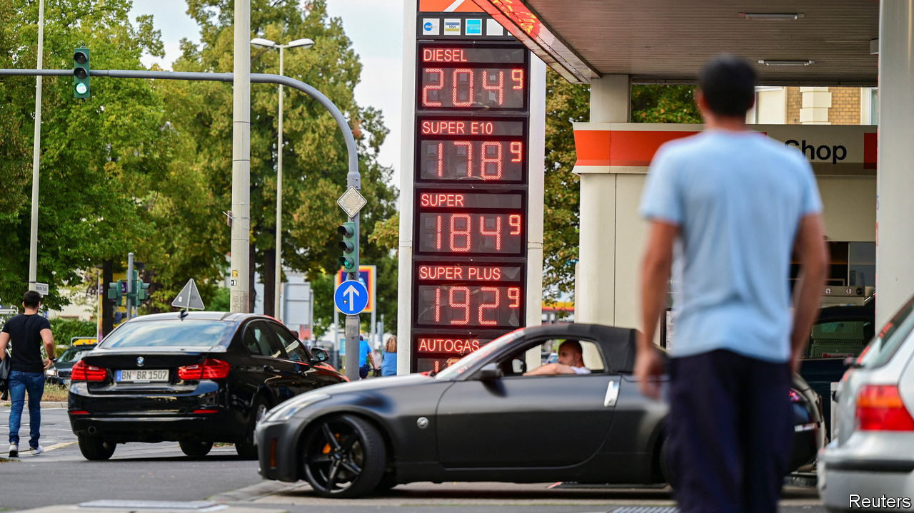

###### Lines of defence

# Europe scrambles to protect consumers against dizzying energy prices 

##### Taxpayers are about to be hit by an enormous bill 

 

> Sep 1st 2022 

Europe’s energy war is heating up. The eu is preparing to boycott most Russian oil, starting from December. Russia, for its part, is curbing gas supply to Europe: on August 31st it halted flows through its biggest pipeline, citing maintenance. The confrontation has caused an energy crunch. Wholesale gas prices are nine times what they were last year; power prices, which are linked to gas, the marginal generation fuel, have soared.

The crisis threatens to boil over in the winter, when huge bills could hit firms and people. Accordingly, European governments are staging defensive manoeuvres. Bruegel, a think-tank in Brussels, reckons they have allocated €280bn ($300bn) to cushioning the shock over the past year. Shielding tactics vary in kind, calibre and cost. 

Many countries are softening the wholesale-price pass-through by slashing taxes. Thirteen have dropped duties on fuel, ranging from a rebate of 5p (six cents) a litre in Britain to six times that in France. Many have also cut vat, including France, the Netherlands and Poland. Some cuts, meant to be temporary, have already been extended. Spain’s suspension of a 7% tax on power generators, due to end last year, will run to 2023.

Customer subsidies are another popular tool. Greece will cover 94% of power-price rises faced by households in September, a measure that is expected to cost the taxpayer nearly €2bn. Norway is footing 90% of power bills above 700NkR ($70, about half the current price) per megawatt hour until March 2023.

Another type of subsidy is limits on retail-price increases, or even price caps, with governments typically paying energy firms the difference from market rates. France is restricting an increase in regulated electricity prices to 4% and forcing edf, a state-owned energy firm, to sell more power to rivals. Romania is capping gas and electricity bills up to certain consumption levels. In another twist, Portugal and Spain are financing part of power plants’ fuel costs.

Price-curbing measures can make a difference. Portugal’s government reckons that, since April, its cap has kept prices 17% lower than they would have been. The problem is that they provide bad incentives. Hungary’s fuel-price cap, for instance, has caused such a surge in demand that the government narrowed the scope for eligibility in July.

Hence the popularity of a second tactic: universal cash transfers. German workers who pay income tax are set to receive a one-off allowance of €300, with families getting a bonus of €100 per child. Increasingly, however, governments are making such policies more targeted. More than 8m British households on benefits will receive £650, on top of a universal £400 handout. Denmark, Italy and others have also reserved transfers for the worst affected.

All of this will cost governments dearly. The European Commission is keen to help, and not just by allowing member states to flout eu competition rules. It is working on limiting the price of electricity by “decoupling” it from the cost of gas—extending, in effect, the subsidy scheme pioneered by Portugal and Spain to the whole bloc. How this mega-shield would be funded remains unclear, however. Do not expect Europe to march in unison soon. 


