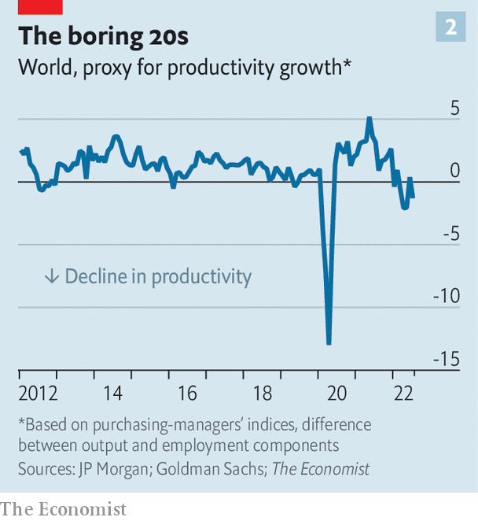

###### Destruction, little creation

# The missing pandemic innovation boom 

##### Digitisation and new ways of working were meant to unleash productivity growth. What went wrong? 

 

> Aug 28th 2022 

Among the trials and tribulations of the plague years, there was a silver lining. In late 2020, with the approval of covid-19 vaccines, and into 2021, as the jabs worked their magic, techno-optimism began to spread. If people could develop life-saving inoculations in months, why couldn’t the world move out of its low-growth, low-productivity slumber? Firms could embrace digitisation as never before; the shift to working from home could allow people, free of office gossip and draining , to ; before long there would be vaccines for every disease imaginable. Governments promised to spend big on science; companies outlined juicy r&amp;d plans. 

It was quite a change of mood. In the years before the pandemic, the rich world’s growth rate had drastically slowed. In the 2010s American labour productivity—output per hour of work—grew at half the pace of the decade before. Societies had become worse at finding new ideas, translating them into innovations and promulgating these innovations. Robert Gordon’s “The Rise and Fall of American Growth”, published in 2016, argued that there were fewer life-changing discoveries to be made. In early 2020 a paper in the , a leading journal, made the case that, even where there were ideas to be discovered, they were getting . 

The possibility that the dynamic had shifted was intoxicating, and not just because it suggested that some good would come of the pandemic. Productivity growth is the main driver of higher real wages. As the supply side of the economy expanded, inflation would become less of a problem. And innovations would improve people’s lives in ways not captured in the economic data. But our analysis comes to a depressing conclusion. So far, there is little sign that the global economy is getting more productive.

 


Official statistics are unusually volatile because of lockdown disruptions (see chart 1). In the second quarter of 2022 American gdp appeared to fall by 0.1%, even as the number of Americans on payrolls rose by 1.3m. Britain’s gdp fell by the same amount, while employment rose by 150,000. Both economies are thus producing less with more people working. As a new paper by Mr Gordon of Northwestern University and Hassan Sayed of Princeton notes, today’s weak productivity growth is the flipside of strong growth in 2020. Back then American firms fired their weakest workers, boosting productivity. Now they are rehiring them, dragging it back down.

 


Data published at higher frequencies support the notion that productivity growth remains poor. A global purchasing-managers index (pmi) compiled by JPMorgan Chase, a bank, asks bosses about the state of the broader economy and their business. A proxy for productivity derived from pmis, which we calculate by subtracting the employment component of the index from the output component, has in recent months actually fallen. We find similar results when applying the same methodology to a real-time indicator of economic activity published by Goldman Sachs, another bank (see chart 2).

Why has the productivity boom failed to materialise? Optimists point out that investment spending is indeed roaring, as predicted—but caution that the benefits will only be felt slowly. There is often a lag of three to five years between higher business investment and productivity growth. New research by Jason Draho of ubs, another bank, concludes that “starting in 2024, the rest of this decade could look more like the second half of the 1990s than the second half of the 1970s”. Yet there are three reasons to worry that the pandemic innovation boom might never arrive.

The first relates to investment. Firms are not necessarily spending on things that lift productivity. In recent months, with customers facing empty shelves, many have scrambled to expand and protect supply chains. This improves resilience, but by creating redundancy it also increases costs. Many firms are also building up inventories, or stocks of raw materials and finished goods. Such spending counts towards investment, as measured in the national accounts, but has zero impact on productivity. In Germany in late 2021 the build-up of inventories accounted for 9% of total investment, the most ever. 

Short-term crisis management has thus taken precedence over long-term innovation. In America r&amp;d spending remains high, but our back-of-the-envelope calculation for 31 countries suggests that overall rich-world spending on “intellectual-property products” is running at about $3trn a year—below its pre-pandemic trend. There is not much evidence of a boom in new discoveries and use of frontier technology. In 2020 economists talked excitedly about the coming wave of automation, as companies invested in AI and machine learning. But American imports of robots, in real terms, are no higher than shortly before the pandemic.

The second factor relates to working from home. Almost overnight much of the rich world moved from the office to the kitchen table. Many have stayed there: a third of paid full days in America are now done from home. This is great for work-life balance. But predictions that it would also help people work more efficiently, which pre-pandemic studies had suggested, are as yet unfulfilled. A recent survey of economists in America and Europe found that they were “uncertain about the long-term impact on productivity”. At home people might be able to focus more on “deep work”; they are also able to spend more time walking the dog.

Indeed, in some instances the pandemic has introduced inefficiencies—the third factor. Companies are still spending on extra cleaning and other measures to make people feel safer, which will do little to raise profitability. With wave after wave of covid, workers are taking more sick days. In early summer an astonishing 4m Americans said they were off work because they had the disease or were caring for somebody with it, according to an official survey. In Britain, as people moved back to the office last year, the share of working hours lost to sickness jumped.

Perhaps, at some point, the rich world will enjoy the long-awaited productivity boom. But, adjusting for the volatility of the pandemic economy, Messrs Gordon and Sayed find “no room for a pandemic-era revival in productivity growth as has been widely suggested”. A large body of peer-reviewed evidence before the pandemic established that innovation had drastically slowed—and explained the reasons why that was so. Wishful thinking is not enough to change that. ■


