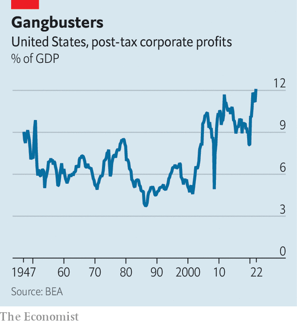

###### Powerful prices

# Vast corporate profits are delaying an American recession 

##### Strong pricing power for firms makes the economy more resilient 

 

> Aug 30th 2022 

To the ears of many, “pricing power” is something of a dirty term. For left-wingers it conjures up images of greedy corporations abusing their market dominance to charge more. For economists it raises the spectre of sticky inflation as companies ratchet up prices to cover higher costs. But from another perspective, pricing power is less of a problem: it enables firms to withstand the kind of inflationary pressures that they are now experiencing. In so doing, it serves as a shock absorber for the economy, forestalling the risk of a recession.

 


The past few weeks have put pricing power in the spotlight in America. According to data published on August 25th, post-tax corporate profits reached 12.1% of gdp in the second quarter, their highest since at least the 1940s (see chart). When companies announced their second-quarter results, dozens noted their capacity to raise prices in the face of higher wages and dearer inputs. Chipotle, a fast-food chain, emphasised that it had sold more expensive burritos to its relatively affluent customers. The boss of Hilton boasted that, having raised room rates sharply in the face of strong demand, the hotel chain was set for “the biggest summer” in its century-long history. At ibm, a tech giant, an executive reported that the company was at last “starting to capture the reality” of higher costs in its pricing.

The combined effect of all these individual corporate decisions is striking. Nearly three-quarters of companies in the s&amp;p 500, America’s main stock index, beat earnings estimates in the second quarter. Overall, their net profit margins were roughly 12%, a touch lower than in the same quarter last year but still above their five-year average of 11%. That helps explain the rally in stockmarkets that got going in mid-June. It also adds to the evidence that, despite all the gloomy talk, America’s economy is in reasonably good shape—and is not in recession.

If there were a compression in margins, it would portend a downswing in the business cycle. Facing lower profits, companies are forced to find ways to cut costs, which often include firing workers. When sufficient numbers do that, it becomes a drag on the rest of the economy. Conversely, comfortable margins suggest less cost-cutting pressure. Thus the corporate results of the past couple of months are squarely on the side of resilience.

Why are companies doing so well? Unsurprisingly, energy firms have led the pack, benefiting from the surge in oil and gas prices that followed Russia’s invasion of Ukraine in February. Revenues for the s&amp;p 500, including energy companies, were up by nearly 14% in the second quarter compared with a year ago. Excluding energy companies, they were up by 9%, according to FactSet, a data provider.

Nevertheless, even allowing for the outperformance of the energy sector, profitability has been impressive. Part of the explanation may be that American companies have more market power than a few decades ago, bringing greater stability to their earnings. Laxer application of anti-monopoly laws over the years as well as the return-to-scale of big-tech platforms help account for that. 

Yet the robustness of profits over the past year is down to something far more basic: the rude health of both consumers’ and companies’ balance-sheets. In nominal terms, final demand has been well above its pre-pandemic trend, fuelled by several rounds of stimulus.

The question is how long the good times will last. Pessimism is building as the Federal Reserve raises interest rates to combat inflation. In July a survey of chief financial officers by ubs, a bank, found that they were more downbeat about their pricing power over the next 12 to 24 months than they had been in January. Some companies are already cutting back their capital-spending plans, which could spill over into hiring, too. 

But this is all being done from a position of considerable strength. Aneta Markowska, an economist at Jefferies, another bank, says the Fed may ultimately be forced to induce a recession to curb inflation, but adds that it will have a fight on its hands, in part because of the resilience of profit margins. “It’s like a Mike Tyson economy,” she explains. “It’s a lot stronger than you think, and it’s going to take a lot of work to take it down.” ■


