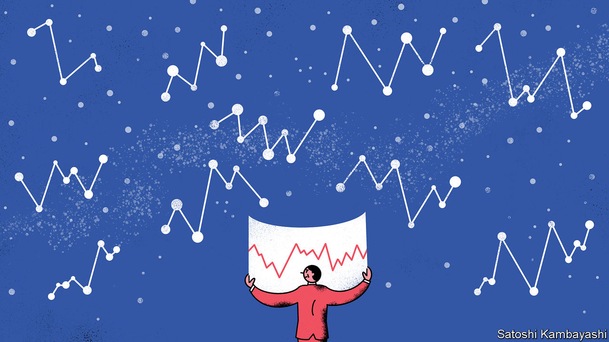

###### Buttonwood

# Why investors are reaching for the astrology of finance 

##### That technical analysis is in vogue indicates a certain uneasiness 

 

> Sep 1st 2022 

Why did the markets move? Most investors, analysts and even financial journalists will look, first and foremost, for news. Perhaps the jobs data were published, a firm announced it was being acquired or a central banker gave a sombre speech. Yet a small, dedicated cult of “chartists” or “technical analysts” believes that the movement of stocks, bonds and currencies can be divined by the making and interpreting of charts.

Their methods are many, varied and wackily named. A “death cross” is when a short-term moving average of an asset’s price falls below a long-term moving average. “Fibonacci retracement levels” rely on the idea that an asset climbing in price will fall back before rising again. Such backsliding is supposed to stop at levels based on Fibonacci numbers, like a 61.8% drop. The “ichimoku cloud”, loved by Japanese traders, sees the construction of a cloud by—bear with this—shading the area between two averages of high and low prices over the past week, month or two months. A price above the cloud is auspicious; one below it is ominous. A true chartist needs only such information and “does not even care to know what business or industry a company is in, as long as he or she can study its chart”, as Burton Malkiel, an economist at Princeton and author of “A Random Walk Down Wall Street”, has noted. 

These methods, though patently mad, have attracted attention lately because of how the s&amp;p 500, the leading index of American stocks, has wiggled around. After slumping to a low of 3,637 on June 17th the index began to climb. On August 16th it peaked at an intraday high of around 4,325, a whisker away from its 200-day moving average of 4,326—a supposedly critical technical level. An asset that has fallen in price but is rising is supposed to meet “resistance” at such levels. To chartists it is concerning when an asset fails to “break through” a resistance barrier—it is an indication of a bear-market rally, rather than a true bull market. And so, this time, it appears to have been: stocks have slumped by around 8% since August 16th.

Plenty of mainstream investors use some version of trend-following. Factor investing, invented by Eugene Fama, the Nobel prize-winning economist, and Kenneth French, is used by successful quantitative funds, like aqr Capital Management. It breaks down returns into component factors like “size” (small companies earn better returns than bigger ones) or “quality” (low-debt, stable businesses earn better returns than riskier ones). Another such factor is momentum: stocks that are rising tend to keep rising. Still, their approach is a little more sophisticated than looking at a price chart. aqr’s algorithms tend to combine factors like momentum with others. They might buy, say, a small or high-quality firm whose share price has recently risen.

It is nevertheless possible to understand the chartists’ obsession with levels and trends. There is no real difference between a euro being worth $1.0001 or $0.9999, but these “big figures” in foreign-exchange markets assume importance. This is in part symbolic and in part practical: clients tend to place orders near round numbers and derivatives tend to be sold with round “strike prices”. That means it will take a lot more activity for the euro to fall from $1.0001 to $0.9999 than for it to fall from $1.0487 to $1.0485. When placing orders, investors try to figure out where others are placing theirs. That can help them place a stop-loss order, to close a trade that moves against them, at a sensible level. If enough investors look at technical levels to inform their behaviour, then they begin to matter. 

Perhaps the real value of technical analysis is what its use tells you about market conditions. No one bothers with the chartists’ pretty drawings when the economy is good, profits are high and stocks are moving smoothly higher—nor, indeed, in the depths of a frantic bear market, when prices will plunge through any and all levels technical analysts are wont to draw. Much as people who are feeling restless about the direction of their lives are more prone to become interested in astrology, investors who are uneasy about the direction of the markets will reach for the easy reassurance of an eye-catching diagram. 

That some are laying the blame for the end of the summer rally on a technical tripwire suggests they have little idea what is really going on. Perhaps Buttonwood should derive a technical indicator of her own: the more regularly chartist analysis lands in her inbox, the clearer it is that no one has any clue as to why the markets are moving.

 


