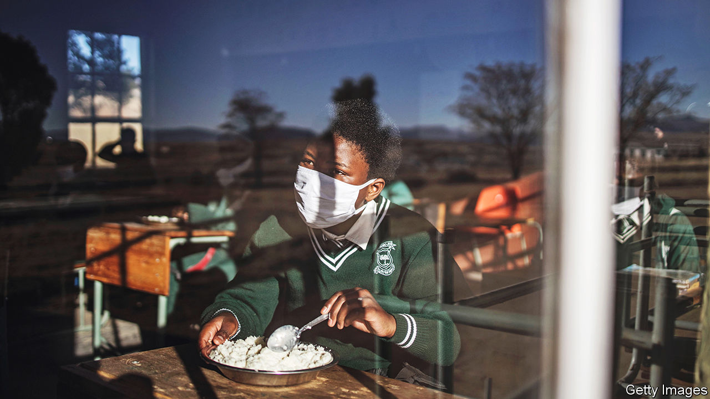
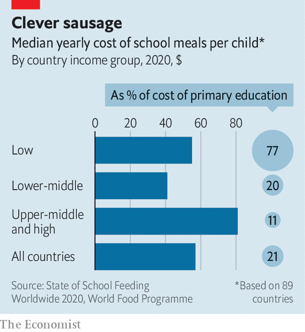

###### Food for thought

# Should every schoolchild eat free? 

##### More school meals would bring poor countries huge benefits; in rich ones the evidence is mixed 

 

> Sep 1st 2022 

Before the pandemic a quarter of pupils in Capistrano Unified, a sprawling school district south of Los Angeles, were eligible to receive free lunch and breakfast. But when classrooms closed the number eating that grub fell sharply, even though staff handed out frozen meals in school car parks and delivered food by school bus, says Kristin Hilleman, who manages its school canteens. At the lowest point just 1% of the district’s pupils were eating the meals her team provides.

Since schools have fully reopened, however, she has faced challenges of a different kind. By the time schools broke up earlier this summer, the number of pupils taking lunch in her cafeterias was about 50% higher than it was before the pandemic. The number coming for breakfast had doubled. Ms Hilleman has been thinking about investing in new freezers to store the extra meals that her district’s central kitchen now produces. The space she has is “bursting at the seams”.

Such stories are one result of an unplanned national experiment. Soon after America’s schools closed in 2020, the federal government suspended the means-testing that determines which children may eat at its expense. That in effect made school meals free for every child. This temporary move aimed to cut formalities that risked keeping meals from being doled out during the pandemic. Starting last month, schools in most of the country have had to begin charging richer pupils once again. Yet lawmakers in Maine and in California—Ms Hilleman’s home state—have found cash to replace the federal money that is disappearing. This year they have become the first American states to make school meals permanently free for all.

Disasters have often prompted expansions of school-meal programmes. After the financial crisis of 2008, in particular, countries all around the world sought to expand them as a way of bolstering social safety-nets. The closure of classrooms during the pandemic has again drawn attention to schools’ role in providing nutrition; in all kinds of places, new spending is being mulled. Research strongly suggests that expanding meal programmes in the poorest countries—where coverage is low and hunger is widespread—could transform the prospects of millions of youngsters. There is thinner evidence that new splurges in rich countries, such as on universal schemes, would have a large positive effect.

About 390m schoolchildren benefit from a school-food scheme of some sort, reckons the World Food Programme (wfp), a un agency. That sum is equal to about half of all children of primary age. Programmes differ greatly. Brazil, Estonia, Finland and Sweden are among the countries that provide nosh free to all pupils. Lunches in England are free to all children in their first three years of school, but only to around 20% of pupils at later stages. 

China’s programme feeds around one-quarter of pupils. Rather than sprinkling free meals among the poorest children in every school, as is common in richer countries, it identifies the poorest bits of the countryside and funds meals for everyone who attends the schools within them. India dishes up more free meals than anywhere else. Its “Mid-Day Meal Scheme” feeds at least 90m children. 

Brazil’s programme, which reaches about 40m, is a distant second. But it is more generous, feeding children as young as six months. At a secondary school in Sobral, a town in Brazil’s baking north-east, servers heap mounds of chicken and rice onto metal trays clutched by teenagers. Pop music echoes around the cafeteria, which is open to the playground. Teachers and pupils eat together, perched on yellow chairs at red tables. The headmaster, Carlos Augusto Pinto de Sousa, says that sharing food encourages respect.

The biggest void is in poor countries, where fewer than 20% of all primary and secondary pupils may be benefiting from a meal in school, according to a survey carried out by the Global Child Nutrition Foundation, an ngo. Reducing the lifelong burden of malnutrition is not the only good that would come from swiftly expanding coverage in these places. Systems that are created to deliver meals often end up also being used to deliver tasty bonuses, such as eye tests and dental checks. 

Free school meals can nourish minds as well as bodies, in three ways. First, in countries where many children are hungry, they create a huge incentive to show up to school. Research from Burkina Faso and Kenya, among other places, shows that providing meals increases attendance where it is low. 

Second, adequate food is essential for brain development. This includes essential micronutrients, which can be added to school meals. Third, children who have been fed find it easier to concentrate, so they learn more when they show up. Emerging evidence finds that school meals can indeed have this effect. 

Offering meals makes it less likely that hungry children (or those who have gorged on sugary snacks brought from home) will disrupt lessons. Providing meals is also an important step towards lengthening school days, which in much of the world end at lunchtime. A recent study in Ghana found that providing school meals there pushed up literacy and numeracy scores, and that the improvements for girls were particularly large.

The pandemic has made it urgent to help schoolchildren in the developing countries that are home to 90% of the world’s children. The World Bank estimates that before the crisis about half of ten-year-olds in such places could not read and understand a simple story, and that share could have risen to two-thirds.

 


The main obstacle to free lunches is the price. The World Food Programme estimates that supplying them in low-income countries costs about $55 per pupil per year. However, median government spending on education in such places is only about $70 in total for each primary-school child (see chart). 

Foreign aid often helps. But divisions among donors can complicate fundraising, says Donald Bundy of the London School of Hygiene and Tropical Medicine. Donors who support nutrition often prefer to spend on preschoolers. Those keen to improve education tend to think that paying for food is not part of their job.

Biniam Bedasso of the Centre for Global Development, a think-tank, says it is worth digging deep. He says that in poor countries providing meals may be a more reliable way of driving up school results than mounting campaigns that are more directly designed to improve lessons (even though these usually look a lot cheaper). That is because projects such as retraining teachers, and making sure they stick with new practices, are easy to mess up. By contrast, even weak governments can usually find someone who can slop beans and rice on a plate. 

In rich countries, where most of the poorer children already benefit from free school meals, the trade-offs are different. The cost of expansion is less prohibitive: one guess is that making meals free for all American children would require another $11bn annually. That would push up the country’s total spending on schools by about 1.5%. The question in these places is therefore whether, if such money were to be found, it would not be better spent improving the quality of the food offered to the poorest children—or on other interventions that might help pupils who are falling behind. 

Chew on this

Fans of universal-meal programmes argue that offering food to everyone can sweep away barriers that prevent lots of needy children from benefiting from existing schemes. The rules used for means-testing inevitably contain loopholes and flaws. Some pupils end up going hungry because parents fail to fill out nosy forms. And some poorer children choose not to eat their free meal, both because doing so can attract stigma and because queuing at a cafeteria can mean spending lunchtime away from their friends.

Nudging more children towards school meals could hold down obesity rates. A survey in England found that dishes provided by schools are healthier than 98% of packed lunches. Encouraging children to chomp fruit and vegetables when they are little might instil good habits that last them a lifetime. 

A study of universal free meals in Sweden, which were rolled out region-by-region in the 1960s, found that both rich and poor children benefited. Children who ate free during their primary-school years earned on average 3% more over their lifetimes than those who did not. The impact was greatest for the poorest children, but even those from wealthy families saw a bump. In England, the introduction in 2014 of free school meals for all children in their first three years of school helped limit rates of overweight and obesity.

Yet some other studies underwhelm. In England the share of older children choosing to eat free meals they were entitled to fell after food was made free to all infants. That could be because an influx of little children slowed service for other pupils by jamming canteens. A recent review of literature examining universal-meal schemes that already exist in some American cities found “limited but promising” evidence that they improved pupils’ weight and behaviour, but only “mixed evidence” of increased test scores or attendance.

Investments over the next few years will produce more data to chew on, both from rich countries and poor ones. In 2021 the governments of France, Finland and about 60 other countries agreed to participate in a “School Meals Coalition” supported by the wfp. Its members promise joint efforts to improve and extend school-meal programmes. They have pledged to find ways to reach a further 73m of the world’s poorest children by 2030, most of them in sub-Saharan Africa. This coalition could probably not have been created without the shock of covid-19, says Mr Bundy.

Since the pandemic started Rwanda has promised to increase five-fold the number of pupils getting meals in its schools. New Zealand, which until 2020 had no school-meal programme, is expanding a pilot scheme quicker than planned. In England a campaign led during lockdowns by Marcus Rashford, a footballer at Manchester United, has bounced the British government into making more food available during holidays. Scotland’s government says all primary-age children will be eating lunch free in a few years.

Campaigners in the United States may have failed to persuade the federal government to let its experiment with universal free meals run indefinitely, but other state governments could yet join California and Maine in finding cash to feed all children for good. Ms Hilleman’s cafeterias still suffer problems stoked by the pandemic. Her district, like many others, is struggling to find enough staff and to secure some types of food. But she believes that making meals free for everyone has made it less likely that children who choose to eat them will suffer stigma as a result. She says that feels like “a huge win”. ■

