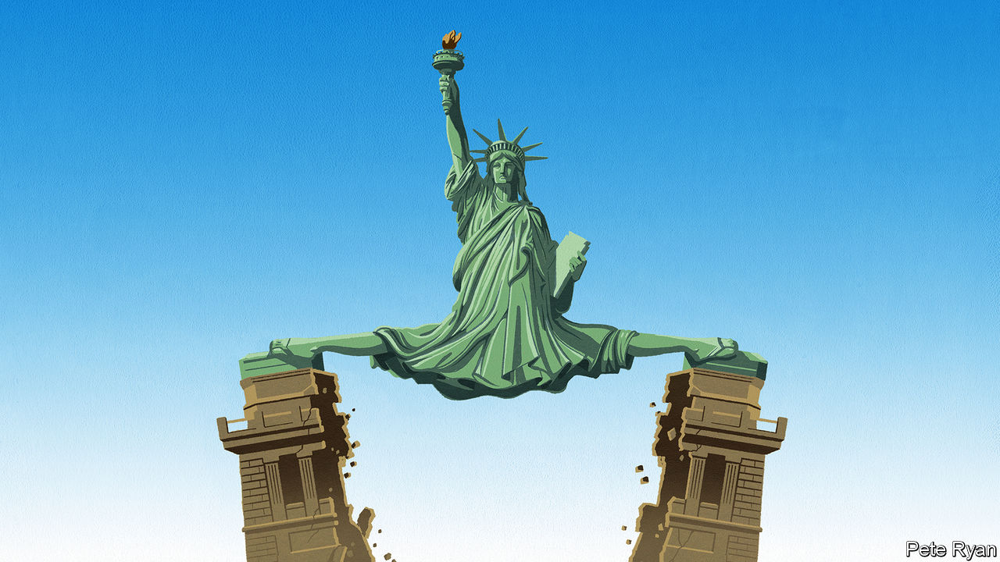

###### The disunited states

# American states are now Petri dishes of polarisation 

##### Only electoral reform can make them work properly 

 

> Sep 1st 2022 

Two states, two very different states of mind. On August 25th California  of petrol-powered cars from 2035, a move that will reshape the car industry, reduce carbon emissions and strain the state’s electricity grid. On the same day in Texas a “trigger” law banned  from the moment of conception, without exceptions for rape or incest. Those who perform abortions face up to 99 years in prison.

These two events may seem unrelated, but they are symptoms of an important trend. Washington, dc, may be largely gridlocked, but the  at a furious pace. In theory, that is no bad thing. With 50 states, America has 50 laboratories to test which policies work and which do not. People can choose to live and companies can opt to operate in places where their preferences are reflected in local rules, as many did during the pandemic, typically moving to states with fewer restrictions. Each state can make its  between the weight of taxes and the generosity of public services. Any state can learn from neighbours with better schools or business regulations. 

Alas, this constructive form of federalism is not what state politicians are pursuing today. Instead, they are fighting a national culture war: prescribing what can be discussed in classrooms, how easy it is to buy and carry a gun, which medical interventions may be offered to teenagers who identify as transgender, and what sort of benefits unlawful immigrants may claim. Such issues enrage both parties’ partisans in a way that, say, fixing the roads or refining tax policy does not. Moderates might prefer less rage and more road-mending, but many state politicians can safely ignore them. 

This is because 37 of the 50 states, where three-quarters of Americans live, are ruled by a single party. The number where one side controls both legislative chambers and the governor’s mansion has nearly doubled in the past 30 years. These one-party states are self-perpetuating, as the winners redraw electoral maps to their own advantage. And politicians with ultra-safe seats have perverse incentives. They do not worry about losing a general election, only a primary, in which avid partisans call the shots because they are more motivated to vote. The way to woo such partisans is to eschew compromise. 

Hence the proliferation of extremism. Most Texans think their new abortion laws are too draconian, for example, even though most also think the old national rules were too lenient. If Texas were not a one-party state, its legislators might have found a compromise. 

Hence, too, a new politics of confrontation. Some states aim to punish those who seek an abortion or transgender surgery in another state; others offer sanctuary to the same people. Blue states encourage lawsuits against gunmakers; red states sue to stop California from setting its own emissions standards. Some partisan pugilism is largely performative. To publicise his view that blue states are too soft on illegal immigration, Texas’s Governor Greg Abbott has sent busloads of migrants to New York. But the relentless focus on national controversies is at best a distraction from the local problems that state politicians are elected to solve. Governor Ron DeSantis in Florida, a probable presidential contender, unveiled a “Stop woke Act” to restrict how race is discussed in classrooms; of the ten examples of excessive wokery in his press release, not one was from Florida. And all these battles are divisive; all entrench the notion that red and blue America cannot rub along despite their differences. 

This makes for a nastier, shriller national conversation. It also makes it harder to do business in America. Whereas once the country was, roughly speaking, a giant single market, now California and New York push companies to become greener while Texas and West Virginia penalise them for favouring renewable energy over oil and gas. Recently Texas went so far as to blacklist ten financial firms for going too green.

The biggest worry is that partisanship could undermine American democracy itself. Many Republicans cannot win a primary unless they endorse Donald Trump’s Big Lie that he beat Joe Biden in 2020. That year a coalition of Republican state attorneys-general sued other states to try to have their votes invalidated. Whatever happens in the November midterm elections, such sparring could proliferate. America is not going to have another civil war, as some feverish pundits speculate, but it has already endured political violence, and that could get worse. 

American dysfunction poses a risk to the world, which depends on America to uphold the rules-based order (or what’s left of it), to deter military aggressors and to offer an example of democratic governance. It is doing especially badly on the last of these. What can be done?

The federal government should stop neglecting its responsibilities. Policies on immigration and climate change, for example, are clearly better set nationally than locally. Reforms to break the gridlock in Washington, such as ditching the Senate filibuster, might help. But more than this America needs electoral reform. 

States of play

It should end gerrymandering, which lets politicians choose their voters rather than vice versa. States should do redistricting through independent commissions, as Michigan does, to de-politicise the process. This would make it harder for one party to entrench itself. It would also, by creating more competitive districts, force more politicians to appeal to the centre. 

Allowing for multi-member districts could also help. Instead of carving up districts and allowing them to elect only one representative, this would increase the diversity of voices in state legislatures and Congress. Ranked-choice voting, in which voters’ second and third choices count if no candidate wins an outright majority of first preferences, could promote moderation. (Ranked-choice voting in Alaska this week kept Sarah Palin out of Congress.) Different states could try different policies.

Voters, too, have a responsibility. It may be hard, in the era of social media, to ignore the blizzard of confected fury and vote for leaders who want to get things done. But the alternative is ever greater disunion, and that does not lead anywhere good.■


