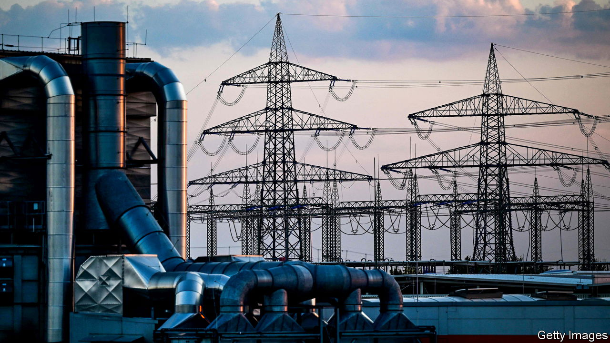
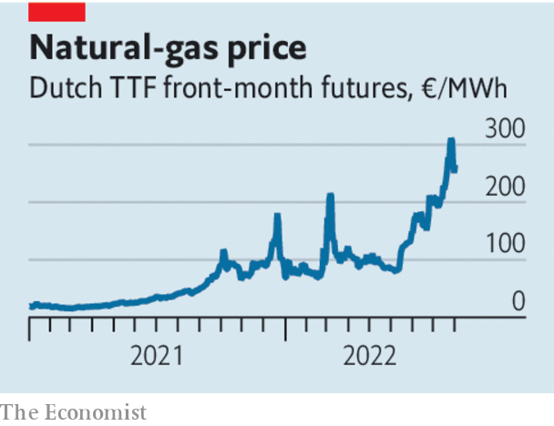

###### Energy in Europe

# How to prevent Europe’s energy crunch spiralling into an economic crisis 

##### Fiddling with prices will do little 

 

> Sep 1st 2022 

As disruptions to , French nuclear power and Norwegian hydroelectricity wreak havoc in Europe’s energy markets, prices are verging on the surreal. Benchmark natural-gas prices surged by 30% last week. Last summer French and German year-ahead contracts for electricity traded at around €100 ($118) per megawatt hour. Recently they rose above €1,000. Prices have fallen since, but gas still trades at the equivalent of around $400 for a barrel of oil. Shell’s boss has warned that the crisis will last more than one winter. 

The pain will be savage and will spread as households’ and firms’ existing energy contracts . That will intensify the squeeze on the economy that is under way as the European Central Bank raises interest rates to combat inflation. Many economists  in the next few months, and the single currency is flirting with its lowest level against the dollar in two decades. The prospect of unrest and squabbles among member states looms ahead.

 


So far the European Commission’s response has not been ambitious enough. Its latest idea is a cap on the price of gas used to generate electricity, which will be discussed at a summit of ministers on September 9th. The commission may also seek to overhaul the power market, so that spot prices are no longer set by the costs of the marginal producer, which is often gas-fired.

Capping prices sounds neat but could be counterproductive. That is because the ceilings will not curb demand for scarce energy. According to one study, a cap implemented in Spain has led to a 42% increase in gas-fuelled generation since June. An eu-wide policy would only increase the demand for gas further still, raising the chances of rationing in the winter. It is true that the current set-up allows some renewable-energy firms, which produce at close to zero marginal cost, to rake in profits. If gas prices were to stay high for years such windfalls could be described as unjustified rents. But that same price signal ensures that gas-fired plants generate power when the wind doesn’t blow, and incentivises more investment in renewables. 

Rather than tinkering, governments should focus on two bigger tasks. The first is to allow the market mechanism to curb demand, while supporting the most vulnerable people. Large handouts will be needed, but targeted assistance can limit the bill: according to the imf, policies that offer rebates and cash transfers to the poorest 40% of people would be cheaper than the policy mix today, which largely includes tax cuts on fuel, or retail-price caps. 

The second priority is to increase supply, something that is not solely in Vladimir Putin’s gift. Other sources of natural gas can be cultivated: this is one reason why France’s president, Emmanuel Macron, has just visited Algeria. Within Europe, countries can help ease bottlenecks, such as inadequate cross-border gas interconnections. Today insufficient investment and differences in standards impede the flow from Spain and France to Germany and eastern Europe. The eu needs to ensure that in the event of rationing, there is a continent-wide agreement about which users are cut off first: without this the danger is that countries will hoard supplies. 

All this will cost money. So far Greece, Italy and Spain, among the euro zone’s most indebted members, have spent 2-4% of their gdp on fiscal handouts to cushion the energy shock. Fortunately, the eu has the firepower to help. Its €807bn pandemic recovery fund is being doled out in the form of loans and grants. Yet so far less than 15% of the pot has been disbursed. Payments for energy projects could be accelerated and the commission could offer cheap loans to help fund targeted fiscal support. The eu came together to tackle the economic consequences of the pandemic lockdowns. Be under no illusions: the energy crisis requires a similarly bold response.■

