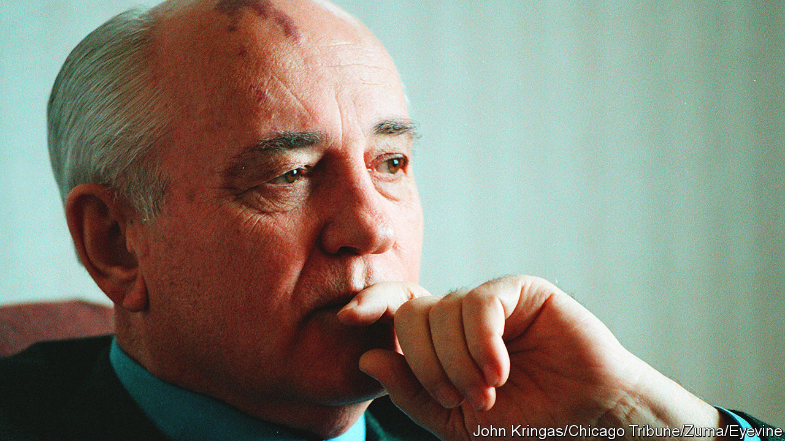

###### The man who ended an empire

# Mikhail Gorbachev liberated millions, even if he didn’t set out to 

##### Modern tyrants, alas, see his story as a cautionary tale 

 

> Aug 31st 2022 

An empire built on lies and violence is not worth saving. Mikhail Gorbachev, who died this week in Moscow at the age of 91, understood that above all else. For this, he deserves to be celebrated, especially by the hundreds of millions of people who have lived in greater freedom and peace since he let the Soviet empire collapse and thus . The tragedy is that so many have either forgotten the lessons of his extraordinary story, or drawn precisely the wrong conclusions from it. 

Mr Gorbachev never set out to dismantle the Soviet Union or its wider dominion (see ). He aimed, rather, to make it stronger and better, through his twin policies of openness and reform, and . He believed in the socialist project far more than in liberal democracy; but he also knew that secrecy and repression bred only corruption and dysfunction, and that what he viewed as a worthy and humanist project would not survive without change.

He also, despite too many incidents in which force was used on his watch, had a deep personal aversion to violence. And so, when the anti-communist uprisings of 1989 swept through eastern Europe, he made the right choice: to let Moscow’s satellites spin out of its orbit, rather than send in the tanks that had crushed Hungarian democrats in 1956 and Czechoslovakians in 1968. Even before that, he had understood the disastrous cost of the arms race with America, and signed a nuclear arms-reduction treaty that lowered the risk of apocalypse in Europe.

With eastern Europe liberated from foreign overlordship, it seems in retrospect inevitable that similar demands for independence would come from the constituent republics of the Soviet Union itself. Though this was not an outcome that Mr Gorbachev wanted, he again faced a choice: to acquiesce, or to prevent dissolution by force. Again, he made the right one, eventually. Soviet troops spilled blood in Georgia and Lithuania, but he ultimately let all the republics go their own way. Today, even those that still live under the shadow of autocracy, like Kazakhstan and Belarus, do not miss the days of bread queues and the gulag. Few people outside Russia agree with Vladimir Putin that the collapse of the Soviet Union was the “greatest geopolitical catastrophe of the 20th century”.

Unlike his successors, Mr Gorbachev was not corrupt. He never sought to enrich himself, his family or his cronies, which was one reason why he was able to retire from office without fearing prison or worse. Mr Putin cannot say the same. On the contrary, in the rump of the old Soviet empire that he still controls, he is doing his best to erase Mr Gorbachev’s legacy. State-sponsored lies and violence are back, along with jail cells for peaceful dissidents. Respect for the law and free speech have vanished. “All Gorbachev’s reforms—to zero, to ashes, to smoke,” said Alexei Venediktov, an old friend of the late president’s, recently. Mr Venediktov used to run an independent radio station, closed down shortly after Mr Putin’s invasion of Ukraine began. On the day Mr Gorbachev died, Russian state prosecutors requested a 24-year prison term for a critical journalist, born near the end of Mr Gorbachev’s rule.

Freed from the dead hand of Russia’s , the former satellites of eastern Europe have prospered mightily. (The former republics, less so, apart from the Baltics.) Russia could have grown rich and free, had not Boris Yeltsin empowered the kleptocrats and Mr Putin done the same for the securocrats. But even though Mr Gorbachev’s vision of an open society has been reversed in Russia, it was an astonishing achievement to have attempted it, and to have followed where it led.

Alas, tyrants around the world have seen what Mr Gorbachev did as a cautionary tale: if you give people a bit of freedom, they will demand more. China opened up economically, but bloodily suppressed its own democratic stirring on Tiananmen Square in June 1989. When, later that year, eastern Europe shook off communist-party rule, the hardliners in Beijing felt vindicated for not having allowed anything similar. When the Soviet Union itself collapsed and communists lost power in Moscow, too, China’s rulers quietly congratulated themselves for not having been so weak and foolish. Given the choice, people tend not to like being ruled over by unaccountable and unremovable apparatchiks; so China’s leaders resolved not to give them that choice. Stability and economic progress in China have come at a terrible cost in terms of personal freedoms, the rights of minorities and ingrained corruption. 

History has moved on since Mr Gorbachev left the Kremlin. Russia is no longer a superpower in any but the nuclear sense, but China has rapidly become one. The Big Lie, a driving force of the Soviet Union that only those without clear memories hanker for, has been shown to work even in mature democracies. These are awkward truths for liberals to grapple with. As they mourn the man who let a tyrannical empire disintegrate, they must keep struggling against modern tyrants and empire-builders. ■

