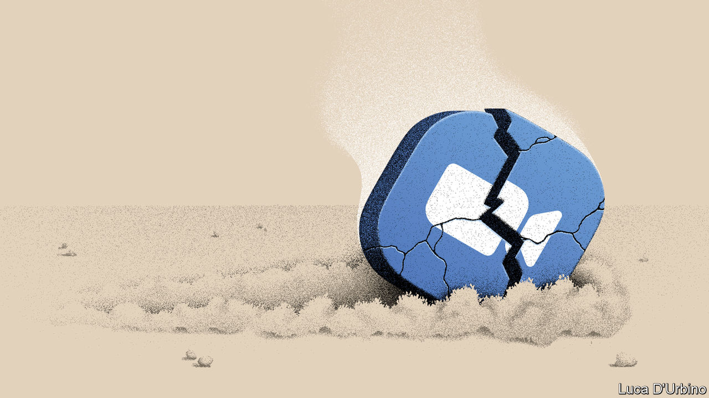
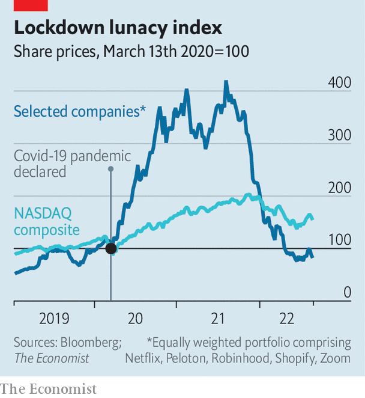

###### Zoom fatigue

# The tech winners and losers of the pandemic 

##### As Zoom and friends tumble, the software that underpins daily life thrives 

 

> Sep 1st 2022 

In the early days of covid-19, the tech industry was consumed by a sense of euphoria. With billions of people locked down at home, work and play were shifting online. Many hoped that the new normal would spark a huge  as firms digitised and workers spent less time . The excitement was most evident in stockmarkets, where any firm related to this trend saw its share price surge. The value of an equally weighted portfolio of five pandemic darlings—call it the “lockdown lunacy index”—increased by 320% from the start of the pandemic to its peak in August 2021. The tech-heavy nasdaq, by contrast, rose by 88%. 

The mania has ended. Today the lockdown lunacy index—which includes Netflix, a streaming service; Peloton, a maker of fancy exercise bikes; Robinhood, a stock-trading app; Shopify, an e-commerce platform; and Zoom, a videoconferencing firm—has fallen by more than 80% from its peak, far exceeding the 18% drop in the nasdaq. Zoom and friends are trading at below pre-pandemic prices. 

How worrying is this return to Earth? To be sure, some of it reflects gloomier prospects for the global economy, racked by inflation, war and rising interest rates. And it is disappointing that two years of digitisation and remote work have not provided . Yet there are reasons still to be techno-optimistic. Much of the early enthusiasm may simply have been focused on the wrong types of firm. Though the pandemic darlings have fizzled, the shift towards ever greater digitisation continues. The true winners are not the flashy consumer-tech firms, but the companies that provide the infrastructure to enable this shift. 

 


Much of the decline of our lockdown index reflects shakier business models. On August 22nd Zoom reported that its year-on-year revenue growth had fallen to 8%, the lowest rate since the company listed in 2019. Three days later Peloton reported a nearly 30% fall in its quarterly sales, compared with a year ago. Subscribers are fleeing Netflix for other viewing platforms, such as Disney+. Robinhood is laying off a quarter of its staff as day traders cool on the markets. 

The fading work-from-home boom has affected the demand for hardware, too. Worldwide pc shipments are expected to decline by 10% this year; analysts reckon mobile-phone sales will tumble by 7%. A downturn in spending on video games and a series of crypto implosions have  of the powerful semiconductors used to mine digital currencies and render computer graphics. 

Look beyond the boom and bust of consumer tech, though, and you see the real successes. The market for the infrastructure technology that underpins people’s daily lives, such as cloud computing, cybersecurity and digital payments, is thriving. The cloud-computing industry is  to almost $500bn this year, up from $243bn in 2019. Amazon’s cloud offering, the largest in the world, is still growing at 33% each year. It accounted for three-quarters of the firm’s operating income over the past 12 months, and is propping up the tech giant’s ailing e-commerce business. Its closest rivals are the cloud services of Microsoft and Google. Their annual sales are growing by 40% and 36%, respectively.

Cloudification has created new demands for cybersecurity, another tech winner. The combined revenue at the three largest listed cybersecurity firms has almost doubled since the start of the pandemic. Their market capitalisation has tripled, and has come down only a fraction since the start of the year. Digital payments are another bright spot, thanks to lockdowns and social distancing. Three-quarters of iPhone owners use Apple Pay, up from half in 2019, and nine out of ten American retailers now accept it as a payment method. Almost 200m people in India and China have used some form of digital payment for the first time since the onset of covid. A third of adults in sub-Saharan Africa now have a mobile-money account, up from a fifth in 2017.

Sanity reigns

The bubble may have burst on the pandemic’s darlings, but the drumbeat of digitisation continues. The less eye-catching technologies that provide the underlying infrastructure for the shift are the true beneficiaries of covid. Whether these will fuel a productivity boost one day remains to be seen. But there was more going on during the pandemic than lockdown lunacy. ■


