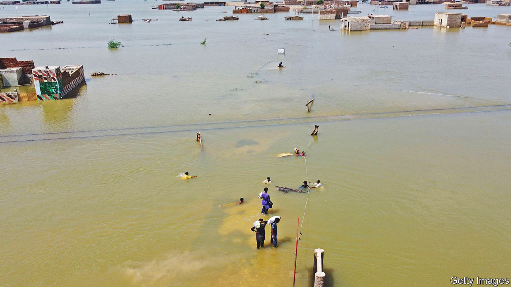

###### Get ready for the rains

# What flood-hit Pakistan should learn from Bangladesh 

##### Proper preparedness can save many lives 

 

> Sep 1st 2022 

An unusually heavy monsoon has caused havoc in South Asia this year. In May and June it inundated swathes of Bangladesh and north-eastern India, killing hundreds and displacing millions. Over the past few weeks it has battered , where more than 1,100 people have died and at least half a million have lost their homes in the deluge. A third of the country is . When such a catastrophe strikes, there is an urgent need not just to provide humanitarian support but also to learn lessons for the future. And in Pakistan’s case, the country does not have to look far to find them.

Flood-prone countries have spent decades developing methods to contain the damage that others can readily adopt. Broadly, these fall into three categories: infrastructure adjustments, early-warning systems and efficient channels for swift financial relief. In South Asia Bangladesh has led the way on all three. 

Bangladesh has for years invested in flood defences to protect its low-lying coastal regions from cyclones. Residents near the coasts and in regions farther inland that are at risk from monsoon-related flooding have been encouraged to make their houses more resistant to floods, and have received money to do so. Shelters have been put in place on raised ground, and modified to include women-only facilities and take animals, making people more willing to use them. As for early warning, researchers gather weather data down to village level to predict floods days in advance. People are warned via text messages and from the loudspeakers of mosques to leave their homes, and helped to shelters by trained volunteers. Cash and, increasingly, mobile-money transfers provide financial help without bureaucracy. 

All this has saved many lives. In 1970, when Bangladesh was still part of Pakistan, 300,000-500,000 people died in a massive cyclone there. A similar one in 2020 killed only about 30.

Plenty of countries need to increase investment in flood defences. African cities are . Pakistan itself improved its early-warning systems after flash floods killed more than 2,000 people in 2010, which may have helped lower the death toll of the current floods. Better cash-transfer networks should help provide relief to those who have lost their livelihoods.

Now for some neighbourly advice

Yet it is clear that Pakistan has failed to take fully on board the lessons on offer from Bangladesh. One reason is a reluctance to heed sufficiently the threat posed by climate change, a failure that afflicts . The weather patterns behind the latest disaster are consistent with what is expected in a warming world. As they become more common and affect areas not used to such extremes, more people will have to be better prepared. 

But the bigger reason is politics. Pakistan’s have been a mess, distracting from the sort of patient planning needed to build resilience against floods. The floods have hit a country already reeling from economic and political instability. Imran Khan, who was ousted as prime minister in April and is keen to do the same to his successor, is exploiting the disaster to score political points, which may end up jeopardising the government’s relief efforts. 

Pakistan’s plight also provides a different sort of warning, about the broader impact of global warming. As climate conditions grow more extreme round the world, they are likely to produce more political instability. Shockingly large numbers of people may be forced to leave their homes in the coming decades as climate change renders their cities and villages . Calls to compensate poorer, worse-affected countries for climate changes they did not cause are likely to grow louder. All the preparation in the world may not be enough to contain the fallout. ■


