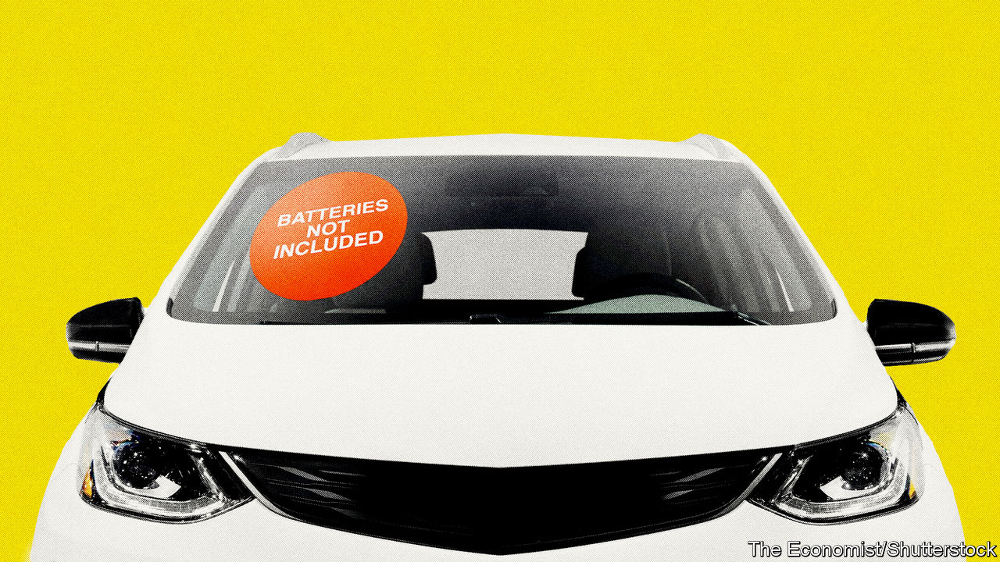
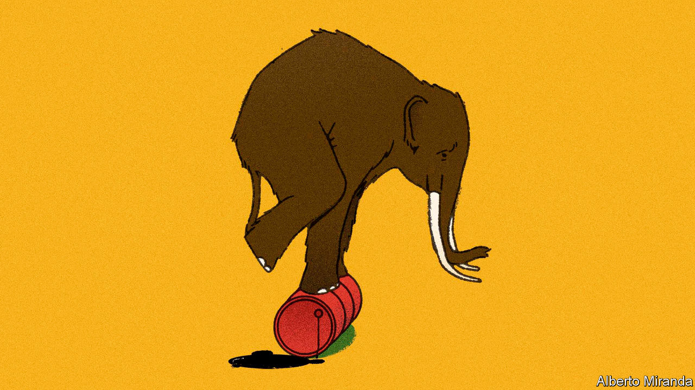
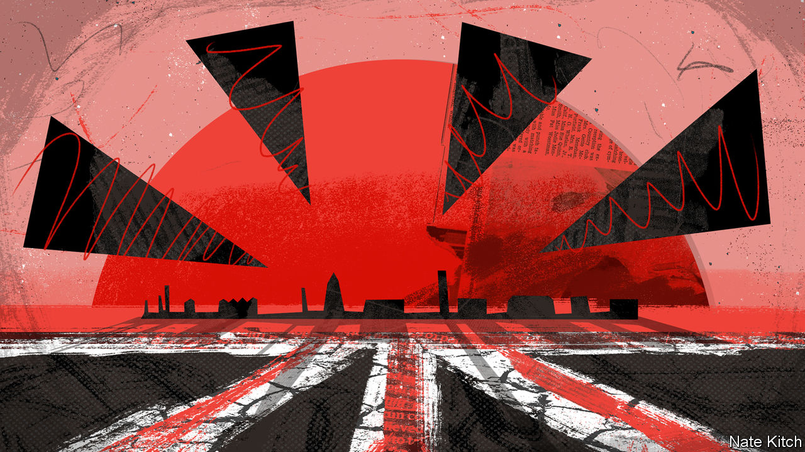

###### On electric cars, forest fires, mustard, management, cigarettes, cutting weeds, voters

# Letters to the editor 

##### A selection of correspondence 

 

> Sep 1st 2022 


Battery cells could be mega

It is a febrile time to work in the battery industry (“”, August 20th). However, the answer to meeting the demand from electric vehicles is not just to run faster, but smarter. The market is obsessed with gigafactories, with many seeing this as the only way to deliver cells at the volumes needed. Reaching gigascale is essential, but there are other routes to getting there than trying to go from zero to 60 straight away.

You said that these facilities take three years to build. In fact, the process can be longer, up to seven years from land acquisition, permitting, infrastructure delivery and power connectivity through to final build and commissioning. There are squeezes, too, on raw-material supply chains, with a handful of big players buying up resources. These need to be tackled to make larger factories a reality.

Added to all that, people often forget that demand for battery cells is much bigger than sometimes stated. Within carmaking, they are needed for powertrains in hydrogen fuel-cell vehicles as well as in electric cars. They are also vital for renewable energy storage to maximise output from wind and solar.

How do we square the circle? Megafactories, smaller facilities, are part of the solution. They can be created quicker than their giga cousins, helping us to scale up production. They require less upfront capital and are suitable for more locations, making it easier to repeat the model. This can mean green industrial jobs in more places, too.

The battery industry’s ambitions are gigantic, but if we’re going to reach them, and deliver the industry’s net-zero potential, then we need more diverse models, including making the transition gradually to giga rather than trying to fast forward in one giant leap.

dave pell

Commercial director

amte Power


 


Fire as forest management

I taught a culture and forestry class for many years, and I’ve seen “Bambi” about 20 times. I appreciated your article on what the Disney classic tells us about eco-disasters (“”, August 13th), but there are some important things to mention about the portrayal of fire. Open woodlands and patchy forests tend to have much higher levels of biodiversity and are more resistant to high severity wildfire, good reasons for making fire and other means of thinning forests part of our management practices. Even in Europe the emphasis on managing dense forests is relatively new. The Black Forest, for example, used to be managed by a form of Swidden, slashing and burning, in the 19th century. 

“Bambi” actually portrays the outcome of a fire very well. After the tragic event, flowers and herbs abound and Bambi’s mate has twins. This is not unusual. In the years following a fire there is typically a profusion of forage for deer and elk, and a habitat for an abundance of creatures that simply need more sun. This nutritional burst leads to more young. 

Too often we characterise an ecological phenomenon as bad or good, when in fact it is part of how the ecosystem works. Sometimes a short term “damage” is a long-term benefit, especially if it leads to greater ecosystem resilience and fewer over-fuelled fires that burn everything in their path. I hope that people will come to terms with this, so that the active management of our forests can begin.

lynn huntsinger

Professor of rangeland ecology and management

University of California, Berkeley

 


Condiment cordiale

The shortage of Dijon mustard in France is intriguing (“”, August 13th). But I would have welcomed an angle on the potential economic opportunity for Britain to seize an opening for English mustard. It is interesting that our Gallic friends have turned to the blander American variant to replenish stocks rather than the more nasally challenging English variety, which should be more familiar to them. Maybe this is because of post-Brexit trade or supply-chain issues. Or does it say something about the state of the Anglo-French relationship? 

jonathan ward


 


Tummy troubles

(August 20th) suggested a new entrant to corporate jargon: &#34;probiotic management&#34;, or gut instinct. Perhaps the perfect opposite of this would be &#34;antibiotic management&#34;, or analysis paralysis. This would give us the perfect framework to use the right management tool for each problem: antibiotic to avoid decisions, probiotic if you can stomach the consequences of making a decision.

srikanth rajagopalan


 


State pushers of cigarettes

You described how climate activists vilify multinational oil companies and ignore state-run oil giants (“”, July 30th). The same applies to multinationals and state monopolies in tobacco. Most of the former have committed to ending smoking by moving smokers to lower-risk nicotine products. Many of their brands have been authorised by the American Food and Drug Administration as being appropriate for the protection of public health. Philip Morris International now derives 30% of its revenues from such products and British American Tobacco 15%. 

Yet state monopolies, which together sell well over 50% of all cigarettes, have not even started the transition. The Chinese state monopoly is by far the biggest seller globally, accounting for about 45% of all sales. The World Health Organisation and most governments ignore this reality. They turn a blind eye to state-run cigarette companies, at the same time refusing to engage with the multinationals that pour billions into research and innovation to help end the 8m deaths a year from tobacco.

derek yach

Former executive director at the World Health Organisation


 


Cutting out the state

As a British expatriate living in the United States, I was shocked— shocked!—to learn that because of the local authority’s neglect, the pavement weeds on your correspondent’s street in Britain have grown to “almost two metres high” (“”, August 13th). In order to avert the collapse of British civilisation as we know it, may I suggest a giant grass scythette, available from Amazon for only £24.67. Should this not be up to the task by the time it arrives, I would be happy to loan your correspondent the chainsaw that every self- respecting American home is equipped with, as our civic responsibilities include keeping the sidewalk (pavement) clear of such impediments.

malcolm harker


 


Political intelligence

The Liberal Democrat who encouraged the party’s pursuit of cerebral voters (, July 30th) should remember Adlai Stevenson’s warning when he ran for American president in the 1950s. A supporter yelled that he would have the vote “of every thinking American”. Stevenson replied, “Madam, that’s not enough. I need a majority.” He lost twice by a landslide.

jonathan coopersmith

 

