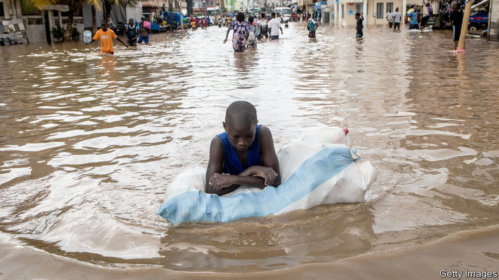
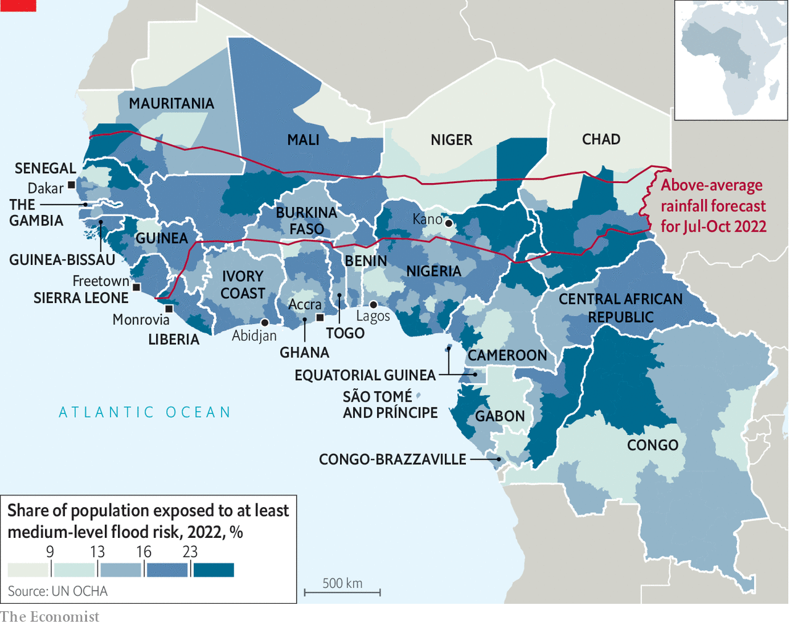

###### Underwater cities

# Every year heavy rain brings misery and gridlock to west Africa 

##### Chaotic urbanisation is partly to blame 

 

> Sep 1st 2022 

“It was a wave of water,” says Oulimata Sambe. She points out the still-sodden armchairs, muddy wardrobe and the water stain a metre and a half up the wall in her small house in Ngor, a fishing village within Dakar, the capital of Senegal. “I had two grandkids on my bed, I had to evacuate them out of the window,” she adds. Not far away, underpasses on Dakar’s scenic corniche became car-swallowing lakes. Just weeks earlier another downpour had turned quiet streets in Dakar into raging rivers and collapsed a section of motorway. 

Similar events regularly occur across the region. Recent flooding and landslides also killed eight people in Freetown, the capital of Sierra Leone. In June flooding killed 12 people in Abidjan, the commercial capital of Ivory Coast. Floods in Lagos, Nigeria’s commercial capital, claimed another seven lives. Even when they are not deadly, city floods ruin lives and livelihoods. Storm water recently inundated the biggest textile market in Kano, a city in northern Nigeria, destroying hundreds of thousands of dollars’ worth of fabrics. 

Unusually heavy rains have become significantly more common over the past 30 years, leaving huge numbers of people at risk (see map). In places this is partly because of deforestation. A recent study by Christopher Taylor of the uk Centre for Ecology and Hydrology, a research institute, and his co-authors found that afternoon rainstorms in deforested parts of coastal west Africa happen twice as often compared with 30 years ago. Their frequency went up by only about a third in places that kept their forests. 

 


Some of the most denuded—and thus drenched—places are coastal cities such as Freetown and Monrovia, the capital of Liberia. Yet areas deep inland are also at risk. Some 340,000 people have been hit by recent flooding in Chad. Worryingly, the Intergovernmental Panel on Climate Change (ipcc) predicts there will be heavier downfalls more often across most of Africa as the planet warms up.

Yet regular flooding of cities in west Africa is not only caused by heavier rain. Breakneck, unplanned urbanisation is also to blame. As cities have grown, builders have thrown up concrete walls haphazardly with little thought about providing drainage, making it harder for water to find a clear path to the sea. As ever larger areas have been paved over, there has been less exposed soil into which water can gently sink away. And as cities get more packed with new arrivals, their few functioning drains get overwhelmed or clogged. 

Unplanned urbanisation can also put more people in harm’s way. Fully 40% of the people who settled in the outskirts of Dakar between 1988 and 2008 made their homes in areas that are at significant risk of flooding or coastal erosion.

Untrammelled development is damaging urban forests and wetlands, too. Ordinarily they should help soak up water and reduce floods. In Freetown, some residents built on a hillside in a protected forest reserve, destabilising the soil. In 2017 it collapsed after three days of rain, killing more than 1,100 people. In Ghana, developers have encroached on perhaps 40% of the internationally recognised wetlands, including some protecting Accra, the capital. 

Flooding imposes economic costs, as well as human ones. Even normal rain in Dakar creates a swampy gridlock across the city and badly slows business—apart from the few brave hawkers who wade between stationary cars selling their wares. The World Bank found that in 2017 flooding in coastal areas caused damage worth almost 3% of gdp in Ivory Coast and 1.4% in Senegal. One study found that families hit by natural disasters in Senegal were 25% more likely to fall into poverty. 

“All our belongings are ruined,” says Yaya, a mother of six whose one-room home in Dakar was recently swamped. She had to throw away the sodden mattress she shared with her children, which pushed her into debt. A new mattress cost 75,000 cfa francs ($115), but she could only scrape together a third of that. “I will pay little by little,” she explains. With interest, she will also pay more. Nearby Fatou surveys her small shop’s once-prized fridge with dismay. “I bought it for 250,000 cfa,” she says. “Now it’s bust.” 

After brutal floods in 2012 President Macky Sall of Senegal announced a $1.4bn ten-year flood-prevention plan. The government has built 43 pumping stations in Dakar and its surrounds and added new drainage canals, too. Accra launched a similar programme in 2019. In some parts of Dakar these efforts have helped. Yet in much of west Africa progress is slow. Informal settlements are often the most at risk, but governments do not always recognise them, which means they are less likely to help make them safer, says Jessica Troni of the un Environment Programme. 

Even in Senegal, some are asking questions about where exactly the flood-prevention money went. In 2016 a deputy minister in the responsible ministry admitted to the national assembly that she did not know how the funds were used. She was fired soon after. 

In Ngor, many are dismissive of the response. “The government doesn’t do anything,” grumbles Abdoulaye, as he unloads tuna from his pirogue. “It’s anarchy.” Some think that the authorities have made the area more prone to flooding, because they directed storm water from other neighbourhoods upstream into a canal that passes through Ngor. Meanwhile, as they do every year, residents of Dakar mop up and struggle to carry on with their lives. Ms Sambe says someone from the local mayor’s office came to visit and promised aid. Yet that was weeks ago. “They’ve done nothing,” she says. ■

