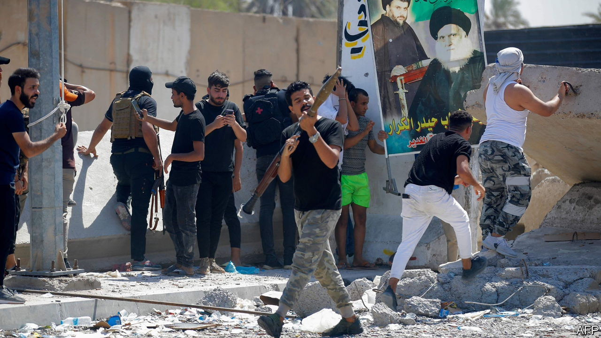

###### Militias amok

# Iraq’s political deadlock turns violent 

##### Despite his vanishing act, Muqtada al-Sadr has never been more present 

 

> Aug 31st 2022 

Religious shia leaders have long recognised the power of vanishing. Their greatest Imam, Muhammad the Mahdi (“messiah”), disappeared in 873. Yet more than a millennium on, he is a potent symbol that inspires believers to challenge oppressors. Muqtada al-Sadr, a rabble-rousing Iraqi cleric and politician, appears to be following suit. On August 29th he announced his “final withdrawal” from politics after months of deadlock since the general election last year. Far from signalling that he was quitting, though, his announcement was a clarion call for his followers to take to the streets. 

Protesters swiftly overran parliament, then fanned out across the “international zone”, Iraq’s fortified seat of government in central Baghdad that is still commonly known as the Green Zone. They stormed government offices and splashed in the Green Zone’s palatial pools. They tore down the icons of their Iranian-backed political opponents, the Co-ordination Framework (cf), including the portraits of its patron, Qassem Suleimani, an Iranian general who was killed in an American airstrike in 2020. 

Violence broke out when Mr Sadr’s supporters attempted to march on the home of one of the cf’s leaders, a former prime minister, Nuri al-Maliki. At that point cf militias opened fire, prompting Mr Sadr’s supporters to send in their own armed group, Saraya Salam, whose men arrived with rocket-propelled grenades. A night of pitched battles in and around the Green Zone followed that left at least 30 people dead and hundreds injured. 

Mr Sadr’s chief grievance is an election that was stolen well after the votes had been counted. His party, Sairoun, was the front-runner with 22% of the seats. Although he draws support mainly among Shias, Iraq’s biggest sect, he cobbled together a coalition that included Sunnis and Kurds, the two other major groups in Iraq. 

But when he seemed to have a parliamentary majority that would allow him to form a government, the cf, a bloc of Iranian-backed Shia parties, staged a “judicial coup”, according to Michael Knights, an Iraq expert at the Washington Institute, an American think-tank. Iraq’s federal court “moved the goalposts as the ball was about to cross the goal line” by ruling that Mr Sadr needed the votes of two-thirds of mps to elect a new president, not a simple majority as is usually the case, Mr Knights notes. The court also ruled that the Kurdish regional government had to hand control of its oil exports to the federal government, in a move that appears to have been aimed at punishing Kurdish parties for supporting Mr Sadr’s coalition. 

An outraged Mr Sadr pulled his mps from parliament. Under Iraqi law this meant ceding their seats to the runners-up from each district, which gave the cf a majority and allowed it to try to form a government of its own. To prevent this Mr Sadr sent in the mob to occupy parliament in July. They soon settled in for a prolonged sit-in protest to demand fresh elections. Their numbers were swelled in early August when thousands came to a mass prayer inside the Green Zone

For now, the rival militias have pulled back from the brink. Fear of an intra-Shia civil war has had a calming effect. After two days out of sight, Mr Sadr appeared on social media to order his forces to retreat from the Green Zone. In return, some suspect he has secured the cf’s approval of his preferred choice of prime minister. Others think that all sides are merely mustering allies for the battle to come. For Iran, Iraq is an important doorway into the region. It will not readily abandon its allies. Mr Sadr, too, wants reinforcements from his Arab allies in the Gulf, Saudi Arabia and the United Arab Emirates. 

Absent from the fray are the actors who once kept a lid on Iraq’s politics. Without Suleimani’s towering presence, Iraq’s Shia factions are squabbling. America has tired of babysitting the country that has cost it more than 4,400 lives and hundreds of billions of dollars. The democratic institutions it created—an elected parliament, federal court, and prime minister—are becoming playthings of Shia militias. The real disappearing act may not be Mr Sadr’s, but that of hope in a democratic Iraq. ■

