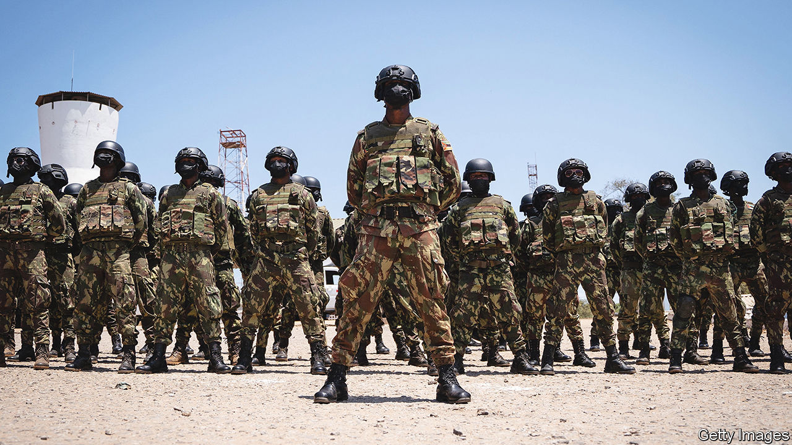
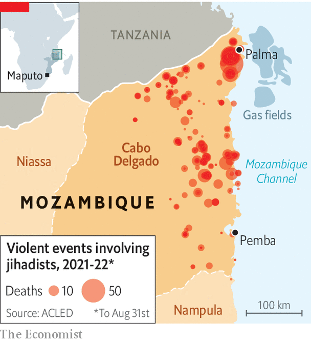

###### The war in the north

# Mozambique’s resilient jihadists 

##### An insurgency in northern Mozambique is still going strong 

 

> Sep 1st 2022 

Marta flicks off the ants scurrying down her t-shirt. “Beheaded,” she whispers, referring bleakly to her husband. They had been hiding in thick bush in northern Mozambique when they were stumbled upon by jihadists toting machetes who had previously pillaged their village. Back in December, Marta, 17 at the time, was blindfolded and marched along tracks to a secluded camp where her husband was then murdered. She was held captive, abused as a sex slave and traumatised. The jihadists cast her out of their camp, heavily pregnant, a few months ago. 

 


She is one of thousands of victims of a jihadist insurgency that has been raging in earnest since 2017 in Cabo Delgado, the sorely neglected northernmost province of Mozambique (see map). Locals call the jihadists al-Shabab, echoing the name of the guerrillas tied to al-Qaeda who have ravaged Somalia for the past 15 years. Mozambique’s jihadists, however, claim a link to Islamic State (is), a rival extremist movement, whose tentacles have spread from Afghanistan and Iraq across to the Sahel and down to eastern Congo. 

At first Mozambique’s jihadists hit dozens of towns and villages in Cabo Delgado’s far north, gaining little attention abroad. Yet when they attacked Palma in early 2021 their shots echoed around the world. This was because the picturesque resort town had been steadily filling up with foreigners working on Africa’s biggest energy project to exploit huge offshore gasfields.

Panicked, Mozambique asked for help from Rwanda and the Southern African Development Community (sadc), a regional bloc. Both sent troops, who regained key towns and pushed rebels away from the area around Pemba, the provincial capital, and from the north coast where infrastructure is to be built to export gas. But the jihadists are far from defeated. Mozambique is in for a guerrilla war that could last years. That is making gas investors skittish. 

eni, an Italian gas firm, is pressing ahead with plans to extract and liquefy gas using offshore platforms that are well out of reach of the insurgents. But TotalEnergies, which had been working on a $20bn onshore project, ceased work altogether last year. ExxonMobil, another energy firm, is dragging its heels on its own $30bn liquefied natural gas project.

After a lull, violence has surged again. In June the northern province witnessed the highest number of attacks in two years, according Cabo Ligado, a monitoring project backed by the Armed Conflict Location &amp; Event Data Project (acled), an ngo based in America that tracks political violence worldwide. The jihadists’ area of operations has widened, too. They are reckoned to have killed more than 4,000 people since 2017 and have caused nearly 1m to flee their homes. Gaggles of women and children can be seen wandering along lonely roads towards the relative safety of Pemba. “This is an enormous humanitarian crisis,” says Luis Montiel of Médecins Sans Frontières, an international ngo, lamenting that it is considered to be “nowhere near the premier league”. “And we are nowhere near the end,” he adds.

Pushed away from the gas infrastructure, the insurgents have spread south and west. Officials in Maputo, Mozambique’s capital, say the jihadists are starving to death in the bush—and that their appearance in the southern parts of Cabo Delgado is a sign of weakness. “We have them on the run,” says Brigadier Simon Barwabatsile, the deputy commander of sadc’s Mission in Mozambique, known by its acronym samim. He notes that the rebels have been hard pressed in the Katupa forest north-west of Pemba. Hence some have moved farther south.

He may be too optimistic. “We can dispel the security forces’ victory narrative,” says Piers Pigou of the International Crisis Group, a think-tank. “It does look like we are in for a long fight.” 

“This has become a game of whack-a-mole,” admits Nuno Lemos Pires, the Portuguese commander of the European Union’s mission training Mozambican soldiers. The eu has earmarked €89m ($89m) in security aid for Mozambique and is expected to provide an extra €20m or so to Rwanda and some €10m to samim before the year’s end. This cash will not last long. The Rwandans’ deployment of around 2,000 troops may cost $1m a day. 

The insurgents, perhaps numbering only a few hundred hard-core fighters, have broken into smaller cells, enabling them to disperse. This may be because of pressure from samim and Rwanda. But it may also be to widen their support-and-recruitment network. Groups of them have even made incursions farther south into the neighbouring province of Nampula. 

Women like Marta who have been freed from slavery say they have seen their captors walking casually through Pemba. Others say that strange men wander into villages from the bush to buy and sell things—and to ask for directions. Locals suspect that some of the young men driving motorbike taxis across the province are raising funds for the rebels. 

The circle of strife

Though al-Shabab’s affiliation to is was at first taken with a pinch of salt, it may be getting serious. In May is declared that Mozambique was one of its provinces. There has been talk of men and materiel coming from eastern Congo, where is has an active branch. Supplies certainly slip through from southern Tanzania. America says the Mozambican rebels are led by an elusive, iron-fisted figure known as Ibn Omar, who is also said to go by the nom-de-guerre of the King of the Jungle.

Troops from samim and Rwanda are keeping the insurgents away from the main towns, but they do not completely control the roads, complains a businessman who can no longer safely send lorries to buy cotton from farmers. The Rwandans are widely seen as Africa’s leading bush-warfare experts. Yet they are in unfamiliar terrain and tend to stick to the roads in the safety of their armoured vehicles. A diplomat in Maputo worries they “have bitten off more than they can chew”. 

As samim and Rwanda have moved forces to cover new areas the insurgents have spread to, the rebels have exposed the Mozambican army’s feebleness, sometimes overrunning places that had previously been cleared by foreign troops. Mozambican soldiers, recruited mainly from the south, are barely able to communicate with the locals up north. “They are totally unable to hold territory,” worries Tomas Queface of Cabo Ligado. “And the insurgents are taking advantage.”

Frelimo, the liberation movement that has ruled Mozambique since 1975, is much to blame for the disgruntlement of the northerners, who have suffered chronic neglect and poverty. Only the well-connected benefit from the riches of Cabo Delgado. Just 11% of people in the province are attached to the electricity grid; only a fifth have a mobile phone. 

Mired in corruption scandals, the government is floundering. Hopes that it would try to ease discontent in Cabo Delgado with a new development strategy are fizzling. “They barely want to recognise that there are problems,” says João Feijó at the Institute for the Rural Environment, a local ngo. “Nobody wants reforms.” Nor, apparently, do the authorities want any scrutiny. During a four-week visit to Mozambique made many requests to speak to government and army officials. We did not receive a reply.

In Cabo Delgado, too, few people think that the government cares about protecting them. Amid the chaos spread by the insurgents, criminal gangs are now looting villages and attacking cars on the roads. “They forgot about us,” spits a man sitting under a thatch roof. “And then they abandoned us to the bandits and the killers.” ■

