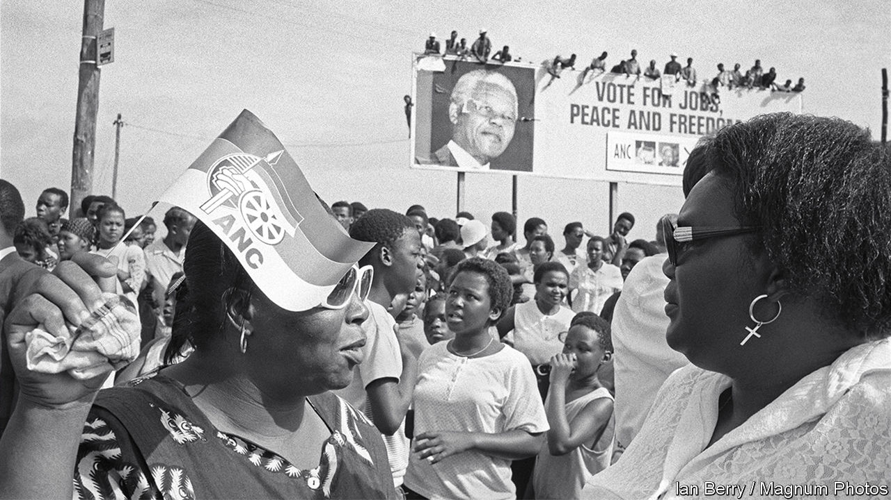

###### Coalitions of the unwilling

# The future of South African politics is in coalitions 

##### The ANC is predicted to lose its majority in the next national election 

 

> Sep 1st 2022 

In 2014 silas tshabalala received word that there was a home for him in a new public-housing scheme on the outskirts of Bethlehem, a town in the middle of South Africa. Eventually he sold enough scrap metal to pay to move his family from their slum. “I was very excited,” he recalls, “but honestly speaking life has not improved.” He points to a tap with no water, toilets that do not flush and an unfinished roof. 

Like many projects ostensibly aimed at helping the poor, the housing scheme was a vehicle for corruption. In this case it allegedly involved Ace Magashule, the former secretary-general of the ruling African National Congress (anc), who has denied any involvement in the project. In 2019, a year after Mr Magashule’s patron, Jacob Zuma, was replaced as president by Cyril Ramaphosa, “the anc came and told us things would improve,” says Mr Tshabalala. “But nothing has changed.” He has voted for the anc since 1994, when black South Africans were enfranchised (pictured). And next time? “No. There is no value in voting for the anc any more.” 

It is an increasingly common view. Many signs are pointing towards the ruling party losing its majority at the general election in 2024. Under the country’s system of proportional representation, that would mean a coalition government—and a new political era for sub-Saharan Africa’s most industrialised country. 

Opponents of the anc often struggle to understand the ruling party’s longevity. Is it nostalgic loyalty to its role in the anti-apartheid movement? Or perhaps patronage? Both matter. But the most important reason is that, for at least the first half of the anc’s 28-year reign, life got better for most South Africans. The poor got housing, running water and electricity. The murder rate—the best proxy for violent crime—fell from 1993 to 2011. Real incomes rose for pretty much everyone. 

Today unemployment is near a record high, at 34%. Over the past decade real incomes have grown only for the richest 5%. Public services are collapsing. There have been a record number of blackouts this year. The murder rate is approaching former highs. Corruption exploded under Mr Zuma. There is a pervasive sense that no one is in charge in South Africa. 

Voters are rightly blaming the ruling party. At local elections last year the anc’s share of the vote fell below 50% for the first time in a nationwide ballot. 

In the past, turnout for the anc has always been higher in general elections than in local ones. But analysts reckon the end is nigh. “There is a psychological acceptance within the country that it’s the end of the anc as a single governing party,” says William Gumede, a commentator. “The anc will lose its majority nationally in 2024,” predicts Sam Mkokeli, a veteran political journalist. “There’s a 20% gap in the market,” he adds, mostly among the black voters who have deserted the anc. 

Who will fill it? The second-largest party, the Democratic Alliance (da), appears stuck at about a fifth of the vote. It does well among South Africa’s minorities but poorly among the black majority that, perhaps unfairly, does not trust what many see as a “white party”. 

At the other end of the spectrum is the Economic Freedom Fighters (eff). Founded by Julius Malema, a former anc youth leader, the party is a mix of hard-leftism, black nationalism and rabble-rousing racism. It has been stuck at around 10% of the vote at the past two elections. “They don’t have a brand that is materially different to the anc,” explains Ralph Mathekga, a political analyst. “It is still a faction of the anc.” 

Some of the gap in the market will be filled by small parties appealing to ethnic identities, such as Inkatha Freedom Party, a Zulu-nationalist outfit. But a bigger gobbler of the anc’s vote may prove to be Actionsa, established in 2020 by Herman Mashaba, a haircare magnate turned politician. Actionsa won 16% of the vote in South Africa’s largest city in 2021 and has performed strongly in by-elections. If the eff espouses left-wing populism, Mr Mashaba’s party is of the right-wing variety. It is more vocal about its leader’s belief in God than many other parties in a devout country. Its support for tough measures against immigrants is popular. 

Could there be a pragmatic alternative? Songezo Zibi, a former corporate executive and newspaper editor, whose ngo, Rivonia Circle, is set to morph into a presidential campaign, reckons so. The centre of South African politics, he argues, is “non-racial, but social-democratic”, drawing an implicit distinction from the non-racial liberalism of the da. But it is unclear whether there is room for a party appealing mainly to the professional classes. 

The idea of coalitions fills some with dread. It could mean more mouths at the trough of corruption. Others are optimistic. Frans Cronje of the Social Research Foundation, a think-tank, argues that national politics will end up looking like that in Germany or Israel—an imperfect but pragmatic game of arm-twisting. South Africa, he points out, is “a country born of compromise”, a reference to the negotiations that ended apartheid. 

Ultimately electoral mathematics will determine the outcome. If the anc were to fall marginally below 50%, it could cobble together a coalition with small parties, meaning that little would change. A larger deficit might mean the terrifying prospect of a deal with the eff or the promising idea of a tie-up with the da, which the da’s leader has openly suggested. It could also create the opportunity for a coalition of non-anc parties, as is the case in the cities of Johannesburg and Pretoria. 

Whatever the precise arrangement, South African politics is on the cusp of change. On July 21st Thabo Mbeki, president from 1999 to 2008, confessed that “there is no national plan to address the challenges of poverty, unemployment and inequality; it doesn’t exist.” He warned that, a year on from the worst civil unrest in the democratic era, the condition of the economy could “spark our own version of the Arab spring”. It would be much better if revolution came via the ballot box. ■

