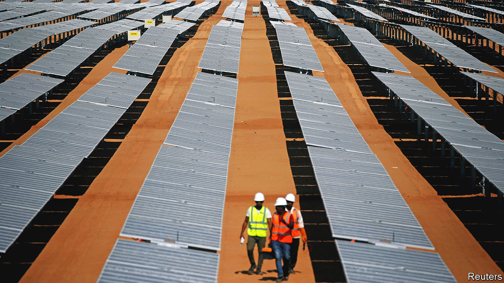
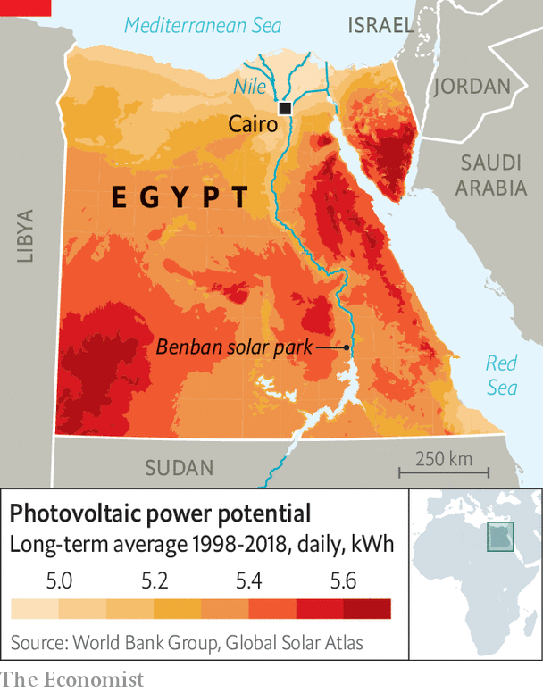

###### Short circuit

# Why Egypt’s plans for solar power are left in the shade 

##### The government is keen on rooftop panels. Its citizens are not 

 

> Sep 1st 2022 

For most of the year the sun bakes down from a cloudless sky over Egypt, making it an ideal place to generate solar power. And because many Egyptians have their air conditioning blasting in the heat of day, it provides power just when it is needed. The International Energy Agency (iea) reckons Egypt is one of the world’s best regions for solar. Some companies agree, having invested in projects such as the Benban solar park, one of the world’s largest, 650km (400 miles) south of Cairo. Egypt’s government has also tried to boost rooftop solar power by offering homeowners generous incentives. Yet even though Egypt will host this year’s international summit on climate change, its dirtier sources of energy continue to overshadow the solar sort. 

In 2016 Egypt set a target of producing 20% of its electricity from renewable sources by 2020, with most of the new capacity coming from sun and wind. But in the 12 months to March 2021 renewables including hydro accounted for just 12%, with solar power contributing under 3% of Egypt’s electricity. Renewable energy has struggled to keep pace with the massive increase in demand for electricity from a growing population (now around 105m). The iea reckons Egypt’s electricity consumption has risen almost threefold in the past two decades. Yet for most of that period until 2017 its solar-power capacity hardly went up, whereas there was a threefold jump in its use of natural gas, which it would far rather export now at high prices.

Egypt’s government has found it hard to convince its citizens of the merits of installing their own solar power. In 2014 it introduced a “feed-in” tariff, promising to pay homeowners and companies for surplus solar power they produce. Yet eight years later only a paltry 749 rooftop solar units have been installed.

Ayman al-Nahhas, a 58-year-old teacher in a village north of Cairo, leapt at the chance to reduce what he called “panic-provoking” electricity bills of about 5,000 Egyptian pounds ($260) a month on an apartment building and workshop he owns. The 200,000 pounds he spent was an excellent financial decision, he says. It also put an end to the frequent blackouts he used to suffer.

 


But the upfront expense deters many. A solar unit able to produce enough power for a family of five costs roughly 65,000 pounds, says Wael al-Nashar, chair of Onera Systems, which installs rooftop units. “Such figures are beyond most Egyptians,” he says. A weakening local currency puts imported units even further out of reach. 

Red tape is yet another barrier. People applying for the government’s permission to install the panels and connect them to the national grid must fully own their properties and be certified to have no outstanding planning snags. Such conditions rule out millions of buildings. It can cost thousands of pounds to get the right bit of paper. Moreover, some 20m people live in greater Cairo, most of them in apartments where they do not have their own space on the roof to put up solar panels. 

Incentives for reform are weak because Egypt has a surplus of generating capacity from gas-fired power stations. Still, those with the cash to embrace clean energy rarely look back. Power cuts at Mousa el-Zanati’s vegetable shop frequently meant that his produce rotted. He had to sell his wife’s gold to raise the cash for solar panels. “But they saved my livelihood,” he says. ■


