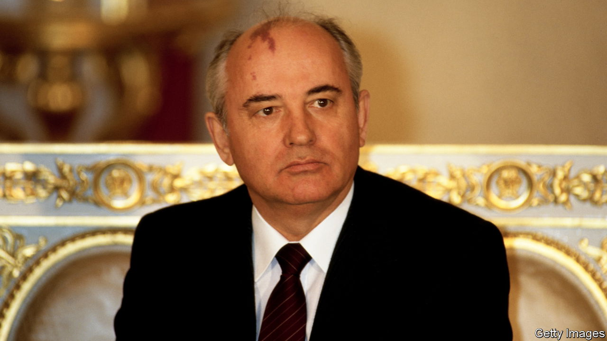

###### The architect of dissolution

# Mikhail Gorbachev did not mean the Soviet Union to end that way 

##### Its last leader died on August 30th, aged 91 

 

> Aug 30th 2022 

The great heroes in Mikhail Gorbachev’s pantheon were two 19th-century socialist thinkers, Alexander Herzen and Vissarion Belinsky, whose main concerns were the dignity of the individual, and whose books he knew almost by heart. When they appeared on the Russian stage, in Tom Stoppard’s trilogy “The Coast of Utopia”, he went to see them. At the end of the performance he was called on stage and given a standing ovation by an audience that, for the most part, had scarcely been born when, in 1985, he became the . 

The (“restructuring” or “reformation”) which he started then never reached the destination he wanted, a democratic, humane socialism—perhaps because that destination was Utopia, rather than a real place. To the elite of modern Russia, he seems an oddity if not a traitor: a fool who brought about the collapse of the Soviet Union and made no money out of it. He had power, a comfortable life and the fate of hundreds of millions of people in his hands—and he let it all go when, on December 25th 1991, he resigned as president of the Soviet Union. 

He had spent eight hours in a meeting with Boris Yeltsin, Russia’s president and his bitter rival, discussing the transfer of power. Afterwards, he went to lie down in his office—for the last time. When Alexander Yakovlev, his closest comrade, walked in, he saw tears in Mr Gorbachev’s eyes. “You see, Sasha,” said the president, “this is how it goes.” 

He had not meant the Soviet Union to die like that. The man who ended the cold war, who changed the course of 20th-century history, was neither a dissident nor a revolutionary. He intended to reform the Soviet Union, not destroy it. But his aversion to violence and his belief in the Enlightenment were enough to finish a system held together by repression and lies. 

He was born in 1931, soon after Stalin had seized complete power and launched the collectivisation which would eliminate the peasantry. He grew up in the south of Russia, a rich agricultural region inhabited by Cossacks who had never known serfdom, in a village called Privolnoe, which means “free-willed”. One of his grandfathers hung Orthodox icons; the other preferred portraits of Marx and Lenin. Like many of his generation, he preserved a peasant’s common sense and caution. He also had the physical strength of someone who had worked the land from an early age. 

It was those sensibilities and human instincts that, years later, allowed Ronald Reagan to see in him not just a Marxist-Leninist, but someone with whom he had a lot in common. Both were self-made men who started in small farming communities, both believed in decency, both embodied the optimism and confidence of the post-war years. The end of the cold war was determined as much by his affinity with Reagan as it was by the inadequacy of the Soviet economy. Since he was more concerned with improving the living conditions of his countrymen than with the status of a superpower (which he took for granted), he saw no sense in continuing an arms race. 

It was the logical conclusion of a journey that began with the death of Stalin. When Nikita Khrushchev denounced Stalin’s cult of personality in 1956, Mr Gorbachev was one of the young party leaders who had to spread the message among rank-and-file Communists. Clearing socialism of the distortions of Stalinism was to be his life’s work. He came to power with no plan or programme of reforms: only, after 18 years of stagnation, the simple conviction that “We can’t go on living like this.” Instead, he offered the Soviet Union youth, energy and—freshest of all—humanity.

 began with a bad omen: . The accident, which the government tried to cover up, epitomised its dysfunction, arrogance and disregard for human life. Now, seizing his chance, he condemned a system “penetrated by servility, bootlicking, persecution of those who think differently, window-dressing, personal connections and clans”. In its place he offered , openness. This, he told colleagues, was the true socialism. 

In that spirit, in 1989 he declared the first-ever competitive elections to the Supreme Soviet. He also agreed that its debates should be televised for the first time. Millions of people saw Andrei Sakharov, a dissident physicist whom he had recalled from exile, openly challenge him. In those few days the political monopoly of the Communist Party was broken, along with the mystery of its power. 

This was also a signal to all its parts that the Soviet Union was dissolving. In early 1991, desperately trying to hang on to the country, he fatally aligned himself with the forces of repression, sending Soviet tanks into Lithuania. A few months later the same kgb-led forces mounted a coup and put him under house arrest in Crimea, where he was on holiday. When the putsch collapsed and he returned to Moscow, he chose to go home to care for , who had suffered a stroke, rather than to play a public politician. 

In his unconcealed affection for his wife, he violated the code that demanded of Russian rulers a complete abnegation of private life. But then again, putting private life above the ephemeral interests of the state was his main credo. Leaving office was not the end, as it had been for most of his predecessors. And unlike his successors he had nothing to fear, no wealth to hide. In the first years after his resignation he did commercials for Pizza Hut to make money. By the standards of today’s Russian elite, he was a poor man. The money from his 1990 Nobel peace prize was used to set up , Russia’s liberal newspaper.

When Raisa was diagnosed with leukaemia, he accompanied her to a German clinic to hold her in his peasant’s arms. Soon after burying her, he appeared at a backstage party at the Moscow Art Theatre. An actor called on the ex-president to read or sing something. Everyone froze with embarrassment, except Mr Gorbachev. The crowd gave him space, and he sang Lermontov’s poem, “Alone I set out on the road. The flinty path is sparkling in the mist.” ■


Novaya Gazeta

