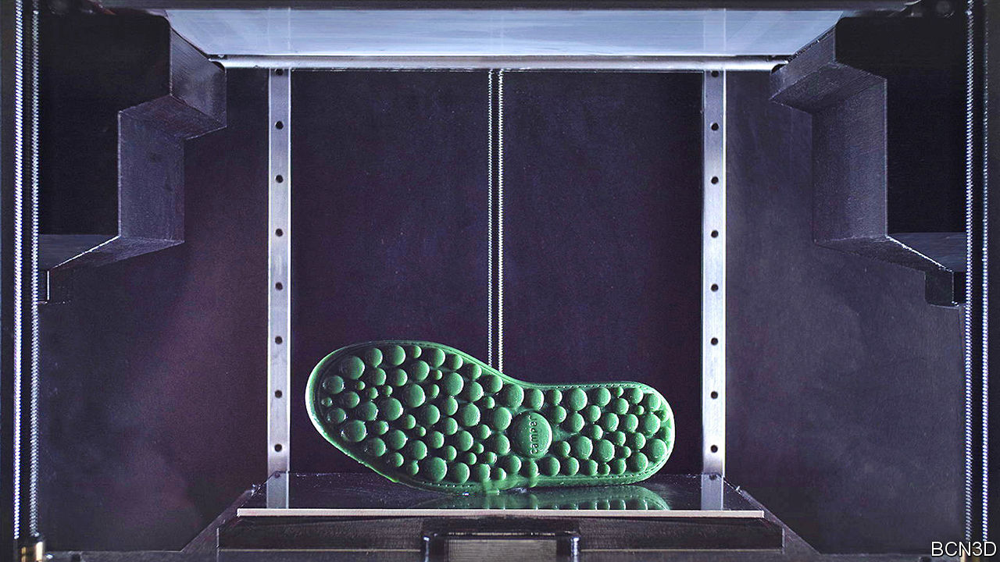

###### Additive manufacturing

# A gooey way to 3D print plastics 

##### Use high viscosity resins and alternate layers 

 

> Aug 31st 2022 

The use of plastics for mass production traces its roots to the 1860s and John Wesley Hyatt, a printer from Albany, New York. Hyatt was responding to the offer of a $10,000 reward to anyone who could come up with an alternative way of making billiard balls—which were, in those days, carved out of ivory, a commodity becoming in short supply. His solution was to form them by pumping a molten synthetic plastic called celluloid into a mould. 

Although Hyatt appears never to have received the prize, the process he invented, injection moulding, became the way in which most plastic items are made. At least they were until the emergence in the early 1980s of additive manufacturing, popularly known as 3d printing. Machines that can print things in plastic have become ever more capable, turning out objects ranging from toys to medical implants, and components for cars, drones and aircraft. 

Another advance is now in the making. bcn3d Technologies, a Spanish producer of 3d printers, has developed a new form of plastic printing which it calls viscous lithography manufacturing (vlm). From an initial 500 firms said to be keen to try the idea out, bcn3d has whittled the number down to 20 large manufacturers from industries such as carmaking, electronics and engineering. These are now working on potential applications at the company’s base in Barcelona. The plan is that early next year they will install vlm machines at their factories around the world before the printers go on general sale in 2024.

3d printers can make plastic objects in several ways. One widely used technique involves an extrusion head tracing lines of molten polymer onto a so-called build plate. Once the first layer is done, the plate moves down a tad, a second layer is added on top of the first, and so on. More recent machines project a pattern of ultraviolet (uv) light into a vat of photosensitive liquid resin to cure and solidify the layers required to create an object. A build plate then steadily pulls the object out of the vat. 

It is this second approach on which vlm is building, as it were—though the process works more like an upside-down screen printer. The machine consists of a pair of liquid-resin reservoirs, one each on either side of a build plate. Above all of these sits a transparent screen that shuttles back and forth. When one side of the screen is above a reservoir a roller coats its underside with a thin film of resin. At the same time, the adjacent side of the screen, having already been coated at the second reservoir, is positioned over the build plate. 

The plate then rises to make contact with the resin film on this part of the screen. A pattern of uv light from an lcd is projected through the screen from above to cure the resin in particular areas, allowing a complete layer to be solidified in one shot. As the build plate is lowered it peels this layer away. The peeled part of the screen then slides back to its reservoir, where any unused resin is recovered to be reused, and the newly coated other side of the screen is subjected to the same process of uv curing and peeling. And so the process continues, back and forth, until the object is complete. 

One benefit of printing in resins is that they produce finely detailed, high-quality plastic parts. A drawback is that they can be brittle. It is possible to mix additional materials into resins, to improve strength, for instance, or to add flexibility. But, a bit like adding more ingredients to a cake, this thickens the mixture, which can make the resin difficult to print. The vlm process, however, can cope with this because, as Eric Pallarés, the company’s chief technology officer, explains, it is designed from the get-go to use much thicker resins.

The two reservoirs can also be filled with different resins, allowing more complex construction. This would permit, say, a soft-touch surface to be added to a rigid switch. Strength could be achieved by mixing in filler materials made from the shredded remains of previously printed objects. Alternatively, a soluble material could be printed, to support delicate structures during construction, and these supports could then be washed away. At the moment, support structures often have to be added and removed laboriously, by hand.

Ejecting injection

So far, vlm is proving roughly ten times faster at making things than most other forms of plastic printing, claims Mr Pallarés. And the size of objects which can be produced is limited only by the size of the lcd used to project the image of each layer. As with most 3d printers, including those which use different processes to print metals, vlm is capable of making complex structures that are difficult or impossible to fabricate with conventional production methods such as injection moulding.

Injection moulding is also uneconomic when it comes to producing low volumes, because the precision-engineered moulds it requires can cost several hundred thousand dollars to make. That does not matter if those moulds are being used to make huge numbers of things, but for small batches the cost is prohibitive. 

Additive manufacturing, however, thrives on low volumes of production, because 3d printers run on software, which is easier and cheaper to change than physical moulds. When it comes to making millions of cheap and cheerful plastic things, Hyatt’s invention is likely to retain its edge for a while. For more bespoke items, additive manufacturing is just getting better and better. ■


