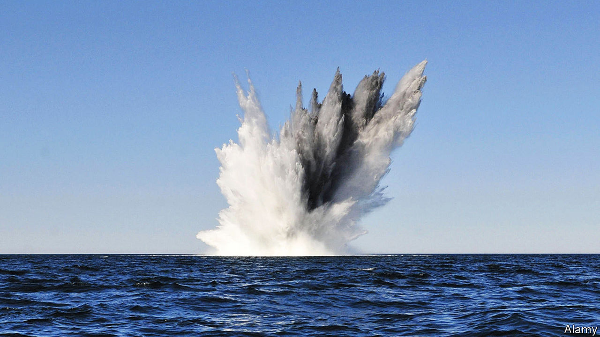
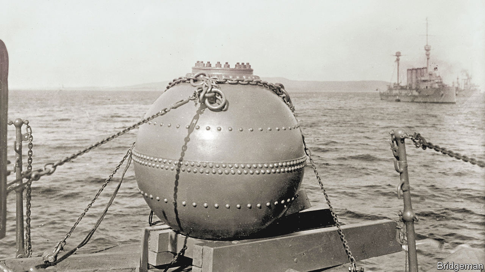

###### Naval mines

# Mines are the neglected workhorses of naval strategy 

##### They are cheap to deploy and expensive to get rid of 

 

> Aug 31st 2022 

The sexy end of modern naval forces, observes Duncan Potts, a retired vice-admiral in Britain’s Royal Navy, is stuff like guided-missile destroyers, fast jets and nuclear submarines. But it is often a far humbler device, the naval mine, that does much of the damage. During the second world war, these static underwater bombs are reckoned to have sunk 2,100 vessels. Not as many as the 4,600 accounted for by submarines, but far more than attacks by aircraft or artillery bombardment by other ships. Subsequent conflicts have seen mines cripple or send to the bottom nearly four times as many American warships as all other types of weapons combined. 

In the latest phase of the conflict between Russia and Ukraine, mines struck early. Fighting started on February 24th. Eight days later, on March 3rd, the m/v , an Estonian cargo ship, hit one near Odessa, the largest port controlled by Ukraine, and sank. Another victim, reported on July 2nd, was a d-106 landing craft belonging to Russia, which was sunk, apparently, by a Russian-laid mine.

Both Russia and Ukraine have laid mines in the Black Sea. These are generally anchor mines, tethered to the seabed and floating just out of sight, beneath the waves. Most are old Soviet models and are, reckons Gokhan Ozcan of Kosder, an association of shipowners in Istanbul, unlikely to destroy craft much bigger than the m/v , which was a mere 79 metres long. However, as he notes, an additional hazard is that some of them have broken free of their tethers and are now adrift.

What lies beneath

In April Turkey’s navy began to scan the Black Sea for drifting mines by flying tai Anka drones carrying a synthetic-aperture radar system made by Meteksan Defence, a firm in Ankara. This can detect floating mines through fog and clouds, and even at night. America’s navy, for its part, employs equipment called the Airborne Laser Mine Detection System, which uses laser pods suspended from helicopters to locate mines at or near the surface.

Detecting mines that sit on the sea floor is harder than looking for anchor mines, for the water above them absorbs both radar waves and light. Moreover, volume for volume, such mines can pack in extra explosives, since they need not sacrifice a proportion of their internal space to the air required to provide buoyancy. The explosion of a deepwater mine creates a physical phenomenon called a bubble jet, which then shoots to the surface. Such a jet can punch through a hull in the fashion of a shaped charge piercing armour. On top of that, the upward force of a jet’s arrival may lift up a ship, and then drop it, breaking its back. The seabed, therefore, is where mines are increasingly deployed. Such benthic sleepers, which may be triggered magnetically or acoustically, are known technically as influence mines. 

Magnetically triggered influence mines detect the hulls of ships passing above them. Each type of vessel has its own magnetic signature, depending on the distribution of the steel used in its construction. If the signature of a passing craft matches one held in a library of target signatures stored in the mine’s memory, it starts to pay attention. Its software works out from the signal’s details whether and when the target is directly above it. At the appropriate moment, it detonates. 

Acoustic mines, triggered by the noise of a vessel’s passage, work similarly, except that the library is of the sounds emitted by passing vessels. Like magnetic mines, the acoustic variety can be given precise instructions about what and what not to attack, for even small differences between vessels can result in sufficiently distinct signatures for a mine to tell them apart. Some mines, indeed, can be programmed to attack not merely a particular class of vessels, but an individual warship.

Both sorts, moreover, can be switched between passive, listening mode, and active, destructive mode. They may be activated, usually by the broadcasting of an acoustic activation code, when hostilities have begun, and then deactivated temporarily when friendly ships are in the area. 

Countermeasure for measure

Anchor mines are often “swept” using a cutting cable bearing explosive charges intended to sever their connection with the seabed. Since mine tethers are a lot thinner than these cutting cables, that explosion leaves the cutting cable intact. Mines thus liberated bob to the surface, where they can be destroyed by a deck gun, or by plastic explosives attached to them by divers. The cutting cable may be strung between two mine-clearing vessels known as minesweepers, or held taut off the side of a lone minesweeper by a device called a paravane (in essence, an underwater kite). 

Influence mines are swept not by cables, but by broadcasting misleading influences at them once they have been detected by minesweepers’ cousins, minehunters. One way to trick acoustic mines into premature detonation is to employ towed devices that imitate the signatures of warships. Patria, a Finnish and Norwegian company, has developed a version of this idea called sonac acs. It can emit either pre-recorded or synthesised sonic signatures. The system, the firm claims, produces frequencies from infrasonic to ultrasonic that are “essentially capable of effectively simulating any ship”. In the past year Patria has announced sales to the navies of Belgium, the Netherlands and Norway. Magnetic mines can similarly be fooled by towed devices containing coils tuned to mimic the magnetic signatures of potential targets. 

There is a rub, however. Engineers have taken to equipping influence mines with delay clocks and counting devices. The former keep a mine dormant until a predetermined moment. The latter detonate after registering a certain number of passes by potential targets. This means they may be triggered by a ship once a minehunting team has left the area.

Minehunting itself is generally done using sonar. “Pinging” the sea floor with acoustic waves and recording signals that bounce back allows software to create an image of what is down there. Recent advances have been impressive, says Tom Reynolds, once a special-operations officer who neutralised mines for America’s navy. A decade ago, he says, towed minehunting sonar arrays were of dubious value beyond 50 metres or so to either side. Sonar systems sold to navies today by hii Unmanned Systems of Newport News, Virginia, where Mr Reynolds is now in charge of business development, manage eight times that distance. In part, they do this by using lower frequencies, which are more readily transmitted through water.

Nor need detectors of this sort be towed. They can instead be fitted to uncrewed underwater vehicles (uuvs). During the American invasion of Iraq in 2003, a conflict in which Mr Reynolds practised his skills, America’s minehunting uuvs relied on a navigation system which he describes as “pretty rudimentary”. It required a uuv to triangulate its position by listening to signals from a network of transponders that had to be placed in the water beforehand for the purpose. hii’s latest version, the remus 300, by contrast, has an inertial-navigation system on board. It can dive to 305 metres and travel up to 165km from its mothership.

 


Other firms are even more ambitious. Saab, a Swedish company, and Raytheon, an American one, are both developing uuvs that not only detect mines, but then go on to destroy them. Saab delivered the first of its Multishot Mine Neutralisation System to France’s navy in May. Raytheon’s version, dubbed Barracuda, is scheduled for deployment by 2026.

Even with such “seek and destroy” uuvs at their disposal, though, minehunters will continue to find their job tricky. Engineers have now taken to disguising mines so that they look like rocks, or are encased in glass-reinforced plastic that absorbs sonar pings. Meanwhile, efforts to develop chemical “sniffing” systems which can detect mine-derived explosives in seawater have so far failed.

Animal crackers

To better appreciate the technological challenges in finding mines, consider that America’s navy still uses trained dolphins. These animals employ a biological version of sonar to detect prey—sending out a series of clicks and listening for reflections. In this context the air-filled swim bladders that bony fish have evolved to preserve buoyancy are particularly reflective, and thus noticed by them.

Conveniently, influence mines also contain air pockets, for their electronics must be kept dry. This allows dolphins to find even those buried in sediment. The animals are rewarded with fish after they release a float to mark a mine’s location.

Units like the Mark 7 Marine Mammal System, as the navy refers to one of its dolphin operations, are transported all around the world, an undertaking involving aeroplanes and helicopters that helps illustrate the stark asymmetry in cost between mines and antimine countermeasures. Countermeasures are expensive. But mines are cheap.

They can, in fact, be very cheap indeed. Cameron Watson of Dryad Global, a consultancy in London that issues alerts on mine risks, observes that Houthi rebels in Yemen augment the factory-made mines they receive from Iran to attack Saudi commercial shipping with makeshift ones. He describes these devices as “tin cans filled with explosives”. But they work.

Mines are also easy to deploy. Large numbers can be dropped into the water quickly, from aircraft and even from fishing boats. Some models, such as the Swedish-made bgm-100 Rockan, are shaped to glide as they sink, which renders the tracking of minelaying craft less useful. Neil Hodges, once head of testing for the Australian navy’s minehunting programme and now a director of BlueZone Group, a mine-countermeasures firm based near Newcastle, New South Wales, observes that a belligerent would probably also toss into the water oil drums, refrigerators and other decoys. You would have to “go and investigate every single one”, he says. 

Some mines can even move around. General Dynamics Mission Systems, an American defence contractor, is developing one called the Hammerhead Encapsulated Effector. This would sit on the sea floor and launch, at an appropriate moment, a torpedo to attack an enemy submarine. China’s em-56 “self-navigating mine” is ejected from a submarine and travels to a target area, such as a port, where it settles and waits. Scott Truver, once an official at America’s defence department and now with ManTech, an American military-technology firm, says America’s navy intends to develop a “flexible minefield” capability. This would involve mobile mines that communicate acoustically with each other and then change positions as needed, be it for a better chance to strike the enemy or to disperse if mine-clearing vessels arrive. 

Then there are rocket mines. These shoot up from the deep and explode near the target vessel, like a depth charge in reverse. Russia’s pmk-2 can reportedly be laid on the sea floor 2km down. Chinese military writings suggest that a rocket mine which would pop out of the water to hit helicopters could be in the works.

On March 27th 1945 American bombers began to drop large numbers of mines in waters near Japan. In mere months, Operation Starvation, as the campaign was called, crippled or destroyed some 670 Japanese vessels, a tenth of which were warships. As Tamura Kyuzu, head of Japan’s minesweeping efforts at the time, put it after hostilities had ended, America “could probably have shortened the war by beginning earlier”. Though there have been big technological advances in both mines and mine countermeasures since then, that is something which naval strategists would still be wise to keep in mind. ■


