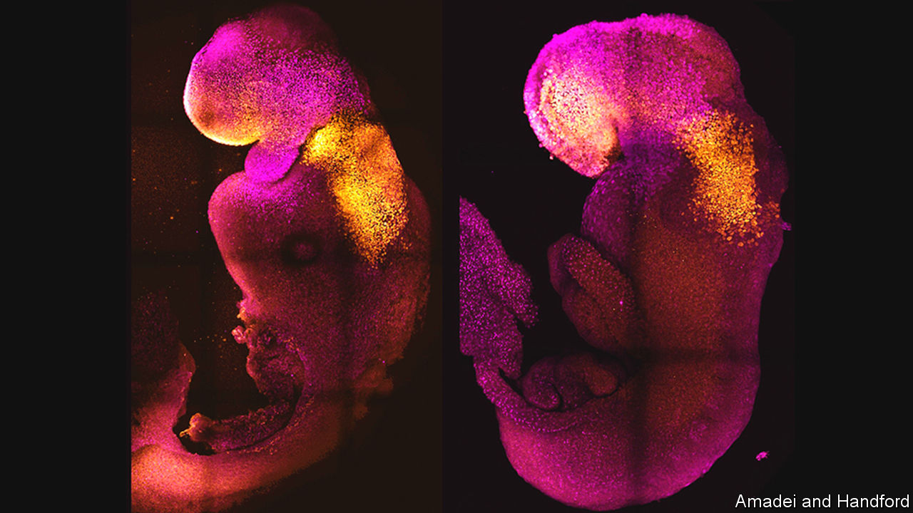

###### Synthetic embryos

# Mouse “embryoids” can now be grown from stem cells 

##### They have incipient brains, hearts and guts 

 

> Aug 31st 2022 

These two pictures are of 8.5-day-old mouse embryos. The right-hand one was conceived in the normal way, by a sperm fertilising an egg. That on the left was grown from stem cells and then transferred to an artificial womb by a team led by Magdalena Zernicka-Goetz of Cambridge University, one of two groups who have reported creating such synthetic “embryoids” in recent weeks. The other group is led by Jacob Hanna of the Weizmann Institute, in Israel, who developed the womb. Blastoids and gastruloids mimicking earlier stages of embryonic development have been grown in the past. Embryoids carry the process yet closer to the creation of a viable synthetic animal, which, if the stem cells in question were derived from the body cells of another, would be a clone of that individual. 


