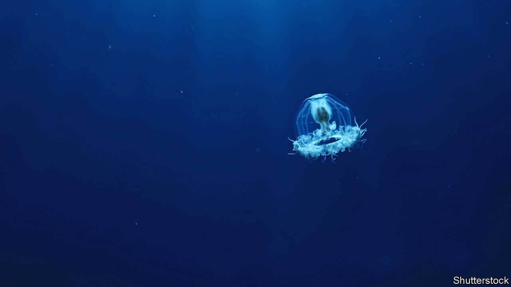

###### Senescence

# The genes of a jellyfish show how to live forever 

##### The problem is that it requires a complete bodily metamorphosis 

 

> Aug 31st 2022 

Billionaires seeking eternal life (and sponsorship of startup companies in this field suggests there are several of them around) could do worse than study , known colloquially as “the immortal jellyfish”. It is not quite literally immortal. Individuals of the species do die. But those that live long enough can rejuvenate and, having done so, go through their whole lifecycles again. And again. And again. 

As is true of most jellyfish, that lifecycle includes a sedentary, asexual stage, known as a polyp, and a swimming, sexual stage called a medusa. Larvae produced by sexual reproduction then develop into the polyps of the asexual stage. But can generate polyps in another way, as well, by the reduction of a post-reproductive medusa to a cyst that then gives rise to one. 

Pulling this trick off does, though, involve a lot of genetic jiggery pokery. And that is the subject of a study just published in the  by Maria Pascual-Torner and Dido Carrero, of Oviedo University, in Spain, and their colleagues. By comparing the genome of  with that of a related, but mortal species, , and also studying which genes are active during the process of rejuvenation, they have been able to identify some of the dna that gives  its age-defying abilities.

Why animals become more decrepit with time, despite having repair mechanisms, is most easily explained by what is known as disposable-soma theory. This starts from the observation that regardless of how well it is maintained throughout the years, an individual organism is one day going to be killed by a predator, a disease, a rival or an accident. Natural selection will therefore favour a successful youth over a successful old age, since the latter may never arrive. Repair is thus good enough, rather than perfect.

The result is that animals which do manage to get old suffer the consequences of their earlier exuberance. These include breakdown of dna-repair mechanisms, oxidative damage caused as part of the chemical process of respiration, degradation of the structures, called telomeres, that cap a cell’s chromosomes and loss of so-called pluripotent stem cells, which permit the repair of damaged tissues. Rejuvenating this lot is a big project. 

To begin their investigation, Dr Pascual-Torner and Dr Carrero identified 1,000 genes from s genome that are known, in other species, to regulate aspects of ageing such as those listed above. Comparing these with the genome of  they identified 28 genes that had different numbers of copies in the two species, and thus, presumably, resulted in different amounts of the proteins they encoded, and also ten unique genetic variants.

These differences suggested that  did indeed invest heavily in dna replication and repair, in regulating its response to oxidative stress, in repairing telomeres and in maintaining stem-cell pluripotency. Moreover, many of the genes involved were specifically activated during the transition from medusa to polyp.

There were also changes in genes with activities probably related to guiding that metamorphosis. These included genes regulating the transcription of dna into rna messenger molecules that carry instructions to a cell’s protein factories, allowing a cell to be reprogrammed, and those governing the way cells communicate with each other, which would be important in the wholesale bodily reshaping that the animal undergoes.

Some of this information may well illuminate understanding of the way human beings age. Though the common ancestor of jellyfish and vertebrates predates the Cambrian period, which began about 540m years ago, many of the genes involved are shared by the two groups, albeit with considerable differences.

That said, rejuvenation of the sort  experiences, which involves the body being largely rebuilt, does seem a rather extreme answer to the question, “would you like to live for ever?” ■


