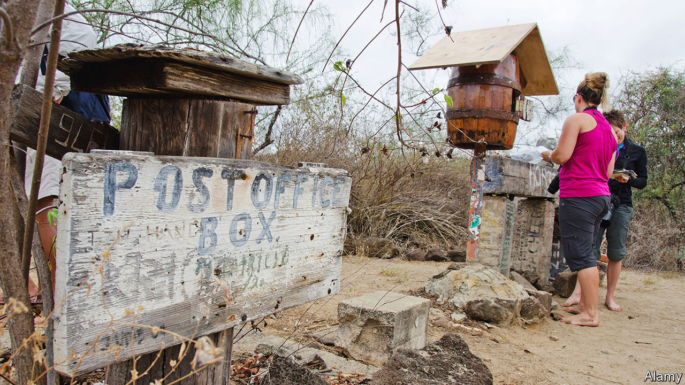

###### Mule got mail

# Ecuador has a backlog of 1m letters and parcels 

##### During the pandemic, the postal service was shut down 

 

> Sep 1st 2022 

Silvia meneses was excited when she ordered some curtains and other items on Wish, a website. That was five years ago. Her parcel has yet to arrive. The experience of Ms Meneses, who runs a sandwich shop in Quito, is a typical one in Ecuador. For years, Correos del Ecuador, the national postal service, was slow and unreliable. During the pandemic, it closed. Ecuador became one of only a few countries not to have a postal service. 

Ecuadorians used to get post, and a fair bit of it. A whiskey-barrel-turned-postbox on the Galapagos islands dates to the 1700s, as a way for sailors to exchange post (these days tourists use it, see picture). What is now the office of the Ecuadorian vice-president was once the post office’s headquarters. Ms Meneses recalls the joys of receiving a letter. 

But the postal service never reached all of Ecuador, with its impenetrable jungle and breath-stealing mountains. Many homes do not have addresses, and not everyone could afford a po Box. Those who could saw a service in decline. Because of steady budget cuts, fraud and exorbitant taxes on parcels, by 2019 Correos captured only 8% of the Ecuadorian postal market (the rest went to private companies). Its lacklustre performance gave Lenin Moreno, then the president, an excuse to shut it down in May 2020.

A service still exists on paper. Mr Moreno forgot that Ecuador is a member of the Universal Postal Union, a un body, and is bound by its convention to facilitate the sending of international post. So in February 2021, just before leaving office, he signed a decree creating a new company. It currently has 84 employees and 24 vehicles, says its manager, Verónica Alcívar (Correos had 422 vehicles). It could be expanded to 250 workers, but that seems unlikely. Instead it has contracted a Colombian firm to deliver a backlog of over 1m letters and parcels. 

Ecuadorians have other workarounds. Unable to receive deliveries from Amazon, an e-commerce giant, they turn to human “mules” to courier goods on planes from the United States. “Christmas is our busiest time of year,” says one civil servant who also runs a successful mule business. He wishes to remain anonymous for tax reasons. 

Documents are trickier. Students wishing to enroll at foreign universities must spend a fortune sending their registration papers abroad. And there can be consequences to not having a postal service. It acts as a “backstop if other systems fail”, delivering medicines, welfare benefits or ballot papers, says Richard John, a historian.

In the centre of Quito, echoes of another way of life remain. Blanca Guaraca, a street vendor, flips through postcards that she sells to tourists. She recommends a post office where your correspondent can post one. It is now a bookshop. When a service is rarely used, it is hard to know when it’s gone.

