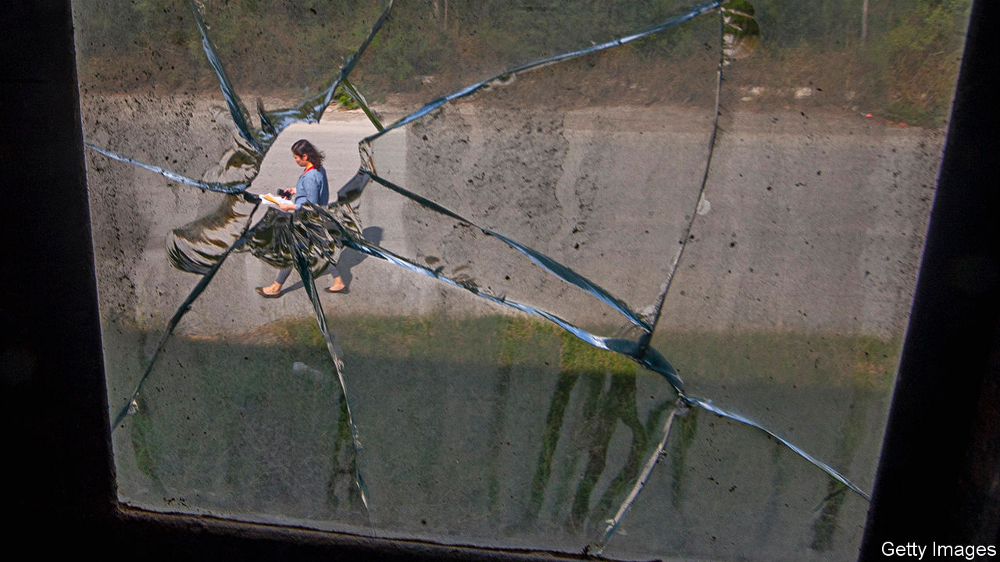
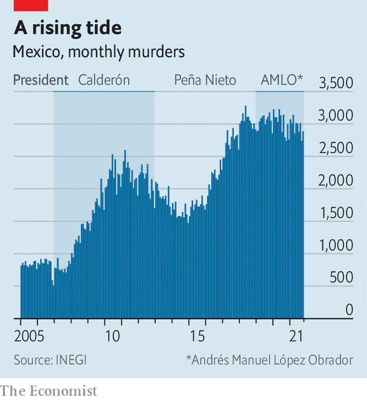
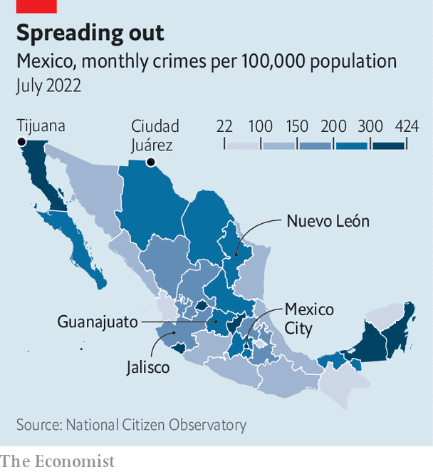

###### Narco nastiness

# Several violent episodes in Mexico suggest a worrying trend 

##### Crime is increasing, despite what the president says 

 

> Sep 1st 2022 

To listen to the Mexican government, criminality is on the wane. “Mexico is a country of tranquillity, at peace, the violence is limited to very few regions,” President Andrés Manuel López Obrador declared earlier this year. Officials boast about a fall in murders and kidnappings since he took power at the end of 2018.

This narrative looked shaky in August when violence flared in four of Mexico’s 32 states, leaving at least 260 people dead. In Ciudad Juárez a fight between two gangs in a prison spilled out into the city. In Tijuana, Guanajuato and Jalisco gangs burned cars and shops, possibly in retaliation for the attempted arrest of one of the leaders of the Jalisco New Generation Cartel, known by its Spanish acronym, cjng. 

Mexico has long been a violent place. Its position between the coca plantations in Colombia, Peru and Bolivia and consumers of drugs in the United States makes it a natural centre for crime. The flow of guns from its northern neighbour does not help. By some estimates, 200,000 guns are illegally shipped into the country each year. 

The events last month were not an anomaly. Recent statistics make for grim reading. Murders may have fallen by 3.4% between 2020 and 2021. But other crimes that involve killings are on the rise. 

Between 2006 and 2012 an average of eight people “disappeared” each day (many of whom were probably murdered). Now the daily average is 25. Mexico’s murder rate is 28 per 100,000 people. That is four times the murder rate in the United States. Polls show Mexicans are more concerned about violence than any other matter. In 2021 the cost of violence in Mexico was estimated by the Institute for Economics and Peace, a think-tank, to be 4.9trn pesos ($243bn), around a fifth of gdp.

Part of the reason for such violence is that the number of gangs, which are responsible for most murders, more than doubled in the decade to 2020. Now there are 205, according to the International Crisis Group, a think-tank. Their reach has expanded across municipalities. They are more powerful and confident, too. cjng has paraded high-grade military gear, including armoured vehicles and drones. Gangs are no longer just drug-peddlers. They traffic people, steal oil and control the markets for avocados, tortillas and chicken in some states.

Mr López Obrador describes his approach as “” (hugs not bullets). His bet is that generous cash handouts, such as a monthly payment of 5,258 pesos to poor youngsters who enroll in an apprenticeship programme, will bring down crime. That aside, his policies are contradictory and often ineffective. 

For a start, he tends to place all the blame on previous presidents. And in one sense he is right to: the policy of taking out drug kingpins, started by Felipe Calderón during his term as president from 2006 to 2012, had the consequence of fragmenting gangs. But for all the faults of the past administrations, at least they had a strategy, says Evan Ellis, a security specialist. By the end of Mr Calderon’s six-year term, the murder rate was falling, from 24 per 100,000 people in 2011 to 22 in 2012. That continued into the term of Enrique Peña Nieto, falling to 17 per 100,000 people in 2014, before rising again.

On coming into office Mr López Obrador dismantled the federal police, deeming it corrupt, and set up a new body called the National Guard. It is made up mainly of soldiers and marines who were given little training in civilian law-and-order, and lack the investigative and forensic nous of the police. As a result, it is fairly ineffective. With more than 100,000 members, it arrested just over 8,000 people last year. By contrast in 2018 the federal police, who at most numbered 38,000 officers, arrested 22,000. In the first 18 months of Mr López Obrador’s term no one was convicted of murder, claims Francisco Rivas of the National Citizen Observatory, an ngo. (No public data have been published to back up this claim.)

And despite his talk of hugs rather than bullets, the president has boosted the numbers of soldiers on the streets. The average number deployed so far during his term is 73,347, compared with 53,000 during his predecessor’s term and 48,500 during Mr Calderón’s. On August 8th he announced he would issue a decree to bring the National Guard under army control. But at the same time, the president has ordered security forces to take a hands-off approach when dealing with criminals.

Mr López Obrador has slashed budgets for domestic security and justice. Yet Mexico spends just 0.63% of gdp on security, the lowest in the oecd, a club of mostly rich countries. Spending on the army has risen under Mr López Obrador, to 104bn pesos, almost double the amount a decade earlier. But that does not reflect an increasing interest in public security: Mr López Obrador has given the army ever more tasks, including building airports and banks. Attorneys-general, at the federal and state levels, who are being asked to do the bulk of investigative work, have also seen their budgets cut.

 


The president’s prickly nationalism may also have made things worse. In 2020 Congress passed a law that requires foreign agents to share all intelligence with Mexican officials. This law, most likely aimed at the dea, the United States’ drug-enforcement administration, has made it difficult to operate because foreign governments cannot be certain their Mexican counterparts will not pass on information to the gangs themselves (as appears to have happened in a few cases). 

Corruption is a worry because the municipal police are so underpaid. Many work for the gangs. Estimates, using data collected by Mexico’s statistics agency, suggest 86% of reported crimes go unresolved. “That tells people they can do whatever they want,” says María Elena Morera of Common Cause, another ngo.

High-profile arrests in the past six months may herald a change in the president’s approach. El Huevo, a suspected drug lord, was arrested in north-eastern Mexico in March. In July Rafael Caro Quintero, who is considered responsible for the murder of a dea agent, and who was the grisly inspiration for the Netflix series “Narcos: Mexico”, was captured. More kingpins are being extradited to the United States, too. “Mexican forces are now doing surgical strikes rather than hitting around blindly,” says Eduardo Guerrero of Lantia Intelligence, a crime-tracking outfit. A law which came into effect in the United States on August 24th seeks to crack down on unregulated private sales of guns, which may also help reduce the number of American guns going south of the border.

But even if he wants to get tougher on crime, Mr López Obrador will find it tricky. In 2019 he undermined his authority to make arrests when he buckled to pressure after the armed forces captured a son of El Chapo, a former leader of the Sinaloa Cartel. In retaliation gang members rioted in Culiacán in north-western Mexico, and within hours Mr López Obrador ordered his release. Mr Guerrero reckons the recent violence was intended to send a similar message to the government to back off. 

 


Rampant violence does not have to be the norm. Between 2012 and 2021 the northern state of Nuevo León managed to reduce crime after its richer citizens helped fund a security plan that included firing corrupt police officers and creating a new, well-paid force to replace soldiers on the streets. It also co-operated with two neighbouring states on security. 

Mexico City has crime under control, too. The local mayor, Claudia Sheinbaum, a close ally of the president, has raised wages for police officers and improved street lighting. Murders fell in the capital by 34% between 2018 and 2021. Ms Sheinbaum is often touted as a potential successor to Mr López Obrador once he steps down from office in 2024. But by then, violence in Mexico will probably be worse. ■

 

