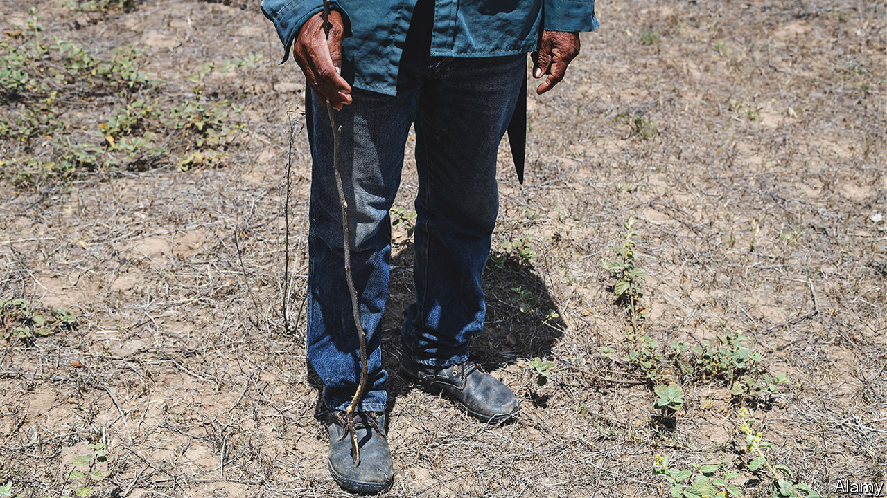

###### Dusty weather

# Traditional farming practices are being boosted in Guatemala 

##### The lack of viable economic alternatives means many want to move north 

 

> Sep 1st 2022 

Up in the hills of central Guatemala the midday sun has burned through the thin layer of clouds. In the valley below, a grid of dusty streets and breeze-block houses mark out Rabinal, a small town at the heart of Central America’s drought-stricken dry corridor. But the tops of the hills are lushly verdant, crested by the last remnants of an ancient forest. A group of youngsters want to keep it that way. 

Every week, half a dozen teenagers and 20-somethings from the local indigenous community, the Maya-Achi, pile into a truck and climb up pothole-ridden roads to reach small farms nestled into the hillsides. Some days they fill the truck with hundreds of infant trees. On others, they haul up bags of native seeds. 

But their mission, and that of the small ngo for which they work, , remains the same: boosting “agroecology”. This is a type of farming which mixes indigenous practices with techniques to buffer crops against the effects of climate change. For 14 years the ngo has been encouraging crop diversification, reforestation and the use of natural fertilisers. In doing so, the Maya-Achi youngsters hope to provide opportunities for Guatemalans, other than migrating north. 

Most residents of Rabinal can still remember a time before extensive droughts gave meaning to the term “dry corridor”. Until two decades ago cool winds would roll in off Guatemala’s Pacific coast each year, depositing rain. But as global temperatures began to rise, and the oceans sandwiching Central America grew warmer, the reliability of that cycle began to break down. The clearing of vast tracts of forest to make way for big farms, mines and settlements further limited rainfall. Lack of land reform, and the legacy of state violence towards the Maya-Achi in the 1980s, have compounded problems.

In recent years, subsistence farmers—who make up 62% of households in the dry corridor—have lost between 50% and 80% of their harvests to crop failure. Over 800,000 Guatemalan migrants have been apprehended at the United States border since 2019. The World Bank thinks that 4m internal migrants will leave the dry corridor, out of a population of 11m, by 2050.

About 500 families around Rabinal have taken up agroecology. In the hamlet of Xesiguán, Beatriz Tecú has rejected industrial fertilisers and herbicides for two decades. Those break down the soil structure, increasing the risk of erosion and reducing water retention. Now, along with protecting the leafy trees and native plants that dot her land, she has helped trap valuable groundwater and stopped fertile topsoil from washing away. Her yields are not large, but as the rain diminished, they have never disappeared. 

Similarly, Alfredo Cortez’s farm down the road is dominated by towering groves of banana trees, giant drums of homemade fertiliser and a fish-pond. “Education is with the eyes,” Mr Cortez smiles, “but changing attitudes is complicated.” A surprise storm or particularly long drought could wipe out entire fields, meaning that convincing others to take a gamble on change is not easy. Neither is Mr Cortez’s plot, for all its abundance, an island safe from climate change. “Thirty years ago, you could barely cross the river there,” he says, pointing to a mostly dry riverbed. 

Surveys of farms in Central America, Mexico and Cuba suggest that agroecology can reduce the loss of fertile topsoil and increase soil’s water retention after hurricanes. Similarly, studies of farms that have adopted such practices in Asia suggest reductions in food insecurity. Agroecology “represents a real alternative to migration or starvation for Central Americans who still live off the land,” says Michael Bakal, one of the founders of .

Not all farmers agree. José de Paz, who owns a dry patch of land just past an evangelical church, knows chemicals exhaust the land, but says that after so many years of use, without them nothing will grow. This year the earth in his corn patch is powdery; his rubber boots sink into the ground as he walks. “What will my kids do if things continue this way?” he says. He points to a three-storey house built with remittances sent from the United States. “You can’t build that working here.” ■


