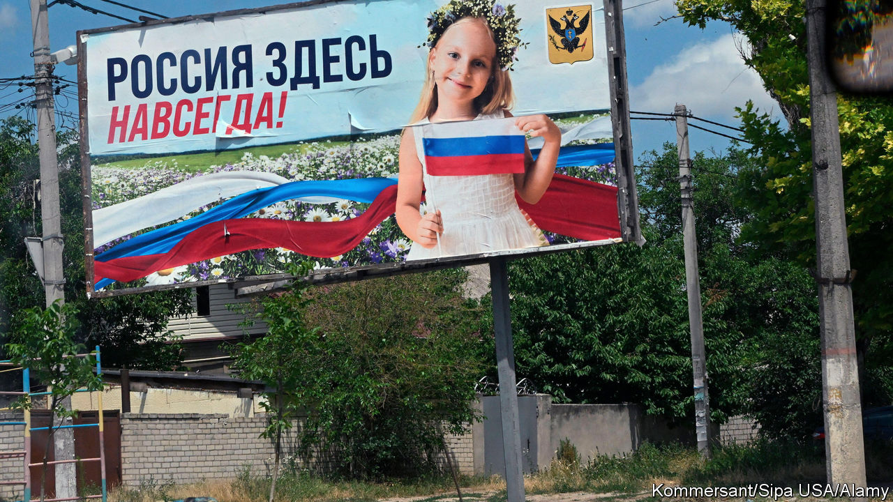
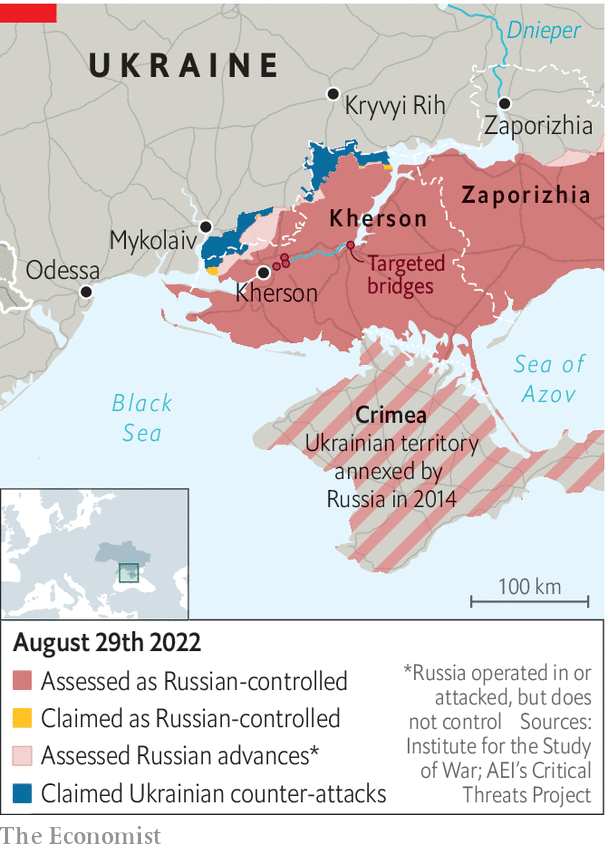

###### The Economist Explains

# Why does Kherson matter? 

##### Ukraine’s southern offensive marks a new phase of the war 

 

> Aug 30th 2022 

On february 24th the Russian army invaded Ukraine. It quickly became bogged down around Kyiv, the capital, but within a week it had captured its first major city: Kherson, the capital of the southern province of the same name. Kherson has been occupied ever since. On the night of August 28th Ukraine launched an offensive towards the city, declaring that “the battle for Kherson has begun.” It is too early to judge how successful these attacks have been. But why does the region matter? 

Kherson is of considerable economic, symbolic and strategic value for Ukraine. Before the war, the region had a population of just over 1m people. Its rich flatlands made it an agricultural powerhouse, providing tomatoes, watermelons, sunflowers and soyabeans. It offered spirited, if brief, resistance to the Russian invasion in the first days of March—so brief that Ukrainian officials suspect treacherous local officials sabotaged its defences. But its main significance is arguably military. As the gateway to both Russian-held Crimea in the south and Ukraine’s Black Sea ports to the west, Kherson is where the success or failure of Vladimir Putin’s war of aggression may now be determined.

 


According to Ukrainian sources 20,000-25,000 Russian troops are thought to be deployed on the west bank of the Dnieper river in and around Kherson city. Many of Russia’s strongest units are deployed in the area, but Ukrainian rocket attacks on bridges have steadily cut off their means of resupply. The current Ukrainian ground attacks appear to be aimed at driving a wedge between two groups of those troops: those in the south-west, in and around the city, and those to the north-east, farther upstream. If the latter could be trapped in a pocket—a cluster of forces isolated from supplies and other units—that could threaten the position of 10,000-12,000 Russians. 

The territory they occupy is also pivotal. Russian troops used Kherson as a springboard to attack the port of Odessa in the first phase of the war, though that advance was stymied around Mykolaiv. Russian generals have said that they remain intent on conquering Odessa, as well as all of southern Ukraine. If Ukraine were to recapture Kherson city, it would block Russia’s path overland to the port. It would also cut off the road north to Kryvyi Rih, the hometown of Volodymyr Zelensky, Ukraine’s president, and a vital industrial hub that generated a tenth of Ukraine’s pre-war GDP. 

Retaking Kherson city and weakening Russian forces there would count as a big success. Advancing farther east would be hard, because it would require Ukrainian forces to cross the river at scale, potentially under artillery fire. But if Ukraine did manage to push into the rest of the province, this would unlock other military possibilities.

Ukraine’s himars rocket launchers and other artillery would begin to threaten Russian supply lines out of Crimea and, perhaps, parts of the Black Sea Fleet. Russian forces attacking north through neighbouring Zaporizhia province, the site of a Russian-occupied nuclear power plant, would also find their left flank exposed to attack. Eventually, if Ukraine were to mount a parallel offensive south from Zaporizhia, it could threaten Russia’s so-called land bridge to Crimea—though that remains some way off.

In short, a successful counter-offensive would reshape the military geography of southern Ukraine. It would have important political consequences, too. Russia has been tightening its grip in Kherson province, introducing a Russian curriculum in schools, offering Russian passports to residents and preparing a sham referendum to pave the way for annexation of the territory. Ukraine is keen to disrupt that process. It is also eager to demonstrate—both to its Western partners, who are providing most of its arms and ammunition, and to the Ukrainian public—that the war is winnable; that Russia can, in fact, be pushed out. The coming days and weeks will be a crucial test of that proposition. ■

