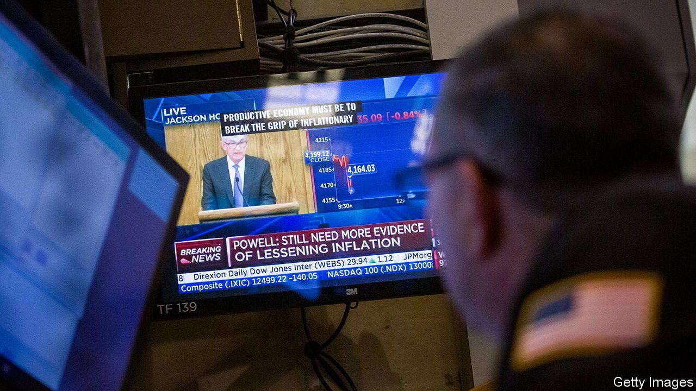

###### The world this week

# Business 

#####  

 

> Sep 1st 2022 

 attending the annual Jackson Hole symposium conveyed a clear, hawkish message on . Jerome Powell, chairman of the Federal Reserve, said he expected the Fed would raise rates throughout next year. Officials from the European Central Bank talked of “sacrifice”, and said that the lessons of the 1970s showed there should be no easing of monetary tightening at the first signs of a dip in inflation. The ecb is expected to lift rates at its next meeting on September 8th. The central bankers warned that higher rates were necessary to tame inflation, even if they lead to recession. 

The stark commitments to carry on with rate increases rattled . The s&amp;p 500, nasdaq composite, Dow Jones Industrial Average, ftse 100 and German dax all fell sharply over a few days, wiping out most of the gains they had made during August’s rally. 

Annual inflation in the  rose to 9.1% in August (it was over 20% in the Baltic countries of Estonia, Latvia and Lithuania). All indicators point to prices rising even more sharply over the coming months. The ecb is now expected to raise its main interest rate by more than half a percentage point. 

Soaring  are a big cause of Europe’s inflation woes, and show no sign of easing amid the disruption to Russian gas supplies. This week Gazprom, Russia’s state gas producer, shut the Nord Stream 1 pipeline again for three days, apparently for more repairs. Gazprom is also set to stop all shipments to Engie, a French utility, in a payment dispute. Meanwhile, Uniper, one of Germany’s biggest utilities, asked for a government increase to its credit line to avoid a liquidity crunch. Wien Energie, which supplies Vienna, warned of difficulties in financing its operations. Amid the turmoil, the European Commission said it was working flat out on an  that would “decouple” gas prices from the electricity market. 

Heating or eating?

In  the energy regulator lifted the price cap on bills by 80%. From October the average household’s annual bill for gas and electricity will rise to £3,549 ($4,117). Companies are not covered by the cap; some said they would go bankrupt.

 


 grew by 7.6% in the second quarter, year on year. The weak lira, a result of the government’s unorthodox economic policies, has boosted exports. But household consumption, up by 22.5% in the quarter, also added to gdp. With inflation at 80%, households have brought forward their purchases to beat further price increases over the coming months. Meanwhile, Turkish authorities raised energy prices for households by an average of 20%, and industry by 50%.

 decided to shed a fifth of its workforce amid a slowdown in digital advertising. The social-media company also warned of slowing revenues in this quarter. 

 in America and Germany seeking damages from  and , for allegedly infringing patents on the mrna technology used in covid-19 vaccines. 

America reached a  with China that will allow American regulators to inspect the  that are listed in the United States. A row over accounting standards had threatened to boot Chinese companies off American exchanges. That threat has receded, although Gary Gensler, head of the Securities and Exchange Commission, said that the new framework was “merely a step in the process”. 

, a Chinese maker of electric cars with global ambitions, reported a big jump in sales and profit for the first six months of the year. The company sold more “new energy cars” in the first seven months of the year than in 2020 and 2021 combined. Nonetheless, byd’s share price swooned after it emerged that Warren Buffett, its most prominent backer, had slightly reduced his stake to 19.9%. 

Honda announced a partnership with lg Energy Solution, a South Korean battery-maker, to invest $4.4bn in building a factory for  in America. lg Energy Solution is expected to benefit from the tax credits provided in the Inflation Reduction Act for companies that lessen the reliance on China for battery components. 

A 90-hour week

People embarking on a career should be prepared to , according to the boss of Bombay Shaving Company in India. Shantanu Deshpande said that employees in their 20s should “worship” their job, and that the work-life balance at that age is “blah”. Those who disagree should speak to his staff, he said. Mr Deshpande’s comments come amid a trend of “quiet quitting”, or doing the minimum that your job requires. “Acting your wage”, as some quiet-quitters put it. 

