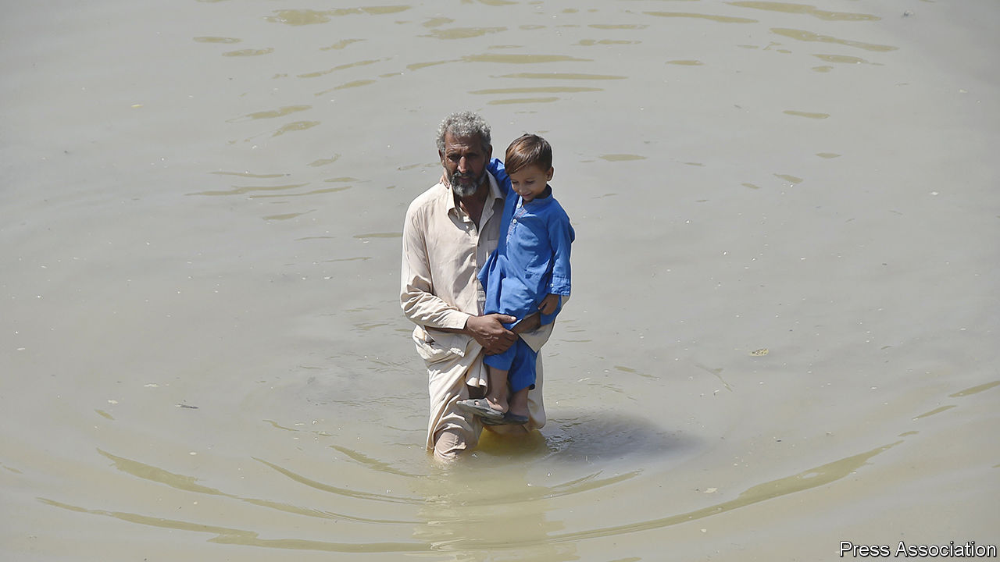
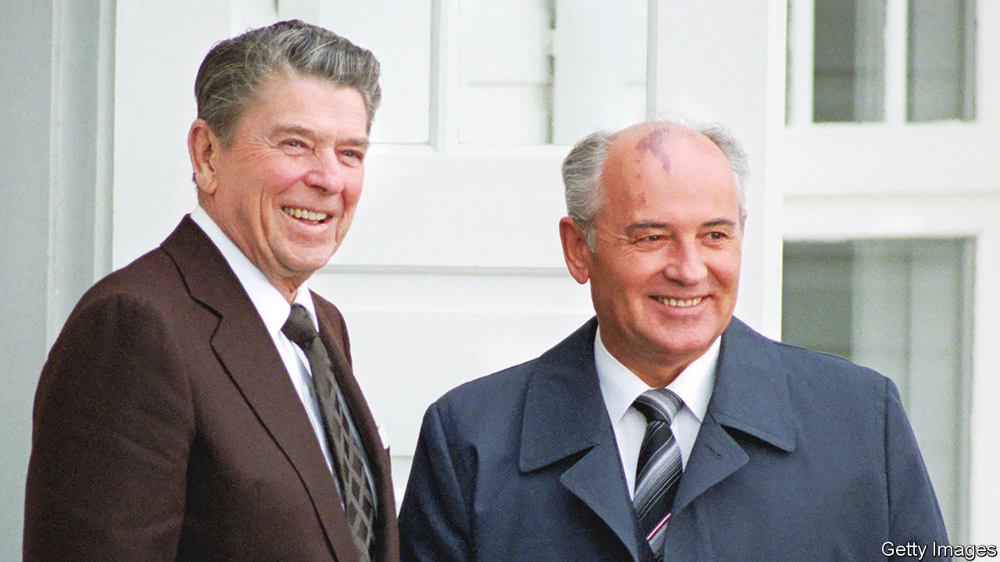

###### The world this week

# Politics 

#####  

 

> Sep 1st 2022 

Exceptionally heavy monsoon rains over two months have caused devastating floods in , killing more than 1,100 people and leaving a third of the country under water. Shehbaz Sharif, the prime minister, said that a million homes have been wrecked and thousands of miles of roads destroyed. The climate minister described it as a “catastrophe”, blaming countries that have become “rich on the back of fossil fuels”. 

Separately, the  approved a $1.1bn payout to Pakistan after the government implemented an austerity budget, which included sharp increases in fuel and food prices amid high inflation. The measures have quickly made the new government unpopular. 

The imf also reached an agreement to provide  with a $2.9bn loan to help it through its worst economic crisis since independence in 1948. As part of the agreement Sri Lanka must implement serious tax reforms. 

We can see you

The un’s human-rights office released a  of China’s treatment of the Uyghurs in . It said China’s actions “may constitute international crimes, in particular crimes against humanity”. It criticised China’s “vague” anti-terrorism laws, which have led to the “arbitrary deprivation of liberty” of Uyghurs and other Muslim groups. And it concluded that allegations of torture, forced medical treatment and sexual violence in detention centres were credible. China dismissed the report as slander.

 shot down a Chinese civilian drone for the first time, having fired warning shots at drones that were buzzing its outlying islands. Earlier, two American warships passed through the Taiwan Strait without incident. It was the first such operation since China staged military drills around Taiwan in response to a visit there by Nancy Pelosi, the speaker of America’s House of Representatives, in early August. 

 Communist Party announced that its five-yearly congress would start on October 16th. Xi Jinping is poised to secure a third term as party leader, in violation of recent retirement norms.

Nicolás Maduro,  autocratic ruler, received  new ambassador to the country. It marks the re-establishment of diplomatic ties between the two countries, which had been severed since 2019. Gustavo Petro, Colombia’s left-wing president, who recently assumed office, has also announced that the border will be reopened, and that military relations may be restored, too.

A truth commission set up by the  government said that six of the 43 students who went missing in 2014 were kept alive in a warehouse for several days. An official at the commission claimed that a local army commander ordered their killings. A week earlier, the attorney-general who oversaw the original investigation into the disappearances was arrested by federal agents.

Supporters of Muqtada al-Sadr, a rabble-rousing Iraqi cleric,  of  government and tried to march on the home of a former prime minister, Nuri al-Maliki, sparking gun battles that killed at least 30 people. The protests come after months of deadlock in which Mr Sadr, whose party won the most seats in elections last year, has been unable to form a government.

At least 32 people were killed and more than 100 injured in clashes between rival militias in Tripoli, the capital of . The government said that the violence broke out when one group of armed men began “firing randomly at a convoy”.

 ruling party, the mpla, which has run the country since its independence in 1975, claimed victory with 51% of the vote in a general election that was widely expected to be rigged. The main opposition, unita, which ostensibly won 44%, rejected the result and has filed official complaints.

Police in  killed 19 people when they fired on a crowd of vigilantes who tried to storm a police station to seize four people arrested on suspicion of abducting a child.

Earning his Nobel peace prize

 


 died in Moscow at the age of 91. The last leader of the Soviet Union helped bring about an end to the cold war, and sharply diminished the threat of a very real nuclear one. Although his landmark summit with Ronald Reagan in Iceland in 1986 ended with no agreement, it led to a breakthrough in arms-control negotiations. At home he brought in  (openness) and  (reform), hoping to revive a dying economy. Lauded in the West, his fellow Russians were aghast at the break-up of their empire. Mr Gorbachev once said that markets were a mark of civilisation, not capitalism. 

Ukraine launched a  against Russian forces in , which abuts Crimea. The offensive began after Ukrainian troops attacked Russia in the eastern Donetsk and Luhansk provinces, diverting Russian resources. Kherson was the first big Ukrainian city to fall to Russian troops in March. 

A team of un inspectors made their way to the nuclear plant, which has endured weeks of shelling nearby. Russian forces have controlled the facility since March, supervising the technicians who have kept it running. The un inspectors hope to assess any damage. 

America’s Justice Department revealed in a court filing that  tried to hide classified material at his home in Florida. During the fbi’s search of the premises some classified papers were found unsecured in his desks. Scores of classified documents were discovered at Mar-a-Lago. It is not yet known which papers Mr Trump had squirrelled away. 

A federal emergency was declared in , after a water-treatment plant near Jackson, the state capital, was shut down because of problems with the pumps. Those who do get water from a tap have been told not to drink it. 

Mary Peltola won a special election for the Democrats to fill the lone seat for  in the House of Representatives, beating Sarah Palin. Ms Peltola ran on a strong pro-abortion platform in a state the Republicans had held since 1973. However, the candidates will contest the seat again in November’s midterms. 

 said it would proceed on September 3rd with a second attempt to launch its Moon rocket, after the first launch was aborted because of an engine glitch. The agency is sending an unmanned capsule on an orbit around the Moon, 50 years after the last Apollo mission. The Artemis programme aims eventually to send men, and women, to the Moon. 

