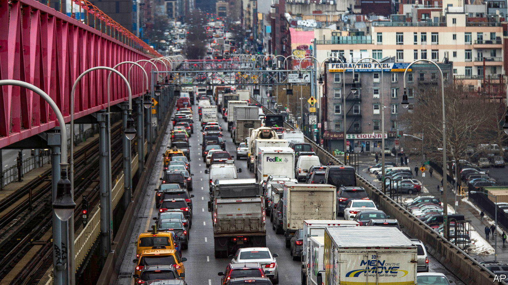

###### Unjamming New York

# America’s most congested city may be on the verge of ending gridlock 

##### Will congestion pricing in New York become a model, or a cautionary tale? 

 

> Sep 1st 2022 

Sam schwartz, best known to New Yorkers as “Gridlock Sam”, has been advocating congestion pricing for five decades. The hope is that charging will discourage people from driving into crammed midtown and downtown Manhattan, and help fund improvements to public transport.

A former cab driver turned traffic engineer, Mr Schwartz tried to introduce congestion pricing to the city in the 1970s and 1980s. William Vickrey, a celebrated economist who drew up the first plans for this in the 1960s, once told Mr Schwarz that it was the “one tried and true method” to reduce congestion. In Singapore, London and Stockholm, which set up zones in 1975, 2003 and 2006 respectively, charging has cut traffic by about a quarter.

After an attempt by Mayor Mike Bloomberg fizzled out in 2008, congestion pricing stalled for more than a decade. At last, in 2019, state lawmakers agreed to implement it south of 60th Street, making New York the first big American city to do so. The law grants exceptions to emergency vehicles, people with disabilities and households in the zone whose income is $60,000 or less.

Now a launch is on the horizon. In August the Metropolitan Transit Authority (mta), the state agency which runs the subway, released seven tolling scenarios, with fees between $9 and $23 during peak hours for non-commercial cars. Lorries may have to pay as much as $82.

New York badly needs a congestion zone. According to inrix, a transport-data firm, it has the worst traffic in America. Average speeds decreased by 22% between 2010 and 2019 in the proposed zone. It can be faster to walk. In 2018 the Partnership for New York City, a business group, calculated that congestion would shave $100bn off the economy of the city and its suburbs over the subsequent five years. New Yorkers forgo on average 102 hours a year due to traffic, or $1,600 in lost productivity.

Yet in recent virtual public hearings on the plans, many voiced concerns. Some dialled in from their cars, including Nicole Malliotakis, a Republican congresswoman from Staten Island. She said congestion pricing was being “jammed down the throat” of her constituents, many of whom rely on cars because the borough is poorly served by public transport.

Cab drivers and delivery workers fear getting charged multiple times. But too many exemptions risk keeping traffic levels high, and making it harder to raise an expected $1bn in revenue—which is to be leveraged to borrow $15bn for the revamping of the mta. New Jersey’s governor, who likens congestion pricing to double taxation for drivers, wants to kill the scheme.

To avoid paying tolls in Manhattan, lorries are likely to use the Cross-Bronx expressway, a congested motorway. That appals Richie Torres, a Democrat who represents the Bronx in Congress. The area is plagued by air pollution and high asthma rates. Nicole Gelinas of the Manhattan Institute, a think-tank in the city, says that if the aim is to reduce congestion by getting more people on public transport, overnight hours—when commuter lines to the suburbs do not run—should be free.

Pricing works best if it can be easily adjusted. New York could charge more when midtown Manhattan becomes chock-a-block during the un’s General Assembly or at Christmas. Mr Schwartz, who coined the word “gridlock” in 1980, is confident most issues will be dealt with by the time pricing is launched, perhaps at the end of 2023. But “I’m not breaking out the champagne until the first car is charged,” he says. ■


