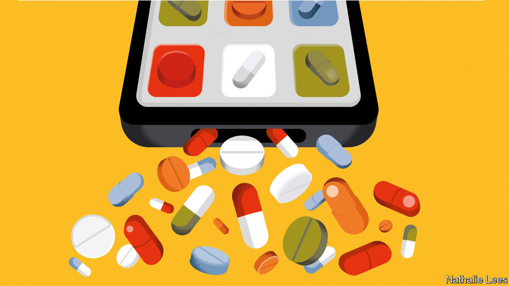

###### Adderall shortage

# Booming telehealth medicine is opening access to treatment for mental health 

##### But surging prescriptions of stimulant drugs worry some 

 

> Aug 29th 2022 

The success of TikTok, a social-media app, is built on its unpredictability. Open it up, and you might be shown a video of a clever machine in a food-processing factory, then another of someone hawking a get-rich-quick scheme. In between there are adverts. And these, at least for many young Americans, have been more predictable: focused, often, on . 

An ad for Cerebral, a venture-capital-funded health startup, shows two women speaking on the phone. “I’ve been looking for mental-health options, but I don’t have insurance,” says one. “Well, have you tried Cerebral?” goes the reply. Another, for Done, relates to attention-deficit hyperactivity disorder (adhd). It promises “personalised adhd care” for $79 a month.

The pandemic was deadliest for older people. But it was perhaps most disruptive to the mental health of young ones, trapped indoors and unable to socialise. New graduates had to start jobs over Zoom. The result, predictably, was a surge in demand for . 

That has happened all over the world. In America, it has also produced a remarkable market response. New firms are offering treatment as a subscription service. Instead of ringing a doctor and waiting weeks for an appointment, you get a same-day slot, over video, through a phone app. Prescribed drugs are delivered in the post, packaged a little like fancy meal kits. Done was started by a former Facebook designer, Ruthia He, and is backed by several celebrity investors. Cerebral is backed by SoftBank, a Japanese conglomerate which has poured money into tech startups. 

Some worry that wider access brings laxer controls. Much concern centres on the handling of adhd, for which the primary treatment is stimulants. adhd is characterised by a struggle to focus and difficulty completing tasks. It is diagnosed subjectively—typically in childhood, though adult diagnoses have risen. Stimulants, of which Adderall is the best-known brand, counteract the symptoms. But they are also addictive drugs, controlled by the Drug Enforcement Agency (dea). 

Before the pandemic, a patient needed to visit a doctor in person to get a prescription. But those rules were lifted to aid social distancing. As a result, the drugs can now be prescribed after a virtual visit.

Many doctors fear that venture-capital-backed firms have strong incentives to overprescribe. “There are all kinds of costs” to taking stimulants, says Anna Lembke, a Californian psychiatrist. At first, the stimulants almost always help, she says, but over time, dependency can build up. When people are “treating doctors like a vending machine”, it creates the conditions for addiction, she says.

Even before the pandemic, perhaps a third of stimulants were “diverted” away from strict medical use. Students use them to study, and to party. Prescriptions jumped by 9.4% last year, according to iqvia, a medical-data firm. In part because manufacturing levels are controlled by the dea, which has not lifted its annual quota, the result is shortages. A survey of its members by the National Community Pharmacists Association, published on August 11th, found that 64% are struggling to get enough Adderall. 

A clampdown may be coming. In April Cerebral was sued by Matthew Treube, formerly its head of product implementation, who alleges that he was sacked after objecting that the firm “consistently and at times egregiously put profits and growth before patient safety”. Employees were encouraged to prescribe stimulants to 100% of new patients, he says. Cerebral said the allegations are “without merit”. In May, Insider, a website, reported that the firm was under investigation by the dea. Cerebral’s boss, Kyle Robertson, resigned, and the firm stopped prescribing stimulants after its pharmacy partner cut it off. Other firms such as Done continue, but it is unclear if they will be able to carry on. The pandemic rules about online prescribing are expected to be revisited in November.

Yet according to Craig Surman, an associate professor of psychiatry at Harvard Medical School who specialises in adhd, it is a tricky balance to strike. Ideally, doctors would have the time and resources to conduct full evaluations, questioning not just patients but also their parents or partners to confirm the diagnosis. But that is not incompatible with telehealth. And a lot of people suffering from adhd are probably still undiagnosed, he says. Between 1% and 2% of the population “will benefit pretty meaningfully from being on stimulants”, he reckons. 

In Britain, medical advertising is illegal and rules for diagnosing adhd are stricter, yet there, too, prescriptions have climbed in recent years. Even in America, the rise in diagnoses long predates the pandemic. A clampdown may save some people from addiction, but it could hurt others. ■


