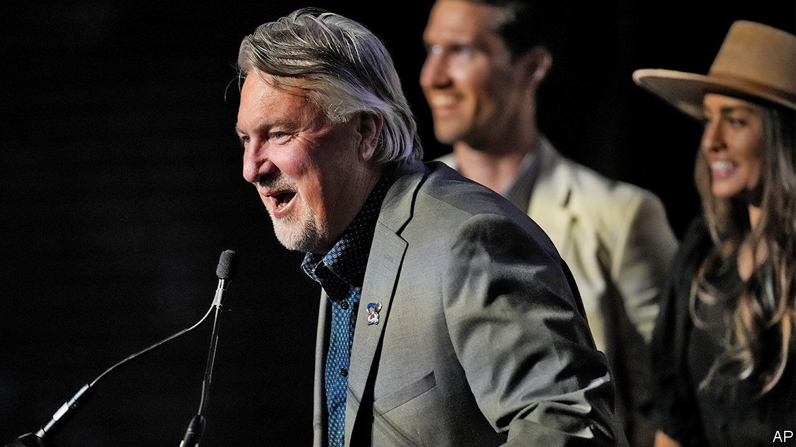

###### Rocky Mountain high ground

# Colorado’s Senate race may offer Republicans an alternative to Trumpism 

##### It could also test the state’s Democratic bona fides 

 

> Sep 1st 2022 

One of the hallmarks of campaign season in America is the appearance of candidates at state fairs, where they can burnish their Everyman credentials and schmooze with voters. Joe O’Dea, the Republican Senate candidate in Colorado, recently strutted in a cowboy hat at a livestock auction during Colorado’s fair in Pueblo, as smells of barbecue and farm animals wafted through the building.

Mr O’Dea is trying to unseat Michael Bennet, the two-term Democratic incumbent. (Mr Bennet’s brother is ’s Lexington columnist, and had no involvement in this story.) At first glance, the state seems too blue for Mr O’Dea’s barnstorming to make much of a difference. Democrats hold the governor’s mansion, the statehouse and both Senate seats. But Democratic dominance is relatively new in Colorado. Less than 20 years ago Republicans controlled each level of government. 

Colorado’s Senate race matters for three reasons. First, every seat counts as the Republicans try to retake control of Congress. Though Mr Bennet will probably prevail, the race seems to be tightening. The , a non-partisan newsletter, is newly rating it as “Lean Democrat”, rather than “Likely Democrat”. National Republicans are taking notice. Mitch McConnell, the top Republican in the Senate, has said the party would go “all in” for Mr O’Dea.

Second, both candidates want to chart a different path forward for their parties. While Republican primary voters in several other states elevated far-right candidates who pledged fealty to Donald Trump, Colorado bucked the trend. In June moderate candidates for governor, secretary of state and the Senate prevailed over their election-denying challengers. Mr O’Dea unequivocally says that Joe Biden won the election in 2020 (though he believes him to be a “lousy” president). He also hopes that Mr Trump will recede from politics. “I don’t think President Trump should run again,” he says. “It’ll pull the country apart.”

His candidacy may reveal whether Republicans are better off nominating hard-core Trump acolytes who fire up the party’s base, or moderates who appeal to independent voters. About 45% of registered voters in Colorado do not belong to a party, and Mr O’Dea is betting they will turn out for him. “I’ve been campaigning to those people,” he says. “They’re gonna make the decision on who our next senator is.”

Mr Bennet also thinks his party has an image problem. Colorado’s blue hue, he told  between campaign events in several ski towns, helps dispel the idea that Democrats “are either a coastal party, or a party of elites. Or even worse—a party of coastal elites.”

Third, Mr O’Dea hopes his moderation will test how Democratic Colorado really is. The answer is important for the West as a whole. Eight of America’s ten fastest-growing states in the decade to 2020 were west of the Mississippi. Along with pandemic “zoom towns”, the boom has led to hand-wringing from western Republicans over the political implications of rapid population growth. Could Republican states such as Idaho, Montana or Utah become the next Colorado? “The Blueprint”, a book about Colorado’s political evolution, offers a more nuanced take. In the 2000s liberal mega-donors, politicians and lobbyists built permanent campaign infrastructure in Colorado that hastened its transformation, the authors argue.

Rob Witwer, a former Republican state lawmaker and co-author of “The Blueprint”, wonders whether the Republican Party in Colorado has been too damaged by Mr Trump to make a comeback. Mr O’Dea will soon find out.■


