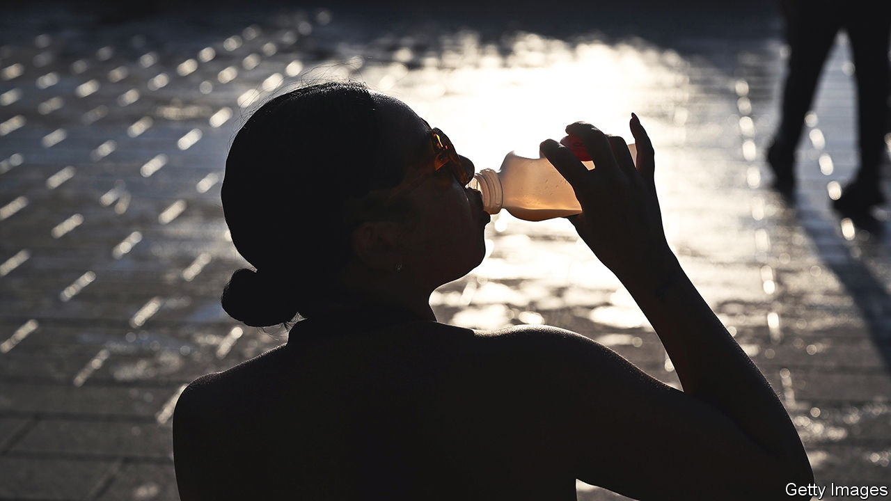
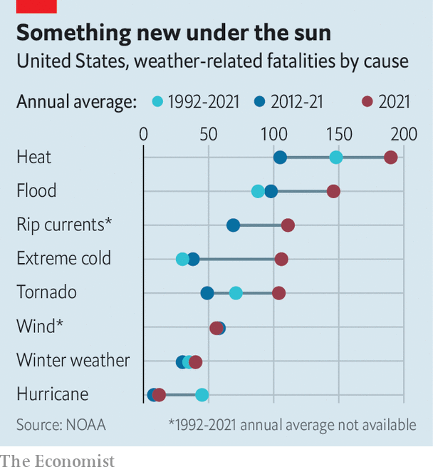

###### America’s hot cities

# Heatwaves kill more Americans than hurricanes, tornadoes and floods 

##### Yet some local governments are still not taking extreme heat seriously 

 

> Sep 1st 2022 

In 2021 extreme heat killed more Americans than any other weather-related disaster. People seek shelter after tornado warnings, and leave coastal areas before a hurricane hits. Yet many ignore extreme-heat advice. In July over 150m Americans, or nearly one in two, were in parts of the country issuing such alerts. In the Great Plains heat indices (a measure of how heat is felt by the body) rose to 49°C. In the run-up to Labour Day, which this year falls on September 5th, over 50m were in areas on alert as a sustained heatwave was forecast in western states. Officials have urged Californians to cut their energy use to help the state avoid rolling blackouts.

America’s cities are struggling to deal with heat. Last year the first “chief heat officer” was appointed in Miami-Dade County; Los Angeles and Phoenix followed suit. Their job is to raise public awareness of the dangers of high temperatures. People get used to routine risks, explains Erick Bandala, a scientist at the Desert Research Institute (dri) in Las Vegas. Mr Bandala likens attitudes to heat to the ease with which many people drive a car. Heat, because it feels familiar, can be a surprise killer. 

High temperatures can cause deadly heatstroke. They can also aggravate existing medical problems. Respiratory illnesses tend to worsen, as heat causes the number of harmful pollutants to increase in the air. For some, such conditions turn fatal. Yet heat is rarely given as the cause. The Environmental Protection Agency reports that as many as 1,300 deaths a year in America fall into this category.

Las Vegas—the second-fastest-warming city in America, behind only Reno, also in Nevada—has taken steps to protect residents. When extreme heat engulfed the city in August it set up temporary “cooling stations”, free air-conditioned public spaces that are now common in several American cities. Las Vegas is also trying to pinpoint specific heat problems. A project sponsored by the National Oceanic and Atmospheric Administration is allowing the city to identify “urban heat islands”, which can be up to 11°C hotter than nearby areas.

Poorer districts tend to be the hottest. Their residents also suffer most in extreme heat. Many do not own air-conditioners, or cannot afford to run them continuously. The homeless are even less able to find relief. But cities suffer broadly in too-hot weather. Workers, especially those outdoors, are less productive. Tourism takes a hit: flights out of Las Vegas were cancelled last summer owing to high temperatures.

Water shortages, common in fast-heating cities, exacerbate the problem. Some local governments still struggle just to provide clean water. Residents in Flint, Michigan had none for nearly three years: their tap water contained dangerously high levels of lead. In August 1m people in the wider Detroit area were advised to boil their water to kill bacteria. On August 29th residents of Jackson, Mississippi’s largest city, lost safe running water “indefinitely” after a storm took out the local water-treatment facility. The heat index that day was 39°C.

The Las Vegas valley depends on Lake Mead, America’s largest reservoir, for 90% of its water. Its levels have reached record lows after a 23-year megadrought. In early August the un warned that the reservoir was on the brink of reaching , the point at which water stops flowing downstream from dams.

To provide relief while preserving water, Las Vegas has begun to plant drought-tolerant trees, says Marco Velotta from the city’s Office of Sustainability. It aims for 60,000 by 2050. Nevada banned ornamental grass from places such as office parks and median strips in southern parts of the state last year. The Southern Nevada Water Authority is offering residents $3 per square foot to rip up their own turf and plant desert-friendly species instead.

Doesn’t seem to be a shadow in the city

Much more could be done to protect urbanites from extreme weather. A study published in 2016 found that only 13% of New York’s counties had cooling centres that could be reached by public transport. For cities with adequate water supplies, greenery is useful: trees, grassy rooftops and parks all help to lower temperatures. Using less concrete, brick and asphalt, which trap heat, helps too. Denver requires some buildings to install “cool roofs”, a white membrane that reflects heat (adoption has been slow). In Phoenix, asphalt is sprayed with a coating that lowers temperatures.

 


A study from First Street Foundation, a non-profit group, predicts that an “extreme heat belt” will settle across America in about 30 years, from Louisiana to Wisconsin. It will affect over 100m people. In August researchers at Harvard and the University of Washington forecast that by 2100 heat exposure would increase by three to ten times in America, among other mid-latitude regions.

People can “certainly live in these areas and adapt”, says Derek Kauneckis, a scientist at dri. But the fear is that policymakers will wait until an extreme event occurs—when Lake Mead reaches dead-pool levels, say—to act. “We know what’s coming,” says Mr Kauneckis. The closer it gets, the harder the task will become. ■


