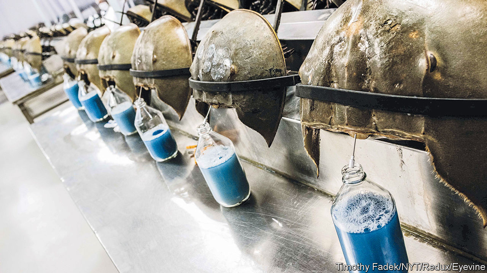

###### Horseshoe crabs

# In America, crab blood remains vital for drug- and vaccine-making 

##### Most rich countries have already shifted to synthetic alternatives 

 

> Sep 1st 2022 

Every april in South Carolina, fishermen catch hundreds of horseshoe crabs as they crawl onto shore to mate. The crustaceans are transported to labs owned by Charles River, an American pharmaceutical company, in Charleston. There they are strapped to steel countertops and, still alive, drained of about a third of their blue-coloured blood. Then they are returned to the ocean. This liquid is vital for America’s biomedical industry. A litre of it goes for as much as $15,000.

Parts of modern medicine have been unusually reliant on the horseshoe crab. Its blood is the only known natural source of limulus amebocyte lysate (lal), an extract that detects endotoxin, a nasty and sometimes fatal bacterium. Drug firms use it to ensure the safety of medicines and implanted devices, including antibiotics, anti-cancer drugs, heart stents, insulin and vaccines. The immune cells in the crab’s blood clot around toxic bacteria, giving a visual signal of unwanted contamination.

As pharmaceutical companies ramped up production of the covid-19 jab, demand for the blue liquid soared. In 2020 nearly 650,000 crabs were bled in America, 36% more than in 2018.

Bleeding is not without harm to the crabs. Conservationists estimate that between 5% and 30% of them die on release. Biologists at the University of New Hampshire have found that, once bled, females become lethargic and have trouble following the tides to egg-laying areas. According to the Wetlands Institute, a non-profit group, the number of horseshoe crabs in Delaware Bay, where the Atlantic variety spawns, has declined by 90% over the past 15 years. 

In 2016 the International Union for Conservation of Nature listed them as “vulnerable” to extinction. It blamed overharvesting for use as food, bait and biomedical testing, as well as habitat loss. This also hurts other species. The red knot, a bird that migrates from South America to the Arctic tundra, is endangered largely because of the decline in horseshoe-crab eggs in Delaware Bay, a stopover.

As crab numbers fall and demand for lal rises, America’s biomedical industry will face a crunch. Billions of covid-19 vaccinations have relied on it, but so do plenty of routine surgical procedures such as hip replacements, whose numbers are growing. Charles River, one of four manufacturers of lal in America, estimates that 55% of injectable pharmaceuticals and implanted devices globally are tested using the extract produced at their facility in Charleston.

Yet a synthetic alternative to lal is already available, which in Europe is rapidly replacing crab blood as the industry standard for testing. In 2003 Lonza, a Swiss biotech company, cloned crab dna to create recombinant Factor c (rfc). Troubled by the red knot’s decline, Jay Bolden, an avid birdwatcher and biologist, pioneered the use of rfc in America at Eli Lilly, a pharmaceutical company. In a study published in 2017 Mr Bolden found that rfc detected endotoxins as well as lal, or even better. The test turned up fewer false positives and, moreover, was cheaper to produce.

That year Eli Lilly vowed to test all new products with rfc; 80% of the company now uses it instead of lal. Sanofi, a French pharmaceutical firm, is also making the switch at their American plants. In 2018 America’s Food and Drug Administration (fda) approved the first medicine tested with rfc. Six more of Eli Lilly’s have since been authorised.

In Europe, China and Japan, pharmacopoeias list rfc among their approved endotoxin-testing agents. But the us Pharmacopeia (usp), a non-profit that helps set medical quality standards on which the fda relies, has been reluctant to add the synthetic substance to its list. That means American firms that want to use rfc tests must work harder to prove their safety to the fda. To explain its hesitation, usp says that “one adverse incident might not only set back the adoption of rfc but could damage overall trust in vaccines or other injectables, already plagued by misinformation.”

That holdup comes with its own costs. Barbara Brummer, who previously worked at Johnson &amp; Johnson and is now with the Nature Conservancy, an ngo, sums it up: “We are doing damage to an endangered population and not using an alternative that is equally effective and could be mass-produced” more cheaply. 

Charles River argues that supply fears are overblown, and that bleeding does little harm to crabs; it has been a vocal critic of the synthetic option, on safety grounds. But if usp approved synthetic testing, Mr Bolden reckons America’s other drug companies would swiftly turn away from lal. The next several rounds of covid-19 boosters produced in America will rely on the horseshoe crab. But such vampire-like dependence on its blue blood cannot last much longer. ■


