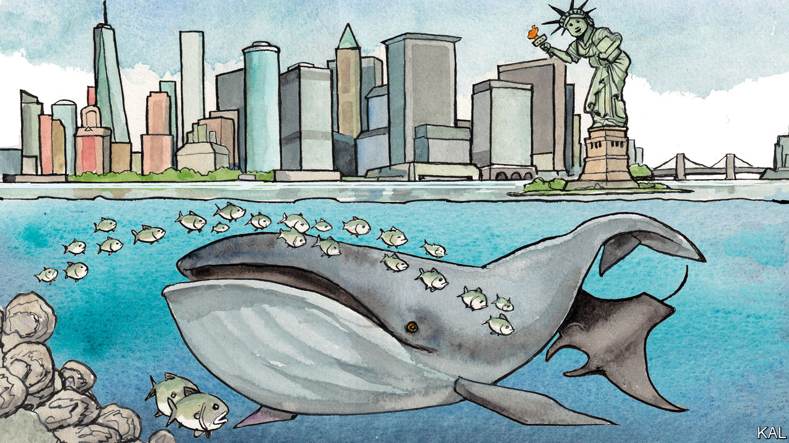

###### Lexington

# New York’s waters are being reborn 

##### From whale to oyster to human, animals are coming back 

 

> Sep 1st 2022 

For reassurance that Americans can still work together with patience and vision, look to the waterways of New York. Nine humpback whales recently surfaced there together, spouting and breeching against the city skyline as though vying for the most dramatic selfie. Fin whales and right whales are also appearing in startling numbers—along with bottlenose dolphins, spinner and hammerhead sharks, seals, blue crabs and seahorses. Oysters, which all but vanished decades ago, are clamping themselves to bulkheads from Brooklyn’s Coney Island Creek to the Mario Cuomo Bridge, almost 20 miles up the Hudson from the city.

Humans, too, can be seen in profusion, on the water and in it. One can forget, when the horizons are bounded by skyscrapers a bus-length away, that New York City is an archipelago, a fringe of North America trailing into the Atlantic. Only one of its five boroughs—the Bronx—is on the mainland, and the three rivers that wind through them, and the harbour into which those rivers drain, are cleaner than they have been in 100 years. They are becoming New York’s great decentralised park. 

New Yorkers paddle-board on the Hudson; they cruise the Harlem river, blasting music as they sun themselves on the foredecks of sleek motorboats; they chase each other on jet skis under the Brooklyn Bridge; they surf at dawn in sight of the housing projects of Far Rockaway, in Queens, then take the A train to work. 

And they catch whale-watching tours from Brooklyn. “It’s amazing,” says Howard Rosenbaum, who grew up in New York when sighting a single whale off the distant tip of Long Island was a big deal. He leads the Wildlife Conservation Society’s Ocean Giants Programme, which happens to be based at the Bronx Zoo. “I’ve worked in every ocean basin, and people associate these wildlife spectacles with other areas of our planet. Yet they’re right here in our backyard.” He suspects the whales’ return owes to some combination of the Clean Water Act of 1972, the Endangered Species Act of 1973, and a decade-old, multi-state initiative to stop the overfishing of one of the whales’ favourite foods, menhaden, known locally as bunker. 

Mr Rosenbaum had the foresight to begin asking questions about whales in the region some 15 years ago. The Conservation Society’s research project has matured as they began appearing in greater numbers. He is now working to deconflict the big marine and terrestrial mammals, to prevent ship strikes and ensure that forthcoming wind farms take the whales into account. 

Some number of New Yorkers have always been drawn to the water. Herman Melville marvelled at how residents of the “insular city of the Manhattoes” were pulled seaward. “Circumambulate the city of a dreamy Sabbath afternoon,” he writes in “Moby Dick”. “What do you see? Posted like silent sentinels all around the town, stand thousands upon thousands of mortal men fixed in ocean reveries.” Some still stared with wonder a century later, in 1951, when Joseph Mitchell published a classic essay in the , “The Bottom of the Harbour”. But by then they were watching “gas-filled bubbles as big as basketballs continually surge to the surface” from the sludge below. The harbour had been just a dump, a factory and a highway for too long.

Consider the oyster, less eye-catching than the whale yet glamorous in its own way. Some biologists estimate that New York harbour was once home to half of the world’s oysters. Early European visitors described finding some a foot long. Their beds lined Brooklyn and Queens and encircled Manhattan; Ellis Island was called Oyster Island. New York oysters were prized in London restaurants, and the families dominating the trade built mansions on Staten Island, where their fleets of schooners docked. Even after the oyster beds were stripped, by the late 18th century, enterprising businessmen kept the trade going for another 100 years by farming oysters. But the pollution became too severe. After cases of typhoid fever were traced to oysters in New York’s harbour in 1916, the city’s board of health banned the business.

The time has come

Some wild oysters lingered. Mitchell could still find a few when he was studying the harbour. For their resurgence now, credit public spirit combined with private initiative. Since 2014 a non-profit group, the Billion Oyster Project, has been working towards returning that many oysters to the harbour by 2035. It recently put down its 100-millionth oyster, and, with help from thousands of volunteers, is now seeding them at a pace of 50m a year. An adult oyster is said to filter water at a rate of 50 gallons a day. 

The non-profit relies in part on divers trained by the Harbour School, a public high school that gives students a marine education on top of a conventional one. The divers say the harbour bottom is still covered in sludge that obscures their vision—“black mayo”, they call it—but around the oyster reefs they can see underwater as far as a dozen feet. 

No one reading this would be wise to eat an oyster from New York’s harbour. There is much work still to be done. About 60% of the city’s sewer system mixes human sewage with stormwater run-off. When heavy rain overwhelms the water-treatment plants, New York empties its bowels into the waterways. The rule of thumb is that it is not safe to enter the water for three days after rain. Cleaning up New York’s water, and reconciling the needs of its animals and humans, is the work of generations. 

The good news is that such work has been going on for a generation, and, despite the menace of climate change, things in some ways are getting better. Also weirder, often in a good way. A few weeks ago Mr Rosenbaum was on a 37-foot boat, watching a humpback whale near the Verrazzano Bridge, which connects Brooklyn to Staten Island. He saw something black-and-white and the size of the boat rising towards the surface. It took him a moment to realise, and then to accept, that he was seeing a giant manta ray. ■


