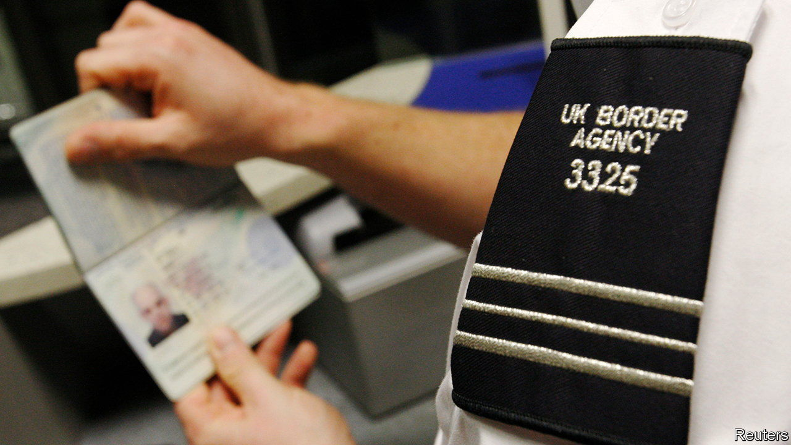
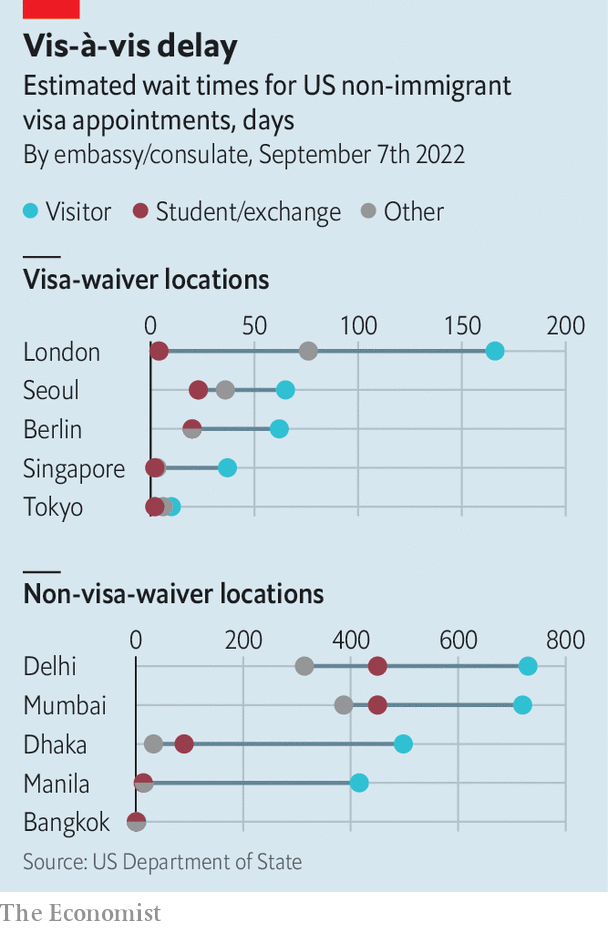

###### More travel chaos

# Long delays at Western consulates are ruining Asians’ travel plans 

##### Overwhelmed, understaffed and processing visas at a slug’s pace 

 

> Sep 8th 2022 

In may this year, Mahmuda Mity, an environmental researcher in Bangladesh, was invited to attend a conference in Britain in early July. She immediately applied for a British visa. By the time her application was processed and her passport returned to her it was July 13th, nearly a week after the conference had ended. Inspecting the now-useless document, she noticed that it had been issued on July 3rd, the day before the conference started. It had been left “stacked in their office for ten days”. 

Sharmin Rahman, a student at a German university, asked the embassy in Dhaka for a visa appointment in June 2021. Only in August did the Germans request documents. The visa will take at least three months to be processed. He will miss the first few months of in-person classes. Lubab Munir, a Bangladeshi lawyer who trained in Britain, was meant to go to a friend’s wedding in Athens in August. He made plans to travel around Europe in the preceding weeks. But the nightmarish visa process put him off. Just to apply “you need to give a hotel reservation, a flight reservation, you need to take insurance out, [all of] which is non-refundable,” he says. Worse, embassies hang on to applicants’ passports. Mr Munir dropped his plans. 

Tales of woe like these are being swapped in living rooms, offices and stalls across the region. Citizens of most Asian countries—Japan, Singapore and South Korea are the notable exceptions—must obtain visas before they can travel to America, Britain, Canada or the Schengen area, which allows seamless travel between 26 European countries. The process is cumbersome, time-consuming, expensive and often humiliating. 

 


That is when visa processing is working well. This year it is not. Visas for travel to Britain are taking at least seven weeks to process, a mockery of its self-imposed three-week “standard”. European embassies warn of exceptionally high demand and long delays. Processing times for Canadian visas run from 93 days in Thailand to 129 days in Bangladesh. But America is the worst offender: tourist-visa appointments at the American embassy in Delhi, India’s capital, now take more than 24 months to arrange. Those seeking student-visa appointments will wait nearly 15 months. Appointments for some visas, such as the h1b for skilled workers, are simply unavailable until 2024. 

These delays are affecting Western embassies all over the world, but they are particularly bad in Asia, which sends huge numbers of people to the West. In 2019 Chinese and Indians received nearly half of the 2.4m visitor visas granted by Britain; India alone accounted for half of the most common type of work visa. America’s five consular outposts in India processed more visas (839,504) that year than did all 46 of its missions in Africa (353,975). 

As the pandemic recedes and travel opens up, a wave of demand in the largest markets for Western consular services is colliding with operations that have been cut to the bone or shut down entirely. Diplomats who moved home during the pandemic have not all been replaced. America’s State Department says it has doubled recruitment for consular posts this year, and is looking into hiring diplomats’ family members, who are already in-country, to do administrative work. But empty positions are hard to fill, says one European diplomat. He reckons it will take a decade for operations to return to normal.

Along with the post-pandemic travel spike, other factors have aggravated the chaos. The busy summer travel period coincides with a particularly large summer bulge of student visas, as more students return to international campuses after two years of remote learning. American officials say that their Indian consulates will process more student visas between June and August this year than ever before. At many embassies, student visas are subject to greater scrutiny and take longer to process than those for tourists, since applications for them are more often fraudulent.

Geopolitics forms another bottleneck. When America and its allies pulled out of Afghanistan last year, many set up special programmes to help Afghans emigrate, thereby taking up some visa-processing capacity. After Russia invaded Ukraine in February, many consular officials were redirected to work on visas for refugees. “That slows down the rest of the system,” admits a British diplomat. Brexit has an impact too. Ever since the end of free movement from Europe, Britain has looked to the rest of the world for labourers, each of whom now needs a visa.

Clogged up Western visa pipelines hurt people living in host countries as well those seeking entry. Many citizens have relatives abroad. Firms want to employ talent from wherever it hails. Businesses still prize in-person meetings. Fewer visas mean fewer travellers, empty hotel rooms, unflogged trinkets and less-packed restaurants. , a magazine for rich tourists, advises its readers to avoid travelling to places which require visas. “It doesn’t just affect one industry. It affects a lot of them,” says Jon Baselice, who heads immigration policy at the us Chamber of Commerce, a lobbying group in Washington. The tourism business was America’s third-largest export in 2019. 

There are obvious ways to solve the problem. One would be to simplify entry requirements. Another would be to grant visas for longer durations (the Americans, to their credit, already do this). More countries could be included in the visa-waiver programmes that South Koreans, Japanese and Singaporeans enjoy. But moves like this are politically difficult as long as there remain even a few who abuse the system, and so are unlikely to happen. Asia’s masses of tourists and students can look elsewhere. It is the countries failing to welcome them that will eventually lose out. ■

