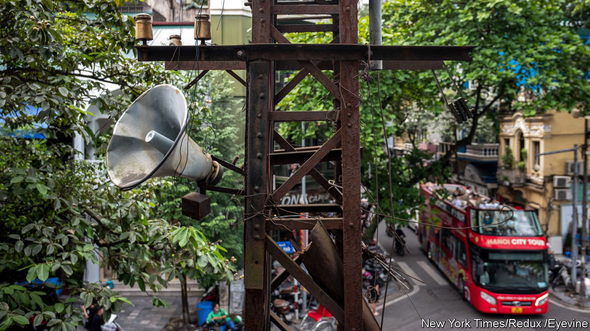

###### A noisy noise annoys Hanoi

# Loudspeakers in Vietnam’s capital will blare propaganda once more 

##### The city’s residents hate it 

 

> Sep 8th 2022 

The streets of Hanoi are not quiet. Hordes of motorbikes race suvs down narrow side lanes. Their horns and engines compete with the din from drills, hawkers and squawking livestock. So raucous is Vietnam’s capital that entrepreneurs can do well from selling silence. Patrons in Tranquil, a café, are instructed to speak only in whispers, if they must talk at all.

The city’s government now plans to add to the clamour by reincarnating  a city-wide public-address system introduced during the country’s war with America that was used to broadcast state messages and propaganda. The city wants working speakers in every part of the capital by 2025, the better to convey the voice of government into homes and businesses. Many Hanoians object. 

The  have a long history. During the war they provided warning of American bombing raids, and shared optimistic updates from the front line. When the conflict ended they were put to other purposes. One Hanoi resident remembers hearing neighbours shamed for not paying their taxes. Another recalls a song encouraging people to clean their neighbourhoods and chastising households which had not yet pitched in. One ditty urged the twice-daily brushing of teeth. 

Endless announcements offended the ears as much as they did the spirit. Pham Gia Ngoc, who spent decades broadcasting statements about everything from power cuts to vaccination schedules, told state media that residents often became so incensed by the racket that they cut speakers’ wires or turned them upside down and filled them with water.  became slang. A Hanoian bigmouth can be accused of being “as loud as the ward loudspeaker”.

The speakers were widespread until 2017. That year the city announced a plan to remove them gradually; it said it would spread its messages in other ways. Some were still working when the pandemic hit. They were used to remind citizens to wear masks and keep their distance. They blasted out a motivational song every morning with the phrase, “Citizens, let’s join forces in this fight so covid disappears!”

Now that the city is preparing to reinstall speakers everywhere, its spin doctors are claiming that there was never a plan to remove them in the first place. This does not sway Hanoians. A recent poll found that 70% of people want rid of the noisemakers. One newspaper editor in Hanoi calls the plan “idiotic”.

So far local officials have not wavered. Zachary Abuza of the National War College in Washington, dc, says that is because the decision was made by Hanoi’s Communist Party committee. It is superior to the city government; its members are more concerned to impress party bigwigs than to avoid upsetting the little folk. “They did not care that the move was anachronistic, or derided by the public,” he says. “They are playing to a higher audience.” ■

