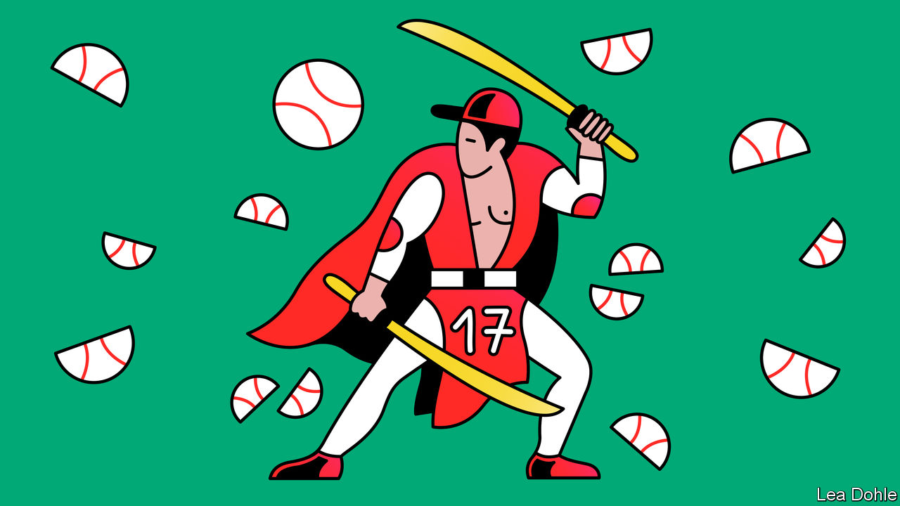

###### Banyan

# The clout of Ohtani Shohei, Japan’s greatest baseball star 

##### The man they call “Shotime” bears comparison with Babe Ruth 

 

> Sep 8th 2022 

Only two players in the history of American baseball have hit 100 home runs and pitched 400 strikeouts. One was Babe Ruth, the American folk hero of the early 20th century. The other, as of September 3rd, is a modest young man from Iwate, a rural prefecture in northern Japan, called Ohtani Shohei.

Japan’s baseball obsession is nearly as old as its relationship with America. Horace Wilson, an American schoolteacher, is credited with introducing the sport to Japan in 1872. Meiji-era education mandarins embraced the game, considering its mix of team play and individuality to be in keeping with Japanese values, notes Robert Whiting in “You Gotta Have Wa, his classic account of Japanese baseball. The yearly high-school tournament, Koshien, is now Japan’s main sporting event.

Passion for bat and ball also connects Japan with America. When a group of baseball stars including Ruth toured Japan amid festering anti-Western sentiment in 1934, fans greeted him with cries of “Banzai, Babe Ruth!” When Ruth hit homers, “all the ill feeling and underground war sentiment vanished,” crowed Connie Mack, the team’s manager.

Love of baseball could not forestall war. When news of the attack on Pearl Harbour reached Ruth he hurled his Japanese vases from his apartment window. Japanese soldiers reportedly used “To Hell with Babe Ruth” as a battle cry. Yet even as war raged, Japan kept swinging. Ultranationalists stopped using the word  (written in , the alphabet for foreign words) and started saying  (written with the Japanese characters for “field” and “ball”).

After the war, baseball helped Japan and America become allies. Both celebrated Babe Ruth Day in 1947. During another baseball tour of Japan in 1949, the two countries’ flags were raised side by side, reportedly for the first time since the war. Lefty O’Doul, the American manager, was granted an audience with Emperor Hirohito, who declared that “It is by means of sports that our countries can be brought closer together.” Douglas MacArthur, the general who oversaw America’s occupation of Japan, called the trip “the greatest piece of diplomacy ever”.

Yet an imbalance endured in the sporting relationship, much as in the geopolitical one. Japan’s leagues were considered inferior, its players a cut below their bulkier American peers. Fearful of competition, Japanese team owners structured contracts to keep players from going abroad.

Then in 1995 Nomo Hideo, a trailblazing pitcher, found a loophole and jumped to the American major leagues. Initially dubbed a traitor, Mr Nomo found favour in Japan when he began mowing down American hitters. Suzuki Ichiro followed in 2001, outlasting racist chants to become an American baseball icon.

But even those successes seemed to come with asterisks. “Japanese players were seen as good, but just technicians,” Mr Whiting says. Mr Nomo deployed an unorthodox, twisting windup to flummox batters; Mr Suzuki could hit, but not home runs. So it went in politics: Japan might be a big economy, but it would never be accepted as a “normal” country.

Enter Mr Ohtani, who plays for the Los Angeles Angels. “He beats the Americans on their own terms,” Mr Whiting writes. Not only has he upended decades of convention by both pitching and hitting professionally—a feat no player since Ruth has seriously attempted—he has dominated both sides of the game with power and panache, whipping 100mph fastballs and bashing 450-foot home runs. He was named Most Valuable Player in 2021, and is a front-runner to win the award again this year. And unlike earlier Japanese stars, who were more isolated, he has “embraced American life”, says Yamazaki Ema, the director of a documentary about Koshien.

In Japan, Mr Ohtani is often compared to  superheroes. In a nationwide “buzzword of the year” contest in 2021, he stole the top spot, edging out trifling concerns such as the pandemic and the Olympics. “Shotime”, the nickname he acquired in America, made the list, as did “”, or “real two-sword style”, a samurai term adopted to describe his two-way baseball skills. 

Mr Ohtani’s feats have helped expand the horizons of Japanese ambitions, says Sasaki Toru, a sports writer. Baseball-mad children once aspired to play professionally at home; now they aim straight for the American major leagues. They might even dream of being the best ever. Mr Ohtani certainly has a strong claim to that title. Better, maybe, even than the Babe himself.■


