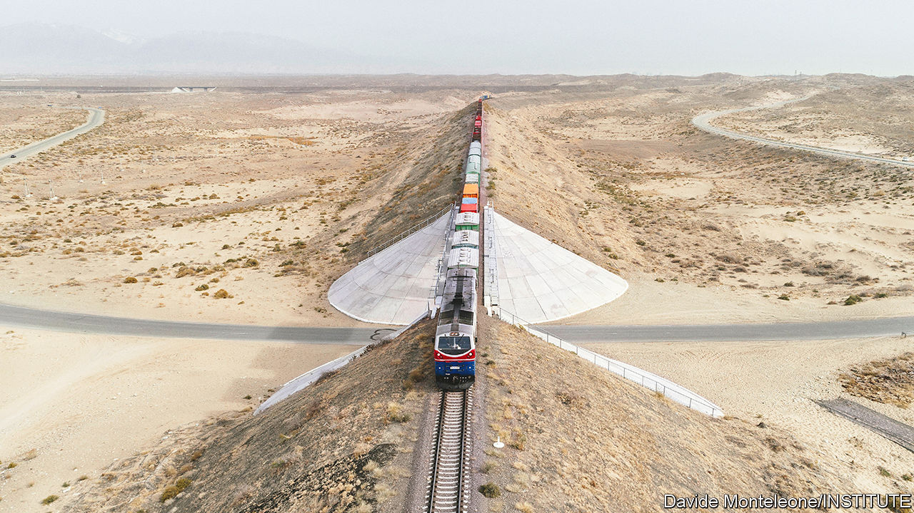
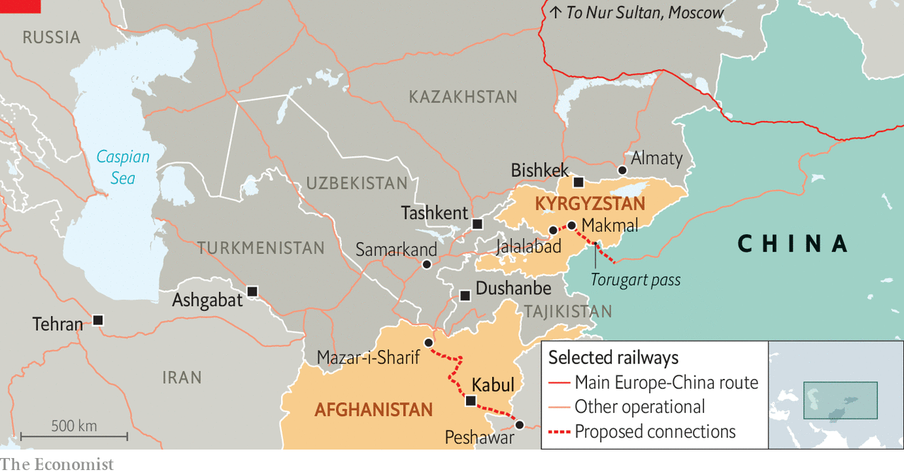
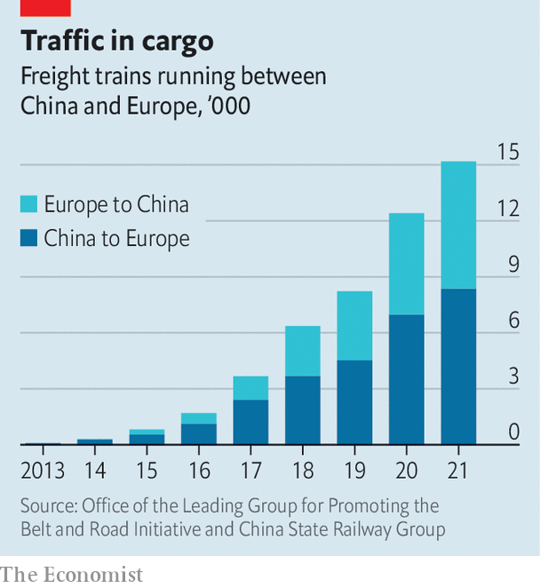

###### Big plans for the ‘stans

# Two new railway lines could transform Central Asia 

##### China, not Russia, stands to benefit 

 

> Sep 6th 2022 

Central asia’s first railway was a military venture. Russia began laying track in 1880, primarily to shuttle troops around the Karakum desert, the better to crush resistance to its rule in what is now Turkmenistan. Within eight years trains ran 1,400km from the Caspian Sea to Samarkand. George Curzon, who rode the railway in 1888 as a young British lawmaker (and future Viceroy of India), wrote that it helped Russia dominate local trade, and doubled its capacity to launch attacks on India. Britain’s strategy, he warned, was not “suited to a position where the Cossacks are at your gates”.

Railways have underpinned Russia’s clout in the region ever since. But today the balance of power is shifting. America has withdrawn from Afghanistan, leaving a vacuum. Russia is preoccupied with Ukraine. China sees an opening to expand its influence and diversify trade routes to Europe. Central Asian nations seek new connectivity too, with each other and to China. Integral to those efforts are two new railways that will be discussed at a summit of the Shanghai Co-operation Organisation, a group of regional powers including Russia and China, in Samarkand on September 15th-16th.

The first sign of progress came in May when Sadyr Japarov, Kyrgyzstan’s president, announced that construction would start on a line connecting China, Kyrgyzstan and Uzbekistan (see map) in 2023. China’s railways already connect to Central Asia’s via Kazakhstan. The route from there through Russia to Europe has become a major conduit for trade in recent years. It carries the vast majority of China’s railway trade with Europe, which grew from $8bn of goods in 2016 to about $75bn in 2021. 

 


The new line would open a route from China to Europe through Turkmenistan, Iran and Turkey, shortening the journey by some 900km and eight days. More important, it would skirt Russia, which has become tricky to move goods across because of sanctions imposed as a result of Vladimir Putin’s invasion of Ukraine. Yang Jie of the China Communications and Transportation Association says the war has caused “great uncertainty” for European customers. Some have switched to a slower, pricier rail-and-sea route, crossing the Caspian by ship to bypass Russia. The new line would provide an alternative, non-Russian, rail-only route between China and Europe.

Kyrgyzstan’s transport minister, Erkinbek Osoyev, says the trans-Kyrgyz link will carry 7m-13m tonnes of cargo a year, mostly bound for other places. The jobs, taxes and transit fees generated would give Kyrgyzstan a hefty economic boost; the mountainous ex-Soviet state of 6.7m people depends heavily on remittances from Russia. 

The concept is not new. Plans were drawn up first in 1997. Russia never liked the idea. China and Kyrgyzstan could not agree over the costs and the route, whether it would serve a wide swathe of Kyrgyz people or just cut straight through to Europe. There were differences over where to switch from the 1.435-metre gauge track used in China and Europe to the former Soviet Union’s 1.520-metre standard. The plans were repeatedly shelved.

Mr Osoyev says China, Kyrgyzstan and Uzbekistan have finally agreed on a 280km route. It will cost $4.1bn and be financed either through direct investment or public-private partnership. The route runs from the Torugart pass on China’s border to Jalalabad in western Kyrgyzstan, which is already connected to Uzbekistan by a railway built by the Russians in 1916. The gauge would change at Makmal, site of a gold mine in which Chinese investors have an interest. Geological surveys are due to start soon and a feasibility study will be finished by March, Mr Osoyev says. 

 


China’s president, Xi Jinping, has endorsed the project. He is attending the  after a day in Kazakhstan, his first trip abroad since the pandemic began. Chinese experts arrived in Kyrgyzstan in August. Uzbekistan’s president, Shavkat Mirziyoyev, has given his blessing too, saying it will “link us to Asia-Pacific countries, paving the way for new economic opportunities”. As for Russia, Mr Japarov says he has Mr Putin’s personal approval. In July, the plan was backed by the Russia-endorsed Eurasian Economic Union. 

Many foreign diplomats and experts are sceptical. They say there have been too many false starts and that Mr Putin’s word is unreliable. They point out that Kyrgyzstan is politically unstable, laden with Chinese debt, and rife with anti-China sentiment. Detractors also note that many of China’s foreign borrowers are struggling to repay loans, and that China is downsizing its  as a result. It will also need to extend its own railway by 160km.

Yet even the sceptics concede that there is momentum behind the latest railway plans. Central Asian governments are providing much of it. They want to improve connectivity with neighbours to hedge against future dominance by outsiders. Uzbekistan is the main cheerleader. Mr Mirziyoyev is in a strong position. He has earned respect from Western governments and international agencies since taking power in 2016 after the death of a Soviet-era despot. “Uzbekistan is the true driver in all of this, financially and logistically,” says Niva Yau of the osce Academy, a research centre in Bishkek, Kyrgyzstan’s capital.

Mr Mirziyoyev will also be championing another railway project at the Samarkand summit: a line connecting Uzbekistan to Pakistan via Afghanistan. A short one already runs from the Uzbek border to Mazar-i-Sharif in northern Afghanistan. The new one would stretch 573km, via Kabul, to Peshawar in Pakistan, thereby linking up with existing rail infrastructure built by Britain during the late 1800s. Landlocked Uzbekistan and Afghanistan would get faster and cheaper access to the sea via Pakistan’s ports. Backers estimate that it would cut the time it takes goods to travel from Uzbekistan to Pakistan from 35 days to around four. Pakistan and Afghanistan would earn transit fees. China’s plans to turn Pakistan’s Gwadar port into a shipping hub would get a boost. China would also gain an export route for a copper mine near Kabul in which it has an interest.

The idea of a trans-Afghan railway predates a trans-Kyrgyz one. Russia and Britain considered it in the early 20th century. So did Iran and the Soviets in the 1970s, as well as Western governments after the American-led invasion of Afghanistan in 2001. Familiar obstacles remain: treacherous terrain, security risks and dubious commercial viability. “Can you imagine building a railway through Afghanistan when you don’t have total control over the political situation?” asks Temur Umarov of the Carnegie Endowment for International Peace, a think-tank. The World Bank warned against a similar route in 2012, citing the state of Pakistan’s railways.

But the Taliban are now in power, and they back the railway. The new security worry is a local branch of Islamic State. Afghan and Uzbek authorities are working together to tackle that and create new economic opportunities. China has  on infrastructure in Pakistan since 2012. Many projects have stalled but the railway could reinvigorate them, especially if other countries and multilateral lenders get involved. Uzbek, Afghan and Pakistani officials say they have asked the World Bank and other lenders for support. 

The fate of both railways may depend on whether they can attract funding from sources besides China. Its belt-and-road problems have made it wary of financing infrastructure projects alone. The trans-Afghan railway thus looks shakier than the trans-Kyrgyz one, as America and its allies refuse to engage with the Taliban. There is a good chance that neither project succeeds. But if either does, it will be a leap towards making the region better connected to the world, and less reliant on Russia. ■

