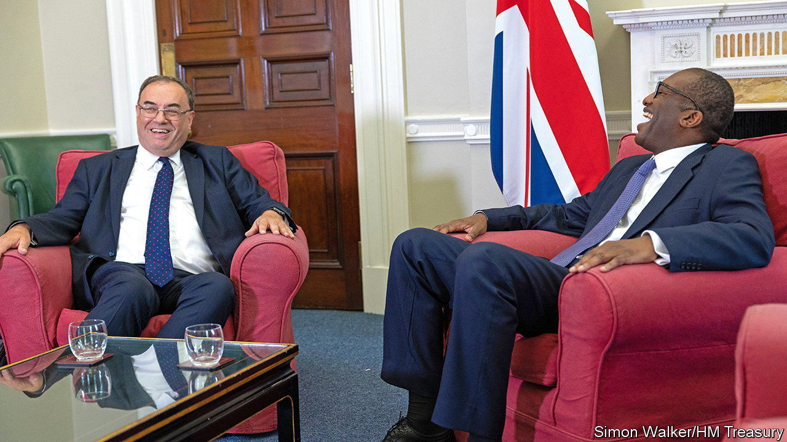
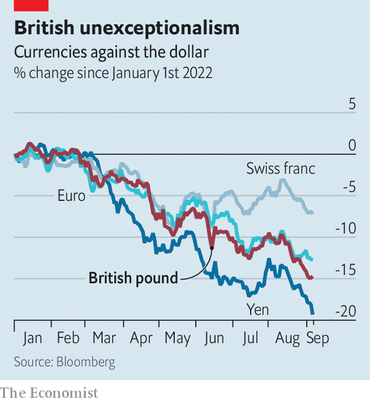

###### Crisis? What crisis?

# A weaker pound does not spell disaster for Britain 

##### Borrowing costs are rising, but the market has not damned the new government yet 

 

> Sep 8th 2022 

Fretting about sound money is unfashionable in today’s Conservative Party. But for those who still do, the nightmare scenario is clear. A profligate government spends more than it taxes, borrowing from the bond market to cover the difference. Gradually, the national debt builds up. As interest payments rise and the government gets no thriftier, investors worry about getting their money back. Then, suddenly, they no longer want to lend enough to cover the deficit. The currency crashes, and Britain is forced to ask the imf for a bail-out, just as in 1976.

Some fear a repeat is about to unfold. Liz Truss, Britain’s new prime minister, spent the summer making expensive promises. Tot them up, from higher defence spending to lower payroll and corporation taxes, and they would increase yearly government borrowing by 1.8% of gdp. Much more borrowing is on the way: on September 8th Ms Truss unveiled a two-year price-guarantee scheme that could cost over £100bn ($115bn, or 4.3% of gdp) to help households and businesses cope with soaring energy bills.

Both the pound and Britain’s government bonds, or “gilts”, have been bludgeoned. Sterling has dropped by 15% against the dollar since the start of the year. An index compiled by Bloomberg, a data provider, that tracks the performance of gilts has fallen by 21%. A year ago Britain’s government could borrow for ten years at 0.7% interest; now it must pay 3%. That the pound has fallen even as interest rates have risen is alarming for investors, says Theo Chapsalis of Morgan Stanley, a bank. Westminster bubble-dwellers talk of a “Black Wednesday moment”, recalling the government’s doomed attempt to buttress a collapsing pound in September 1992.

But such parallels are drastically overdone. Black Wednesday took place when Britain was in Europe’s exchange-rate mechanism. That obliged it to set interest rates and sell foreign-exchange reserves to keep the pound’s value within a narrow range. Today it has no such obligations. A weaker pound makes imports dearer and the Bank of England’s job of controlling inflation harder. It does not precipitate a crisis. Moreover, sterling’s fall against the dollar has been in line with the rest of the “g5”, a group of heavily traded currencies (see chart), and did not worsen on reports of the size of Ms Truss’s energy package. 

 


The sharp rise in gilt yields is also less alarming than it seems. Mr Chapsalis points out that despite the rise, the spread between the government’s five-year borrowing costs and the market’s expectation of the Bank of England’s base rate has stayed stable. Gilt yields are up because the market judges the era of ultra-low interest rates to be ending, not because it thinks Britain’s fiscal policy is courting disaster.

As public-spending demands pile up, that judgment may yet be tested. But for now, argues Kamakshya Trivedi of Goldman Sachs, another bank, investors may be reassured by having more clarity on what comes next. A government that raises spending and cuts taxes has been on the cards all summer; many details have not. It may be a case, says Mr Trivedi, of “sell the uncertainty, buy the plan”. ■

