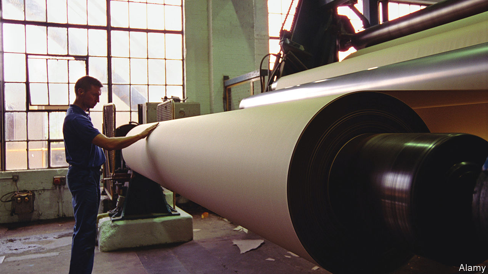

###### Taking a leaf out of your book

# Books are physically changing because of inflation 

##### Rising paper prices are forcing publishers to change 

 

> Sep 8th 2022 

The second world war was a hard time for British publishers. Paper imports collapsed; paper started being made from straw; publishers printed only sure-fire hits. New novels were rejected; a history by Winston Churchill went out of print.

But the war did not stop some books from doing well. A volume by a hitherto little-read author called Adolf Hitler, for example, sold splendidly. Despite being 500-odd pages long and containing chapter titles such as “The Problem of the Trade Unions”, “Mein Kampf” was an instant hit. After topping British bestseller lists in 1939 it became the most frequently borrowed book in British libraries and was, one magazine noted, a “topical bestseller”. 

Publishing can, then, find the paper for the things it wants to print, even in times of scarcity. The industry is currently experiencing another period of shortage, and war is once again a cause (along with the pandemic). In the past 12 months the cost of paper used by British book publishers has risen by 70%. Supplies are erratic as well as expensive: paper mills have taken to switching off on days when electricity is too pricey. The card used in hardback covers has at times been all but unobtainable. The entire trade is in trouble. 

Not every author is affected: a new thriller by Robert Galbraith, better known as J.K. Rowling, is a 1,024-page whopper—and this week reached the top of the bestseller lists in Britain. But other books are having to change a bit. Pick up a new release in a bookshop and if it is from a smaller publisher (for they are more affected by price rises) you may find yourself holding a product that, as wartime books did, bears the mark of its time. 

Blow on its pages and they might lift and fall differently: cheaper, lighter paper is being used in some books. Peer closely at its print and you might notice that the letters jostle more closely together: some cost-conscious publishers are starting to shrink the white space between characters. The text might run closer to the edges of pages, too: the margins of publishing are shrinking, in every sense. 

Changes of this sort can cause anguish to publishers. A book is not merely words on a page, says Ivan O’Brien, head of The O’Brien Press in Ireland, but should appeal “to every single sense”. The pleasure of a book that feels right in the hand—not too light or too heavy; pages creamy; fonts beetle-black—is something that publishers strive to preserve. 

But, says Diana Broccardo, the co-founder of the publisher Swift Press, although some savings might seem small, over an entire year “small things…can add up.” You can squeeze out an awful lot of white space from a seven-volume series of Proust’s “In Search of Lost Time”. Authors might like to imagine that they are judged by the sheer power of their prose; in truth, publishers must also measure their words by the tonne and by the metre. 

Some publishers are considering shorter books. Previously, if an author was commissioned for 70,000 words and filed 80,000, you’d not worry too much, says Mr O’Brien. Now, he says, “You might say, ‘Well actually, no.’…Because otherwise the book is just not going to work.” 

This is not necessarily a bad thing. For at the heart of the publishing industry lies an unsayable truth: most people can’t write and most books are very bad. Readers who struggle with a volume often assume that the fault is theirs. Reviewers, who read many more books, know it is not. George Orwell, who worked as a reviewer, considered that fewer than one book in ten was worth reviewing, and that the most honest reaction to most was: “God, what tripe!” 

Paper-supply problems provide an opportunity for tripe to be trimmed. In wartime such trimming caused a minor revolution in English literature, says Leo Mellor, a fellow at Cambridge University. Out went dull Dickensian dialogue, in came elliptical modernism. Suddenly, says Mr Mellor, there was “a premium on the laconic and the succinct”. 

Book publishers might wince at shortages, then, but book buyers might be relieved. Even bestsellers can disappoint. Reviews of Ms Rowling’s new book were largely positive—though one did wonder why her later books “have to be more than 1,000 pages long” and suggested that it might help “if the wafflier sentences were pruned”. For all its sales, “Mein Kampf” was a bit of a trial: a disgruntled reviewer called Benito Mussolini called it “that boring book which I have never been able to read”. Few readers have ever complained that a book is too short. The reader’s struggle, as well as Hitler’s, could be briefer. ■

