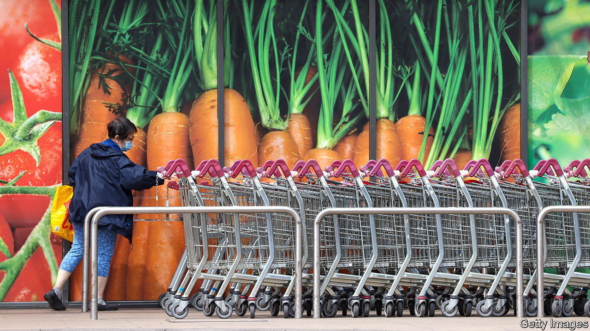
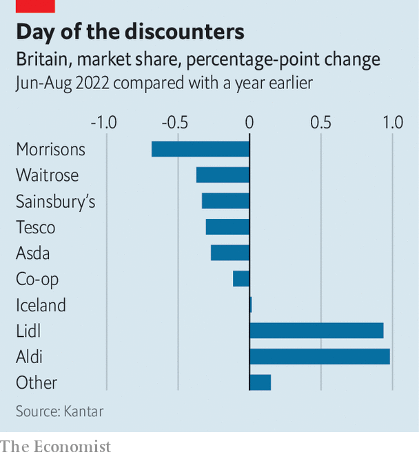

###### Eat up

# The cost-of-living crisis in Britain is not just about energy 

##### The rising price of food is also affecting shoppers, supermarkets and suppliers 

 

> Sep 8th 2022 

Asked in august what was behind the rising cost of living, 82% of adults blamed gas or electricity bills. But even more, 96%, blamed higher food prices. Although food is a smaller proportion of household budgets than energy, people pay for it frequently and visibly rather than via direct debits that they might not watch closely. Overall food prices were 12.8% higher in August than they were a year earlier; suppliers and shoppers are slowly adjusting their behaviour.

Now, as in the global food-price crisis of 2008, increases are being driven by higher costs. Even before Russia’s invasion of Ukraine, a tight labour market and rising global commodity prices meant that in January 2022 British inputs into food production were 7.2% more expensive than a year earlier, and the imported kind 6% pricier. In July these increases had ballooned to 14% and 17.5% respectively, pushed up in part by the eye-wateringly high price of gas. That is used to make fertiliser and carbon dioxide, which is itself deployed to slaughter animals and preserve food.

At first long-term contracts slowed the spread of these higher costs down the supply chain. As those contracts have come up for renewal, suppliers and retailers have had tough conversations. In June Tesco, Britain’s biggest supermarket chain, tussled with Kraft Heinz, a food manufacturer, over the price of its baked beans; that led to the product’s temporary disappearance from shop shelves. According to Assosia, a data company, in August the price of four tins of baked beans rose from £3 ($3.45) to £3.49, a 16.3% increase. 

In some cases the cost of processed foods can be trimmed by reducing the quantity of expensive proteins in them, using vegetable oil instead of animal fats or becoming less fussy about where ingredients are sourced. But such measures can achieve only so much. William Woods of Bernstein, a broker, says that discounters with the thinnest margins, like Aldi and Lidl, started lifting their prices as early as spring last year; their competitors began moving six months later.

 


Fraser McKevitt of Kantar, a research firm, says that, in contrast with the global financial crisis, supermarkets are refraining from ramping up promotional offers. They are putting more emphasis on trying to deliver consistently good value than on luring customers with one-off deals. That reflects both the expense of running such deals and fierce competition from the discounters, whose market share has increased slightly over the past year (see chart). Both Tesco and Sainsbury’s, two of the big four chains, are matching their prices to those of Aldi, a cut-price rival.

Mr Woods says that shoppers have taken their time trading down to cheaper products, and suspects that savings accumulated during the pandemic delayed this move. But now the shift to supermarkets’ own-label ranges has started. Data from Kantar suggest that sales of these have risen by 7% over the past year, whereas those of branded products are essentially flat. If and when a recession gets going, that pattern could be complicated by more affluent people spending more on premium products as they switch from dining out.

As wholesale gas prices swing wildly, there is scope for food prices to rise higher. Expensive fertiliser prices could drag down agricultural yields and prolong the pain. Although commodity prices have been falling since April, a weaker pound limits how much that helps British importers; they can also take up to six months to feed into lower retail costs because of those contracts between supermarkets and manufacturers. Food prices will leave a sour taste for a while yet. ■

