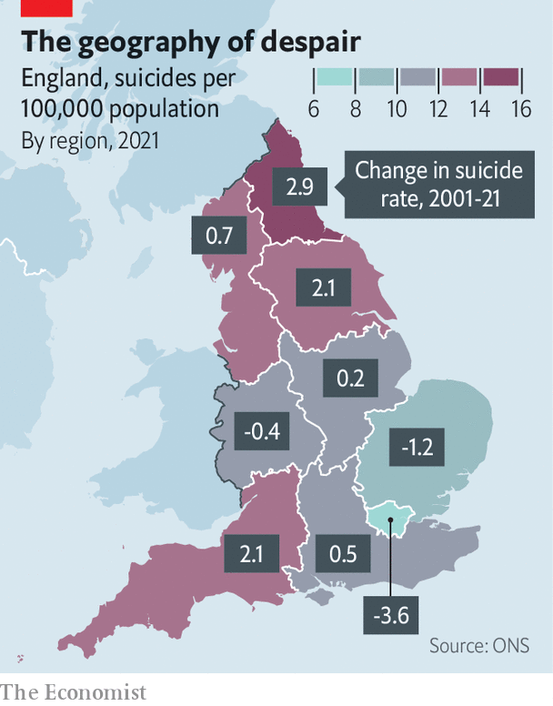
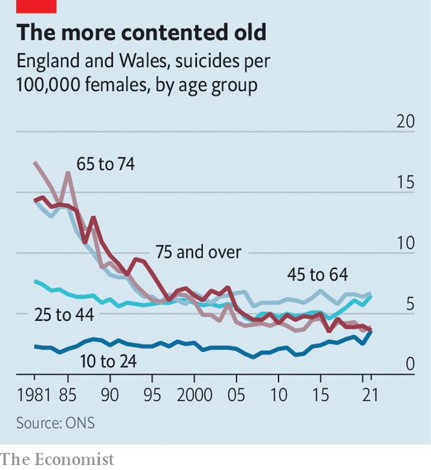

###### Self-harm in Britain

# The profile of suicide victims in Britain is changing 

##### New data show that old people and Londoners are less at risk 

 

> Sep 8th 2022 

As covid-19 spread in the spring of 2020, some feared a rise in the suicide rate. Many people were isolated and depressed, and the National Health Service was focused on battling the new disease rather than on Britons’ mental health. Data released by the Office for National Statistics on September 6th suggests they need not have worried. Last year 5,583 suicides were recorded. That is a rate of 10.7 per 100,000 people, a shade lower than the 2019 rate of 11 per 100,000. 

But if suicide did not increase overall, it did change. The suicide rate among people aged at least 75 fell to the lowest level since records began in 1981. Less happily, the rate for 10- to 24-year-olds reached its highest level for two decades. Among girls and women, who account for a quarter of suicides, young and old are now equally at risk (see chart). 

 


Old people’s lives have improved greatly in the past few decades, suggests Louis Appleby at the University of Manchester; they also find it harder to get hold of dangerous medicines. Families, charities and the state all made strenuous efforts to help them during the worst of the pandemic. Less attention was paid to the young, who suffered a harder psychological hit. A large panel study by University College London found that at one point during the lockdown of early 2021, more than a quarter of people aged 18-29 were having thoughts of death or self-harm. 

The other change is regional. In 2021 London recorded its lowest-ever suicide rate, of 6.6 per 100,000 people. Since 1981 the capital has gone from having the highest suicide rate of any region to the lowest. Meanwhile the North East, the poorest region of England, recorded its highest rate since the 1980s. Coastal spots such as Redcar and Cleveland in north-east England and Ceredigion in Wales fare the worst. 

 


Peter Congdon of Queen Mary University of London says there is some evidence that suicide rates cannot be explained entirely by personal characteristics. The environment in which people live also seems to play a part. It could be that London’s economic success over the past few decades has protected its citizens from self-harm, whereas the poverty of the North East has endangered everyone there. There is a message in that for the new government. Boris Johnson’s “levelling up” agenda is ailing and listless, a casualty of the previous prime minister’s lack of seriousness. But the problem he identified is real.■

