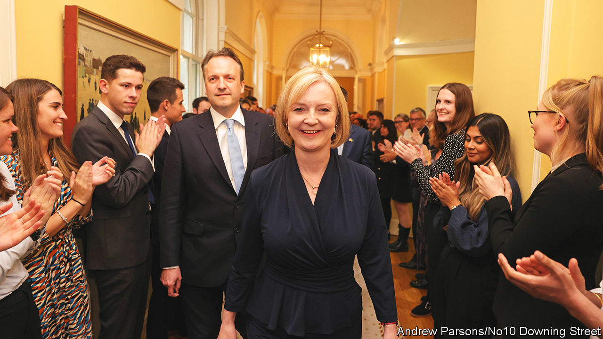
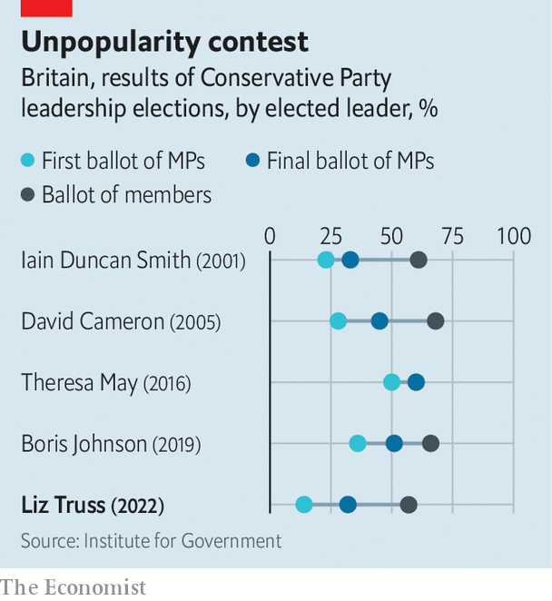
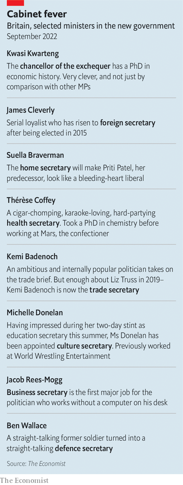

###### Wasp in a bell jar

# What kind of prime minister will Liz Truss be? 

##### Britain’s new leader is a small-state conservative in a big-state era 

 

> Sep 5th 2022 


Declinism, that dull fear of Britain’s sunset, has shaped the country’s post-war politics. It propelled Britain into the European Economic Community, the eu’s precursor, and fuelled Margaret Thatcher’s economic revolution. Now it has helped Liz Truss into Downing Street. On September 5th Ms Truss was declared the winner of the ballot of 172,000 Conservative members to replace Boris Johnson as the Tory leader. The next day, at Balmoral Castle in Scotland, the queen invited her to form a new government.

Ms Truss won partly because she is cheerful. On the campaign trail, she would dismiss the warnings of hard choices from Rishi Sunak, her rival. “I don’t agree with this declinist talk,” she’d say. “I believe our country’s best days are ahead of us.” Such optimism struck a chord among party activists. Her colleagues think it might appeal to the wider electorate, too. “It’s boosterism without Boris,” says a cabinet minister. “It’s a gamble, but it might be a very powerful cocktail.”

Whereas Mr Johnson’s government often seemed to run on optimism alone, Ms Truss promises substance as well as sunshine. She is a self-styled radical, and perhaps the keenest disciple of the Thatcherite tradition to hold the office since Thatcher’s own exit from Downing Street 31 years ago. She has grand ambitions to transform Britain’s sluggish economy so it does not end up as a low-growth, high-tax social democracy. For her, this is a moral choice as much as an economic one: who wants to live in a society where the state takes half your income?

 


“Action this day!” she declared in Downing Street on September 6th. Yet she faces almighty countervailing pressures. Her free-market instincts are at odds with the need to intervene to navigate an immediate cost-of-living crisis. On September 8th she guaranteed that average annual household energy bills will not exceed £2,500 ($2,870) over the next two years. Businesses will get help, too. The scheme will be funded by government borrowing. 

She must contest a general election in January 2025 or earlier, in which she will face the judgment of a deeply dissatisfied public. She inherits a country in dismal spirits: 69% of Britons, including 60% of Conservative voters, agree that the country is “in decline”, according to polling by Ipsos for . And the party she now leads has grown insurrectionary: it has deposed her two immediate predecessors and is unenthused by her.

Story of a Tory

Ms Truss was born in Oxford in 1975 to John, a mathematics professor, and Priscilla, a nurse. They were part of a left-wing, anti-war movement that flourished in opposition to Thatcher. Her childhood was spent on peace marches, clutching an old carpet roll fashioned to look like a nuclear missile, chanting “Maggie, out!”

Her journey rightward began at her state secondary school in Leeds, where she claims she encountered an inverse snobbery against good universities and making money. “Too often, there’s a bit in Britain which is kind of squashing people,” she told an interviewer in 2018. She saw too the restricted lives of her parents’ acquaintances in communist Poland, and concluded there was something to be said for Thatcher’s freedoms. Her father now consoles himself with the hope she is a sleeper agent, she says, undermining the regime from the inside.

Elected to Parliament in 2010, Ms Truss came to public prominence soon after as the co-author, with four other new mps (among them , her chancellor), of “Britannia Unchained”. This pamphlet warned of Britain’s drift into being a low-productivity, unambitious country, unable to compete with fast-growing Asian economies. The authors credited Thatcher with rescuing Britain from an age when “Blue Peter [a tv show] taught children how to line blankets with newspaper to keep elderly relatives warm without heating”. More than any economic reform, her triumph, they wrote, was making Britain believe in itself again.

Ms Truss’s remedy for Britain’s economic ills is a Reaganite mixture of deficit-financed tax cuts and regulatory reform. She proposes low-tax zones with relaxed planning laws and wants the headline corporation-tax rate kept at 19% (Mr Sunak had planned to increase it to 25% in April). She intends to reverse an increase to payroll taxes, introduced by Mr Sunak in April, and is mulling tax relief for carers. She plans to lift defence spending to 3% of gdp by 2030. Setting aside her energy-crisis package, these measures alone would push up the deficit by around 1.8% of gdp.

Ms Truss is convinced that Britain has room to borrow more and that over the longer term, her policies will reap rewards in the form of higher growth. Her government’s central goal will be raising Britain’s trend growth rate to 2.5%; the Office for Budget Responsibility currently expects a growth rate of 1.7% at the end of its forecast horizon, in 2026. She brushes off the fact that payroll-tax cuts will benefit wealthier people: a preoccupation with redistribution has been part of the problem, she says.

She regards the job of tackling inflation as primarily a task of monetary policy, one where the Bank of England has manifestly failed to meet its target of 2%. She plans a wide-ranging review of the bank’s mandate, which could embrace everything from setting a higher inflation target to targeting nominal gdp or looking at the money supply. As for regulation, Ms Truss argues that, although Thatcher blazed a trail by privatising utilities, rulebooks drawn up in the 1980s look obsolete now. Her camp muses about placing a series of weak network regulators under a single agency.

She wants to free up flows of capital; she has improbably high hopes for the potential of reforming an eu insurance regime known as Solvency 2 and is happier to talk up the potential of Britain’s financial-services industry than her predecessor. She is also far keener on labour mobility than Mr Johnson, who thought the job of government was to create jobs where people are born. On the contrary, Britain’s productivity is poor precisely because people stay put, Ms Truss reasons.

She will be a more effective administrator than Mr Johnson, although that is a low bar. She is proud of having signed a clutch of deals as trade secretary and of having helped negotiate the release of British hostages in Iran as foreign secretary. (In truth both revealed a knack for selling difficult concessions as triumphs.) Yet for all her talk of “delivery”, her record of achieving big structural reforms is thin. “She’s travelled around lots of departments and nary made a mark,” says a colleague.

The civil service, bashed during Mr Johnson’s tenure, can expect little respite from a Truss premiership. Her career has been studded by a disdain for institutions she holds responsible for British underperformance. She claims that a Treasury orthodoxy of “abacus economics” is partly to blame for the country’s sluggish growth. Judges were horrified when, as lord chancellor under Theresa May, she failed to defend them from tabloid attack. Mr Johnson sent her to the Foreign Office, where she chastised diplomats who seemed to her almost embarrassed of their country. She has recast British foreign policy as a civilisational battle between autocracies and what she terms “the free world,” with Britain at the centre of a “network of liberty”.

Yet under her, a prickly Britain may become pricklier still. She goaded Mr Sunak for his trade overtures to China, which she regards only as a threat. For all her admiration of Ronald Reagan, she says there is no need for Britain to fret about the “special relationship” with America “like some teenage girl at a party”, and wants to find a wider pool of allies. 

Ties with the eu will remain, at best, in deep freeze; she is threatening to override parts of the Brexit divorce deal struck by Mr Johnson. Relations with France, Britain’s closest geographic neighbour, are unlikely to improve. Asked during the leadership campaign whether she regarded President Emmanuel Macron to be a friend or foe, she declared that the jury was out. Optimists thought that was mere electioneering; in reality, it reflects a genuine clash over Mr Macron’s approach towards Vladimir Putin on Ukraine.

Ms Truss regards herself as more of a social liberal, and less of a traditionalist, than Thatcher ever was. Like much of the Tory party, she is a critic of the new politics of gender identity but says that it isn’t the job of the state to tell shops how to organise their changing rooms. She has dismissed calls for a new law to guarantee political neutrality in schools; better to win arguments than legislate, she says. A sprawling bill to regulate “harmful” content online has been put on ice.

Britannia, chained

Most new leaders are granted at least a few weeks to bathe in the afterglow of their campaign, before the hard reality of government intrudes. For Ms Truss, the spike in energy prices means the collision has been instant. “Her fate will be determined not in the first 100 days, but the first ten,” says a cabinet minister.

On the campaign trail Ms Truss declared herself averse to a “Gordon Brown economics” of taxing with one hand and awarding “handouts” with the other. She was much keener to talk about increasing energy supply. She wants to encourage more extraction of North Sea oil and gas, end a moratorium on fracking and add nuclear power. She has ruled out extra windfall taxes on the energy industry and insisted that rationing will not be necessary.

But new supply will take months or years to come online. Cornwall Insight, a consultancy, has predicted that without intervention, average annualised energy bills would soar to above £6,000 by next summer, which would prove ruinous for many households and businesses. Hence the need for dramatic action. Her response is a very blunt instrument: a guarantee that average annual household energy bills will not exceed £2,500 for two years, as well as help for companies.

The cost of the scheme, which will be paid for by government borrowing, could amount to more than £100bn, exceeding the scale of the furlough scheme introduced in the pandemic. Spending countless billions was popular with the public then, and it is likely to be so again. But it was also an experience much of the Conservative Party genuinely loathed. It was as if all their opponents’ ideas of the state, whether paying for furlough schemes or imposing lockdowns, were being vindicated and theirs discarded. 

And the demands on the public purse are not confined to energy. The strain on the National Health Service (nhs), where the waiting list for people to receive care now stands at 6.7m, scarcely intruded into the Tory leadership contest, but its woes will be a major battleground in the next general election. Ms Truss’s instinct is that the nhs requires better management and cannot simply consume an ever-growing slice of output. She has given Thérèse Coffey, her closest political ally, the task of reducing the backlogs. 

But the pressure to spend more will be unrelenting: the Resolution Foundation, a think-tank, reckons that demography will help drive government spending from 40% of gdp before the pandemic to about 45% by 2030, shifting Britain from being a Canada-sized state to a Germany-sized one. Ms Truss has offered little detail on how public spending might be shrunk.

It is this condition of political dysmorphia—a small-state party trapped in an increasingly big-state country—that is at the heart of the Tories’ restiveness. Ms Truss is the Tories’ fourth leader during their 12 years in office; rebellion has become a means of doing business.

Mr Johnson, despite his outsized brand and electoral victory of 2019, could not tame them. And Ms Truss starts her time in office from a weak position. She finished behind Mr Sunak among mps in the first stage of the contest, with just 32% of the vote. That is the lowest of the five leaders elected since the current two-stage system of choosing Conservative leaders was first used in 2001. Her winning margin against Mr Sunak in the membership vote, with 57% of the vote to his 43%, is also the lowest on record.

 


The party faces a choice of “unify or die”, says one Truss supporter. “mps are just going to have to suck it up.” Yet the scars left by a bitter summer campaign will not disappear quickly. Mr Sunak’s supporters have been slung from the cabinet, which is dominated by those loyal to her (see table). 

Mr Johnson, still mythologised as an electoral Midas, will loom over her premiership. By a margin of 63% to 22%, Tory members would prefer him to Ms Truss, according to a poll conducted in August. Her support within the parliamentary party rests on the Eurosceptic right, which is notoriously transactional.

That corner of the party, in particular, is in a declinist mood. Some wonder what the past decade of Conservative government has been for. They see in Britain a country seemingly less conservative than ever: a tax burden at its highest in decades, a growing taste for state intervention and an untamed “woke” culture. Ms Truss is the fourth roll of the dice for a party squinting hard, searching for a simulacrum of the woman who turned Britain around before. The country she now leads may well be looking for something else entirely. ■

