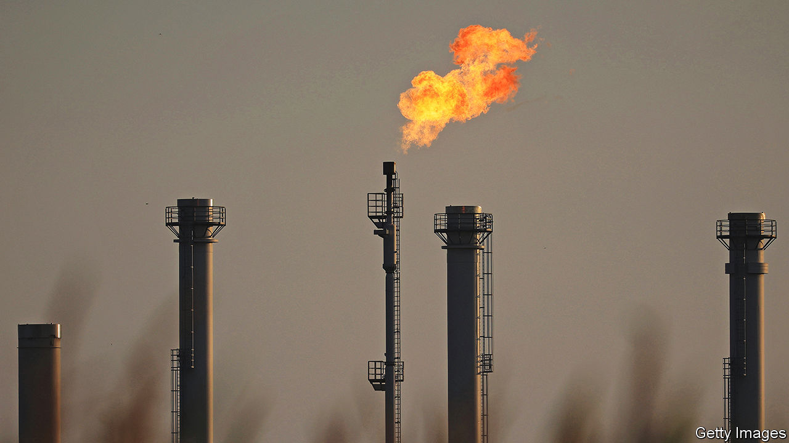
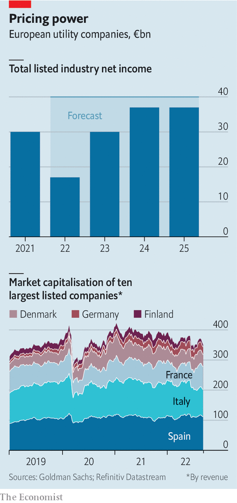

###### Generating controversies

# Some European power companies are on the brink 

##### Others are on a high 

 

> Sep 8th 2022 

Robert habeck, the telegenic economy minister of Germany’s newish coalition government, has become a darling of the German media. He has been called a “rock star” and mooted as the next chancellor. Now the media has turned on him over his plan to bail out some utilities with a natural-gas surcharge that could cost an average four-person household an extra €480 ($480) per year (plus value-added tax). The measure is just one part of a complex set of government interventions.

Mr Habeck argues that the levy is necessary to save utilities such as Uniper or the sefe Group (formerly Gazprom Germania). They are facing billions in losses as a result of Russia’s decision to curtail supplies of gas in response to Western sanctions over its invasion of Ukraine in February. In order to meet their obligations to customers, the power companies must cover the shortfall by buying the fuel at exorbitant cost in the spot market. 

The trouble is that as designed, proceeds from the levy could go to some energy companies that appear to be doing rather well out of the current ruckus. They include firms such as Gunvor, an energy trader based in Switzerland whose net profit nearly quadrupled in the first half of the year, and rwe, a German one which reported an adjusted gross operating profit of €2.9bn for the first six months of 2022, up from €1.8bn for the same period last year. 

A humbled Mr Habeck has vowed to look for ways to adjust the levy to avoid benefiting undeserving firms. rwe has pledged not to take advantage of the scheme. Still, the episode illustrates the topsy-turvy state of Europe’s energy markets, where some companies are asking for bail-outs while others stand accused of price gouging and threatened with windfall taxes on excess profits. The winners are getting “revenues they never calculated with; revenues they never dreamt of; and revenues they cannot reinvest to that extent,” fulminated Ursula von der Leyen, the president of the European Commission, the eu’s executive arm, on September 7th.

The most troubled utilities are, predictably, those that depend directly on gas from Russia. Germany’s Uniper, Europe’s largest importer of the stuff, worked smoothly with Gazprom for more than 40 years until June. Since then Russia’s state-owned behemoth has cut deliveries by 80%. In July Uniper reported an €12.3bn loss for the first half of 2022. The government agreed to take a 30% stake and provided €15bn in emergency aid. Even so, Uniper continues to lose €130m a day, calculates Wanda Serwinowska of Credit Suisse, a bank. As the supplier of more than 25% of Germany’s gas, it is too big to fail. On August 29th it asked kfw, a state-owned bank, to increase its €9bn credit line by €4bn.

On August 31st Wien Energie, Austria’s largest regional utility, which is also heavily reliant on Russia, received a €2bn credit line from the government to meet margin calls. The company is in talks with officials about a €6bn bail-out. And on September 4th Sweden and Finland announced that they have made $33bn available for Nordic utilities that struggle to trade on extremely volatile power markets, where sky-high prices mean that companies must post much higher collateral to secure trades. The collateral needs of Fortum, a Finnish utility, jumped by €1bn, to €5bn, in a week.

 


Utilities that do not depend on gas to generate power are doing considerably better. But their latest results have little to do with the current turmoil. Because most companies hedge and sell forward contracts for electricity and gas, profits today often reflect the price of commodities a few years ago, says Alberto Gandolfi of Goldman Sachs, another bank. All told, Mr Gandolfi forecasts, European utilities will generate combined net profits of €17bn this year, down from €30bn in 2021 (see chart). If governments do not intervene, those combined profits could bounce back roughly to last year’s levels in the next few years, the bank reckons. 

Even if all of this—some €150bn between 2020 and 2024, according to Goldman Sachs—were confiscated by the state, it would be a drop in the bucket next to the €2trn that Europeans will need to fork over in extra energy bills between 2021 and 2023 if prices do not come down. Sam Arie of ubs, one more bank, warns against raiding utilities for cash. A windfall tax would discourage them from making much-needed investments. It could, for example, prompt rwe to rethink its plan, announced in July, to invest €5bn in renewables this fiscal year, 30% more than it had originally planned. It would also leave the firms with less money to build infrastructure to bring liquefied natural gas from terminals in the west of the European continent to its gas-starved centre. 

Investors in Europe’s listed utilities have remained remarkably placid. The combined value of the biggest firms looks as boring as ever. The market may have concluded that excess profits will be taxed away—or simply won’t materialise. ■


