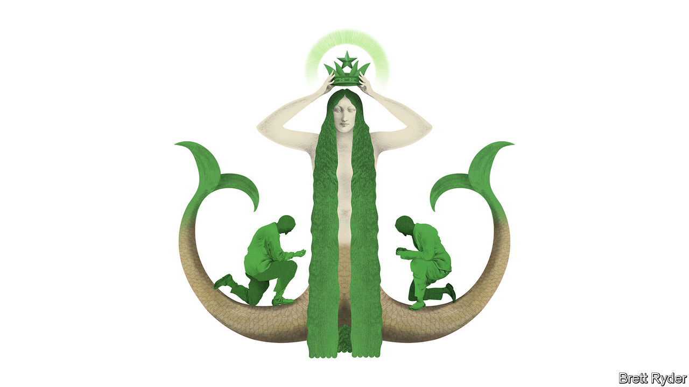

###### Schumpeter

# Starbucks and the perils of corporate succession 

##### How the old boss can hamstring the incoming one 

 

> Sep 8th 2022 

The transfer of corporate power from battle-hardened builder to professional manager is always tough. Howard Schultz, who turned Starbucks from a handful of Seattle coffeeshops to a global behemoth, has pulled it off twice. At the turn of the millennium he passed on the chief executive’s mantle to an heir, only to return to shepherd the firm through the global financial crisis of 2007-09. He then abdicated once more in 2017. After stepping in as boss for a third time in April, he is now preparing to hand over the keys to the caffeinated kingdom yet again. 

This time the ascendant prince is Laxman Narasimhan. The announcement of his exit from his current job as ceo of Reckitt, a British consumer-goods giant, caught the market by surprise on September 1st, wiping 5%, or $3bn, from the company’s market capitalisation. Nicandro Durante, a member of Reckitt’s board, will be in charge until a permanent replacement is found. A second surprise came hours later: Mr Narasimhan’s new job. He will join Starbucks in October as chief executive-in-waiting. Initially he will acquire privilege but not power, learning the ropes on a whirlwind tour of coffee farms and city stores before taking over as chief executive proper in April 2023. 

Mr Narasimhan comes from blue-blood managerial stock: two decades at McKinsey, a consultancy, preceded a stint as chief commercial officer at PepsiCo. In September 2019 he was appointed as Reckitt’s boss. Verdicts on his time there are positive, if perhaps premature. After laying out his strategy in February 2020, Mr Narasimhan oversaw growth in the firm’s top line and protected margins despite the huge cost inflation afflicting the industry (and many others). Covid-19 and a baby-formula shortage in America were unexpected tailwinds during his tenure. How his strategy will perform in calmer times is an open question—Reckitt shareholders will feel short-changed by his early exit and a stubbornly flat share price. 

Shareholders in Starbucks, a firm twice as big as Reckitt in terms of both revenues and market value, are nevertheless quietly encouraged by his operating record. The first important date in Mr Narasimhan’s calendar is September 13th, when Starbucks will hold its much-anticipated strategy day. With the company’s share price down by almost 25% this year, Mr Schultz needs to brew up something hot. He is expected to flesh out his woolly “Reinvention” strategy (the goal is apparently to “inspire and nurture the human spirit—one person, one cup and one neighbourhood at a time”). For investors, the presentation may provide much-needed clarity about the firm’s future direction. For Mr Narasimhan, it will be the scorecard against which he will be marked.

It is already clear that he will have his work cut out. Transaction volumes in America during the most recent quarter were flat, with sales growth driven by customers spending more following price increases. A recession, which now looks more likely than not as the Federal Reserve continues to raise interest rates to quash soaring inflation, would disrupt this approach. Even brands with strong pricing power and customer loyalty (27m members of Starbucks’s loyalty programme contribute about half of its sales in America) must be careful not to overstretch consumers’ wallets, which could dampen demand. International growth is unlikely to come to the rescue, either. The government in China, the company’s biggest foreign bet, insists on tough covid-19 restrictions that have dragged sales at the 6,000 or so Chinese Starbucks down by more than 40% in the three months to July 3rd, year on year. 

At the same time, changing consumer tastes require new investment. It is increasingly the complex roster of customisable cold beverages that keeps customers coming back. As simple Americanos are out and iced toasted-vanilla oat-milk shaken espressos are in, the ruthless efficiency drive and menu-preening which Mr Schultz successfully deployed to cut costs in the wake of the financial crisis would probably prove more difficult still. 

Cost-cutting will be further complicated by continued tightness in labour markets. This makes hiring harder. It also makes for bolshier baristas. More than 230 of the company’s outlets have voted to unionise since the end of last year. Starbucks is fast becoming a symbol of retail rebellion. 

It is too early to quantify the financial impact of this movement, but one certainty is that Mr Schultz, who has long opposed unions and instead offered generous benefits, will cast a long shadow over this dispute even after relinquishing executive power. The hiring in April of Frank Britt, a workforce-relations specialist, as chief strategy officer, suspension the same month of a $10bn-plus buy-back scheme in the name of investment in the workforce, and fractious legal disputes over the treatment of unionised shops guarantees as much. Any hint of wage rises in the September strategy review would further hamstring the new ceo.

Sleepless in Seattle 

Mr Narasimhan could yet make the job his own. His time at Reckitt certainly hints (without quite yet conclusively proving) that he is a skilful manager. At a time of increased meddling in American business from both the left and the right, he is also less of a political liability than Mr Schultz, a billionaire who considered running for president as an independent and manages to be a hate figure both to conservatives, who denounce him as a symbol of vapid corporate wokeism, and to progressives, who see him as an anti-union robber baron. 

The incoming boss may find a way to sidestep his larger-than-life predecessor and innovate, rather than merely acting as a hired gun brought in to implement a strategic vision he had no hand in crafting. If Starbucks is to succeed in the long run, that is what both he and Mr Schultz must understand. And if the new ceo disappoints, at least shareholders know there is business’s biggest barista waiting in the wings. ■


 


