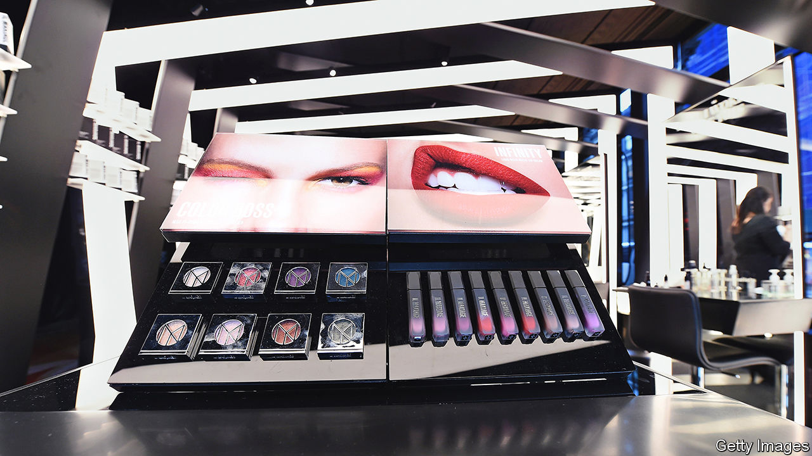

###### Wrinkle treatment

# The ugly truth about young beauty brands’ business model 

##### They have a thing or two to learn from their mature rivals 

 

> Sep 8th 2022 

People like to feel pretty. Over the past ten years Americans have spent more than $500bn on beauty products. By 2024 the Chinese are expected to splurge more than $100bn a year. In the past most of that would have gone to cosmetics conglomerates, such as L’Oréal and Estée Lauder, or to consumer-products giants like Unilever, selling every imaginable tincture to make everything from toenails to tresses more fetching. But in recent years fresh-faced newcomers, often more specialised and more digital, have entered the fray. 

Now the upstarts are showing some wrinkles, as their business models are tested, investors lose patience with red ink and the incumbents up their game. The sales of Glossier, a hot American make-up firm most recently valued at $1.8bn, fell by a quarter in 2021. The firm has laid off a third of its staff; its long-rumoured initial public offering (ipo) may be the subject of rumours for a while yet. Olaplex, a haircare firm that went public last September in a blockbuster ipo that valued it at over $15bn, has since shed half its market capitalisation. Do the beauty challengers need to undergo their own metamorphosis?

The time-honoured way to market cosmetics was to pay millions to mostly white, mostly female top models and a-list stars who would appear in ads in glossy magazines and on billboards. Shifting the products, which were mostly made in-house, invariably involved a booth in a department store, a chemist’s or a specialist retailer such as Sephora. The upstarts took a different tack. They outsourced production and enlisted social-media influencers of all hues and genders to promote their brands. This was meant to drive traffic to their online stalls, either on the firms’ own websites (an approach pioneered in the beauty business by Glossier) or on existing e-commerce platforms such as Amazon and Shopify in the West or jd.com and Alibaba’s tmall in China. 

This approach has some big advantages. It affords the young companies access to data on shoppers and their preferences, says Lindsay Drucker Mann, chief financial officer of Il Makiage, another young American make-up darling. “If we sell through wholesale, we lose that information,” she explains. Given how quickly make-up trends can sometimes change—just think of the sudden popularity of minimalist “clean-girl make-up”—such information is invaluable. 

It also helps digitise beauty shopping, which as a deeply sensory experience has long resisted digitisation. Il Makiage is developing artificial-intelligence (ai) algorithms (sometimes by acquiring smaller ai firms) to help people choose the right foundation shade. Other brands use ai-assisted quizzes to help buyers pick the right product for them. 

Techno-literacy may also make it easier to identify and target historically underserved market segments. Fenty Beauty caters to consumers who, like its founder, Rihanna, a pop icon, have a darker skin tone. In May the firm (which is part-owned by lvmh, a French luxury conglomerate) launched in eight African countries. Uoma Beauty, created by Sharon Chuter, an executive who quit the old cosmetics industry over its failure to be more “multicultural”, offers 51 foundation shades. Uoma’s sales grew sharply in 2021, relative to 2020. Pharrell Williams and Harry Styles, two other pop stars, have each launched gender-neutral beauty brands. Revenues of Byredo, which has been making gender-neutral perfumes since 2006, surged to $141m last year, up from $18m in 2020. 

Increasingly, however, the upstarts’ digital-first approach is showing its limits. Outsourcing, for example, allows the companies to remain light on assets but can turn out to be costly at a time of supply-chain shocks of the sort that have rocked many sectors during the pandemic. 

The influencer-based marketing strategy, meanwhile, has proved great at encouraging initial purchases but not necessarily repeat buys. Moreover, as the influencer economy has grown, so have the cheques demanded by the biggest names. They command as much as $200,000 for a single social-media post. The fees may be bid up further as the incumbent giants increase their social-media exposure, which most of them are desperately trying to do in order to appeal to younger shoppers.

The ugly truth

Bricks-and-mortar shops where many purchases, particularly of make-up, are spur-of-the-moment, remain critical to the beauty business. Most Americans still buy their cosmetics from Walmart. Chemists such as Walgreens and cvs also maintain a large market share. Around 90% of Uoma Beauty’s sales are through retail partners, says Ms Chuter. In July Glossier stepped away from an exclusively direct-to-consumer approach by agreeing to sell some of its make-up through Sephora (which is owned by lvmh). 

Big-beauty bosses are no doubt watching all this with glee. The upstarts’ problems have highlighted the incumbents’ abiding advantages: greater scale, sturdier supply chains and robust distribution networks. They also boast more resources to funnel into research and development (and not just chemistry labs: L’Oréal runs thriving tech incubators in America, France and Japan) or into acquisitions. 

Even before the latest crunch some startups were becoming willing buy-out targets. In 2019 Drunk Elephant, an American skincare brand (founded in 2012), sold itself to Shiseido, a Japanese giant (founded in 1872). As more of the upstarts trip up and funding dries up amid a venture-capital winter, they too may find that old beauty still has allure. ■


