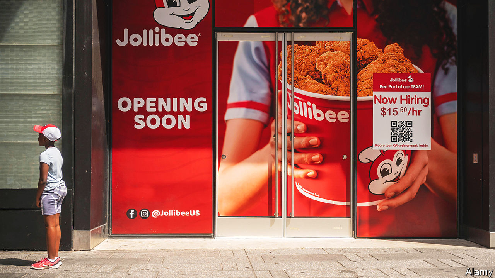

###### Help still wanted

# Why businesses are furiously hiring even as a downturn looms 

##### A shake-up in the labour market gives the upper hand to job applicants 

 

> Sep 5th 2022 

Should companies be hiring or firing? Demand for workers has roared back over the past two years. At the same time fears of recession are widespread. Firms are scrambling to respond—and coming up with different answers. Last week Snap, a social-media firm, said it would fire a fifth of its workforce and noted the “difficult macro backdrop”. Mark Zuckerberg is reported to have told employees at Meta that “there are probably a bunch of people who shouldn’t be here,” but has so far not announced big lay-offs. Tim Cook, boss of Apple, takes the middle course. The iPhone-maker will continue to hire “in areas”, he said recently, but he was “clear-eyed” about the risks to the economy.

For now the hirers are trumping the firers. Figures released on September 2nd show that American employers, excluding farms, added 315,000 workers in August. The Jobs Openings and Labour Turnover Survey (jolts), released a few days earlier, reported 11.2m job openings in July. There were almost two vacancies for every unemployed person (see chart 1). The situation in Britain is similar. The Bank of England forecasts a bitter recession but vacancies are near record levels. 

 


Why is that? Behind today’s labour paradox lie three factors. First, high churn in the labour market. Second, that market’s post-pandemic shake-up. Last, most businesses, fighting day-to-day battles, have limited bandwidth to deal with subtle cyclical shifts. The few that do may be able to secure a lasting advantage. 

Start with high churn. The job market is in a state of perennial change. Simple economic models treat all firms as the same and the economy as a “representative firm” writ large. In reality, firms are very different. Some businesses expand, while others shrink—in booms and in busts. The change in employment captured by indicators such as the monthly non-farm payrolls is a net figure, the difference between job creation and job destruction by enterprises and between joiners and leavers at the level of workers. These flows are large compared with the change in employment. In July payrolls rose by 500,000, but around 6.4m began new jobs and 5.9m left their old ones. 

 


The jolts data capture the rate of worker flows in a single month (see chart 2). Over the course of a year, an even larger number of people move from job to job or from not working to working (and vice versa). As a rule of thumb, jobs flow at a slower rate than workers. In expansions job creation outweighs jobs destruction. In recessions, job destruction is greater. But churn is high at all times. Some hiring firms are also firing firms. Walmart, America’s largest private employer, confirmed in August that jobs would go at its headquarters even as it was creating some new roles. 

For other businesses, a cyclical downturn is forcing a rethink. Planned lay-offs at firms like Netflix, Robinhood and Shopify are a correction to rapid hiring earlier. A lot of the historical cyclicality in hiring is down to high-growth startups and newish businesses, says John Haltiwanger of the University of Maryland. In booms providers of capital, be they venture-capital funds, banks or public-market investors, are willing to fund all sorts of enterprises. In downturns, they become averse to risk.

Lay-offs can also be a response to deeper structural challenges. In February Ford’s boss, Jim Farley, was blunt about those at the carmaker: “We have too many people; we have too much investment; we have too much complexity.” In manufacturing, the need to cut jobs invariably means people get fired. But there are industries, notably retailing, where the normal rate of turnover is so high that jobs can be cut without any terminations. Just stop hiring and payrolls will shrink. Mr Zuckerberg’s approach, it seems, is to try and hurry along Meta’s rate of worker attrition. 

What about the second factor, the post-pandemic shift in the job market? Steven Davis of the University of Chicago’s Booth School of Business calls it the “great reshuffling”. The demand side of the market has not been changed much by covid-19, according to a recent study by Eliza Forsythe of the University of Illinois and three co-authors. Many of the 20m Americans who were laid off in April 2020 were quickly recalled by their employers. The supply side was more radically altered. The employment-to-population ratio remains below its pre-pandemic peak, mostly as a result of older workers exiting the workforce, say the authors. And it is still a struggle to fill customer-facing jobs. The surge in vacancies is especially marked in the leisure, hospitality and personal-care industries. 

Employers in America are stepping up the intensity of recruitment. Skills requirements in adverts for customer-facing jobs have been relaxed. Pay has picked up more sharply than in other kinds of work. Ms Forsythe and colleagues find an increased likelihood of unemployed and low-skilled workers moving into white-collar jobs. Opportunities on the higher rungs of the jobs ladder appear to have opened up, because of retirements. 

It is much the same in Britain. On a boiling weekday in August, dozens of businesses set out their stall on the campus of the University of Middlesex. Firms like JH Kenyon, a funeral director, Metroline, a bus company, and Equita, a debt-collection agency, were targeting not fresh graduates but the local unemployed. Recruiters recalled how jobseekers used to come to them—a “constant pipeline”, according to one. Now firms are doing the seeking. 

The combination of a looming recession, high churn and the shifts in the supply of workers is exceptionally complex to manage for most firms. In principle, a well-run business could recruit strategically across the business cycle. In practice, even the certainty of a recession in 12 months’ time would not be enough to help firms fine-tune hiring. They would need to know the magnitude, duration and industry characteristics of any recession. Turning hiring on and off in response to subtle cyclical shifts is unfeasible. 

Firms, like people, have limited bandwidth—and that bandwidth is being expended on navigating work-from-home policies. At one extreme is Elon Musk, who has told Tesla’s employees to turn up in the office for at least 40 hours a week or “pretend to work somewhere else”. At the other are Yelp, a review website, which favours a “remote-first” strategy, and Spotify, which allows “work from anywhere”. This approach has advantages in a tight job market. It lets firms cast recruitment nets over a wider area. Remote workers may trade off greater flexibility for lower pay. But there are obvious downsides, too. It is tough to sustain unity of purpose when colleagues barely meet each other.

Can any firms navigate today’s tricky labour market well? Apple appears to be doing so. In Europe Ryanair, an airline, hoarded staff during the pandemic and began hiring aggressively as the economy reopened. It has kept flying this summer, gaining market share as rivals have cancelled flights. But for many firms finding an answer to the labour paradox will not be easy. One recruiter at the jobs fair in Britain with a pipeline of infrastructure projects says he hopes it will be unscathed by recession. Still, when it comes to hiring workers in the here and now, it is a scramble. “You just need to be able to turn up on time and show some willingness and commitment,” he says of his target applicant. “No previous experience is required.” ■


