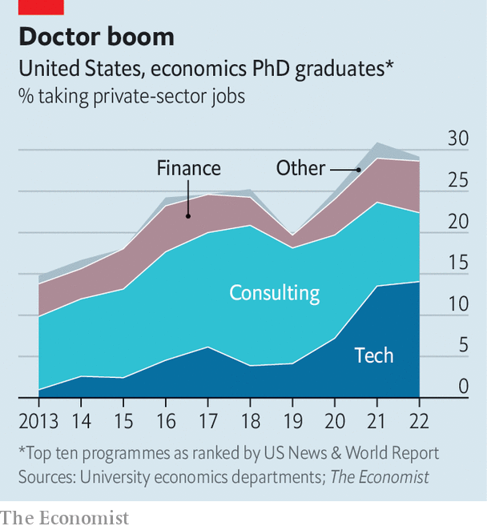

###### Mr Smith goes to Silicon Valley

# Why economists are flocking to Silicon Valley 

##### And why big tech wants them 

 

> Sep 7th 2022 

For more than a decade Facebook, now known as Meta, has awarded fellowships to promising graduate students working on cutting-edge research. The prize, which this year comes with up to two years’ worth of university tuition and a $42,000 stipend, has gone to computer scientists, engineers, physicists and statisticians. Now it has gone to an economist. “I was not expecting it,” says Jaume Vives i Bastida, the lucky recipient working on a phd at the Massachusetts Institute of Technology (mit).

Silicon Valley is increasingly turning to economics for insights into how to solve business problems—from pricing and product development to strategy. Job-placement data from ten leading graduate programmes in economics shows that tech firms hired one in seven newly minted phds in 2022, up from less than one in 20 in 2018 (see chart). Amazon is the keenest recruiter. The e-emporium now has some 400 full-time economists on staff, several times as many as a typical research university. Uber is another big employer—last year the ride-hailing firm hired a fifth of Harvard University’s graduating phd class.

 


For the dismal scientists pay is a factor, says John List, a professor at the University of Chicago who has worked at Uber and Lyft. But tech companies also offer many of the benefits of a university career without the “publish or perish” culture. In the past, heading to the private sector often meant forgoing research completely. Now, explains Mr Vives, “Research can still be a big component of your job.” Access to the companies’ ample data is another selling point, says Steve Tadelis of the University of California, Berkeley, who spent two years at eBay, an online marketplace. 

For big tech, meanwhile, economists offer skills that computer scientists and engineers often lack. They tend to have a good grasp of statistics, as well as a knack for understanding how incentives affect human behaviour. Most important, economists are adept at designing experiments to identify causal relationships between variables. Machine-learning engineers usually think in terms of prediction problems, notes one Ivy League grad who recently started a job in tech. Economists can nail down the causal parameters, he says.

An e-commerce firm may want to estimate the effect of next-day shipping on sales. A ride-hailing firm may wish to know which sets of incentives lure drivers back to the city centre after they are hailed by customers attending a big concert or sporting event. In two periods between 2015 and 2017 Mr List and colleagues at Lyft, Arizona State University and Boston University manipulated the prices and wait times for Lyft rides across 13 American cities to estimate the value of time. The study, which found that Lyft users value their time at about $19 per hour, yielded a paper. It also led to a new feature on the Lyft app called “Wait &amp; Save”, which lets riders opt for a longer wait time in exchange for a lower fare. 

For all its recent recruitment success, Silicon Valley may have a harder time attracting the finest economists. In contrast to fields like artificial intelligence, “our best minds still stay in the academy,” observes Mr List. Maybe not for long. “I would like to be a professor, I would like to do research for a living,” says Mr Vives. “I can also do that at a tech company.” ■


