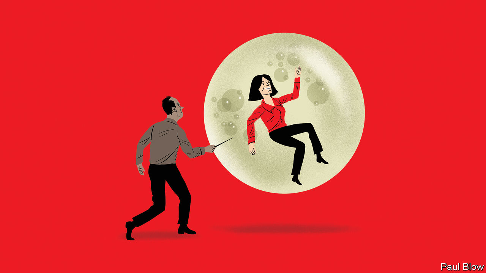

###### Bartleby

# Why the fuss over quiet quitting? 

##### Bosses’ loud reactions to an anodyne idea are telling 

 

> Sep 8th 2022 

It’s not the crime but the cover-up. And it’s not the video but the reverberations. In the past few weeks the term “quiet quitting” has entered conversations about the workplace. A 17-second clip on TikTok, a social-media platform, in which an American called Zaid Khan embraces the notion of not going above and beyond at work, has caused an awful lot of noise. 

The video itself is amazingly anodyne. A piano tinkles. Bromides such as “Work is not your life” and “Your worth is not defined by your productive output” flash on the screen. Mr Khan implies that time not spent hustling at work can be better spent playing with a bubble machine and admiring trees. 

Dull or not, it stamped on a nerve. Workers approvingly shared their stories about deciding not to work overtime, about prioritising work-life balance and about doing enough to get their job done without succumbing to burnout. Several bosses promptly lost their moorings. Kevin O’Leary, a businessman-cum-television-personality, called it “the dumbest idea I’ve ever heard”. Arianna Huffington, another entrepreneur, wrote a LinkedIn post in which she described quiet quitting “as a step towards quitting on life”. 

The fact that some employees feel unenthused about their work is hardly new. In all workplaces employees show varying degrees of commitment to their jobs. Some work late, others leave at 5 o’clock sharp, a few seem to do little more than respire. A survey of workers around the world by Gallup, a pollster, found that only 21% of them are engaged by their jobs. The very idea of going above and beyond requires a distribution of effort, with less committed colleagues providing a baseline against which others can be judged. The nature of the work also matters: it is easier to be engaged by some jobs than others. It is unsurprising, too, that quiet quitting has a particular resonance now. Lots of employees feel detached from their work. 

The bargain of hard work for higher pay is less attractive than it once was. A succession of big shocks, from the financial crisis of 2007-09 to the pandemic, has made career planning seem pointless to some. Higher salaries go less far in many places: housing affordability is at its lowest level on record in Britain, according to Halifax, a lender. All of which may make some workers less motivated to pull all-nighters in search of a promotion. 

The melodramatic reaction of some bosses looks stranger at first glance. This is not the start of a revolution, after all. Mr Khan’s post may have garnered 3.5m views on TikTok but the most viewed video on the platform has been seen 2.2bn times (it features an illusionist on a broomstick). Even slackers need to make money; showing application is still a pretty reliable way of getting ahead in the workplace. 

Even so, for many chief executives, it may well feel as though the ground is shifting in new and disturbing ways. Consider the types of people who tend to make it to the corner office. These are individuals who almost certainly want to be on the highest rung of a career ladder, who are heavily influenced by monetary incentives and who have made work their life. Quiet quitting is simply not in their make-up. 

Yet old certainties about what motivates people have changed. The pursuit of purpose matters more than it did during the formative years of many of today’s bosses. The modern version of Gordon Gekko would run a social-impact fund and say “green is good”. Research published last year showed that co-workers and culture matter more to people’s sense of job satisfaction than pay, a blow to anyone who thinks that the prospect of landing a bigger pay cheque is all it takes to gin up wild enthusiasm. 

The pandemic has discombobulated bosses in other ways. Advice to burn the midnight oil jars when everyone else is worried about burnout. Plenty of corner-office occupants want employees to return to the office, the environment in which they built their careers; the end of summer has seen another push from many American companies to fill up the cubicles again. The idea that employees may all be playing with bubble machines rather than going the extra mile feeds suspicions about remote work. 

The quiet-quitting kerfuffle tells a tale of two alienated groups. One comprises those disenchanted employees who wonder what the point is of working themselves to the bone. The other is a less obvious tribe: those in the corporate elite whose way of thinking about the workplace is under threat. ■


