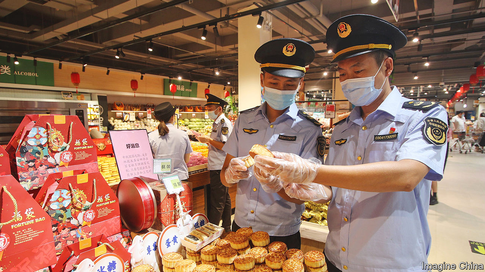

###### Too rich for some

# China’s government bites down on expensive mooncakes 

##### Why the high-priced pastry makes officials nervous 

 

> Sep 8th 2022 

“The worst gift is a fruitcake,” said Johnny Carson. “There is only one fruitcake in the entire world, and people keep sending it to each other.” Most Chinese people have never heard of Carson, a beloved American television host who died in 2005. Yet many would get his joke. China has its own fruitcake equivalent: , or mooncakes.

Mooncakes are often dense, cloyingly sweet—and, as Carson suggested, re-gifted. They play a central role in celebrations of the mid-autumn festival, a popular Chinese holiday that falls on September 10th this year (it is timed to coincide with a full moon). But in the months leading up to the celebration, mooncakes have become the object of intense government scrutiny.

Something similar happened during President Xi Jinping’s first term (from 2013 to 2018), when he moved to stamp out corruption. Mooncakes have long been associated with graft. Businesses seeking favours from the government often send officials fancy boxes full of the pastry—and other, more expensive goodies. It is probably no coincidence that Mr Xi’s campaign was followed by a steep drop in mooncake sales.

But the market has since rebounded. This year China is expected to churn out 437,000 tonnes of mooncakes, according to iiMedia Research, a consultancy. Sales are expected to reach 24bn yuan ($3.5bn), up by 11.8% compared with last year.

Most bakeries and restaurants offer mooncakes in their traditional form, with a heavy crust encasing fillings such as red-bean paste, egg yolks or lotus seed. But expensive delicacies, such as shark’s fin and edible bird’s nest, are sometimes added. Luxury hotels and designer brands have packaged these fancy mooncakes together with gold leaf, jade and expensive tea or liquor. That has led to new concerns over corruption and is out of step with Mr Xi’s drive to reduce inequality and rein in ostentatious wealth.

Officials, therefore, have been inspecting mooncakes for sale in malls, supermarkets, hotels and restaurants. State media have published photos of uniformed agents on the hunt for “overpackaging and overpricing” (pictured). Anyone selling a mooncake gift set for more than 500 yuan must store the transaction data for two years, in case officials want to investigate. In Mr Xi’s China, the worst gift is expensive .

